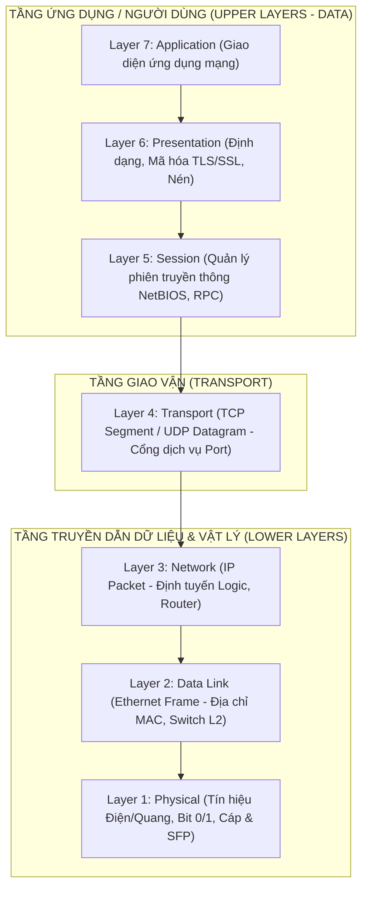
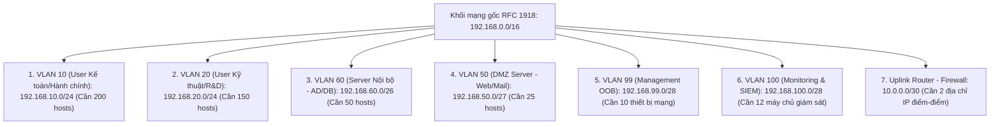

# GIÁO TRÌNH CHUYÊN ĐỀ 1: NETWORK FUNDAMENTALS (NỀN TẢNG MẠNG & KIẾN TRÚC GIAO THỨC)

> **Mục tiêu học tập**:
> 1. Hiểu sâu sắc bản chất lý thuyết và thực tiễn của hai mô hình chuẩn: **OSI (7 tầng)** và **TCP/IP (4 tầng)**.
> 2. Nắm vững cấu trúc chi tiết của các đơn vị dữ liệu giao thức (PDU), cấu trúc Header các tầng (Ethernet Frame, IPv4 Packet, TCP Segment, UDP Datagram).
> 3. Phân tích chu trình Đóng gói (Encapsulation) và Mở gói (De-encapsulation) trong không gian mạng và cách ánh xạ luồng dữ liệu giám sát an ninh (Syslog, SNMP, SIEM telemetry).
> 4. Thành thạo kỹ năng tính toán nhị phân, phân lớp địa chỉ IPv4, không gian mạng riêng (RFC 1918), kỹ thuật CIDR và phân bổ mạng con có độ dài biến đổi (**VLSM**) cho đồ án an toàn mạng.
> 5. Nắm bộ câu hỏi phản biện chuyên sâu phục vụ bảo vệ đồ án trước Hội đồng chấm thi.

---

## BÀI 1: MÔ HÌNH THAM CHIẾU OSI 7 TẦNG (OPEN SYSTEMS INTERCONNECTION)

Mô hình OSI (ISO/IEC 7498-1) được Tổ chức Tiêu chuẩn hóa Quốc tế (ISO) công bố năm 1984 nhằm mục đích cung cấp một khung lý thuyết chuẩn hóa cấu trúc phân tầng cho hệ thống truyền thông mạng, cho phép các thiết bị phần cứng và phần mềm của các nhà sản xuất khác nhau có thể tương tác liên thông hoàn hảo.



---

### 1.1. Phân Tích Chức Năng Chi Tiết Từng Tầng Trong Mô Hình OSI

#### 1. Tầng 7 - Application Layer (Tầng Ứng dụng)
- **Bản chất**: Là giao diện trực tiếp kết nối giữa ứng dụng phần mềm đang chạy trên máy tính người dùng và các dịch vụ mạng nền tảng. Tầng này không phải là bản thân ứng dụng (như trình duyệt Chrome hay phần mềm Wazuh Dashboard), mà là **giao thức truyền thông** mà ứng dụng đó sử dụng.
- **Các giao thức cốt lõi**:
  - `HTTP/HTTPS` (Port 80/443): Truyền tải siêu văn bản và giao diện Web quản trị.
  - `DNS` (Port 53): Phân giải tên miền thành địa chỉ IP.
  - `DHCP` (Port 67/68): Cấp phát cấu hình IP động.
  - `Syslog` (Port 514 UDP / 6514 TCP TLS): Chuẩn truyền nhật ký sự kiện hệ thống.
  - `SNMP` (Port 161/162 UDP): Giao thức giám sát và quản lý thiết bị mạng.
  - `NTP` (Port 123 UDP): Đồng bộ thời gian chuẩn xác thực toàn mạng.
  - `SSH` (Port 22 TCP): Quản trị dòng lệnh từ xa bảo mật.

#### 2. Tầng 6 - Presentation Layer (Tầng Trình diễn)
- **Bản chất**: Chịu trách nhiệm chuyển đổi cấu trúc dữ liệu sang định dạng chuẩn chung mà cả máy gửi và máy nhận đều hiểu được.
- **Ba chức năng cốt lõi**:
  1. **Định dạng dữ liệu (Formatting)**: Chuyển đổi mã hóa ký tự (ASCII, Unicode UTF-8, EBCDIC) hoặc định dạng hình ảnh/dữ liệu (`JSON`, `XML`, `YAML`, `JPEG`, `Base64`).
  2. **Mã hóa & Giải mã (Encryption & Decryption)**: Thiết lập kênh bảo mật tầng giao vận thông qua **TLS/SSL**, biến đổi dữ liệu bản rõ (Plaintext) thành bản mã (Ciphertext) để chống nghe lén.
  3. **Nén dữ liệu (Compression)**: Giảm kích thước dung lượng gói tin nhằm tối ưu băng thông đường truyền.

#### 3. Tầng 5 - Session Layer (Tầng Phiên)
- **Bản chất**: Chịu trách nhiệm khởi tạo (Establishment), duy trì (Maintenance), đồng bộ hóa (Synchronization) và giải phóng (Termination) các phiên hội thoại truyền thông giữa hai tiến trình ứng dụng đầu cuối.
- **Cơ chế hoạt động**:
  - **Check-pointing**: Chèn các điểm kiểm tra vào luồng truyền dữ liệu lớn. Nếu đường truyền bị đứt đoạn, phiên có thể tiếp tục truyền từ điểm kiểm tra gần nhất mà không cần truyền lại từ đầu.
  - **Chế độ truyền**: Đơn công (*Simplex*), Bán song công (*Half-Duplex*), hoặc Song công toàn phần (*Full-Duplex*).
  - **Giao thức tiêu biểu**: RPC (Remote Procedure Call), PPTP, NetBIOS, AppleTalk ASP.

#### 4. Tầng 4 - Transport Layer (Tầng Giao vận)
- **Bản chất**: Cung cấp cơ chế truyền thông điểm-tới-điểm (**End-to-End**) giữa hai tiến trình phần mềm cụ thể thông qua số hiệu cổng (**Port Number: 0 đến 65535**).
- **Các kỹ thuật then chốt**:
  - **Phân đoạn & Tái hợp (Segmentation & Reassembly)**: Chia nhỏ khối dữ liệu lớn từ tầng trên thành các Segment/Datagram có kích thước vừa với MTU mạng và đánh số thứ tự (Sequence Number) để ghép lại chính xác tại máy nhận.
  - **Điều khiển luồng (Flow Control)**: Sử dụng cơ chế Cửa sổ trượt (*Sliding Window*) nhằm ngăn bên gửi truyền dữ liệu quá nhanh làm tràn bộ đệm bên nhận.
  - **Điều khiển tắc nghẽn (Congestion Control)**: Điều chỉnh tốc độ truyền dựa trên tình trạng nghẽn của mạng (TCP Tahoe, Reno, Cubic, BBR).

#### 5. Tầng 3 - Network Layer (Tầng Mạng)
- **Bản chất**: Đảm bảo việc truyền các gói tin (**Packets**) qua các mạng logic khác nhau từ máy nguồn đến máy đích cuối cùng (Host-to-Host delivery).
- **Nhiệm vụ cốt lõi**:
  - **Đánh địa chỉ logic (Logical Addressing)**: Sử dụng địa chỉ IP (IPv4 32-bit hoặc IPv6 128-bit) duy nhất toàn cầu.
  - **Định tuyến (Routing)**: Tìm kiếm đường đi tối ưu nhất thông qua các giao thức định tuyến (OSPF, BGP, Static Routing).
  - **Chống vòng lặp vô tận (TTL - Time To Live)**: Mỗi khi packet đi qua 1 Router (1 Hop), giá trị TTL bị giảm đi 1. Nếu TTL = 0, packet bị hủy bỏ ngay lập tức.
  - **Thiết bị hoạt động**: Router, Layer 3 Switch, Firewall L3.

#### 6. Tầng 2 - Data Link Layer (Tầng Liên kết dữ liệu)
- **Bản chất**: Đảm bảo việc truyền các khung dữ liệu (**Frames**) an toàn, không có lỗi vật lý giữa hai nút mạng kết nối trực tiếp trong cùng một mạng cục bộ (LAN / Broadcast Domain).
- **Cấu trúc 2 tầng phụ (Sublayers theo IEEE 802)**:
  1. **LLC (Logical Link Control - IEEE 802.2)**: Giao tiếp với Tầng 3, thực hiện đồng bộ luồng và thông báo lỗi.
  2. **MAC (Media Access Control - IEEE 802.3)**: Quản lý quyền truy cập đường truyền vật lý, kiểm soát địa chỉ phần cứng (Địa chỉ **MAC 48-bit**) và tính toán mã kiểm tra lỗi dư thừa vòng (**FCS / CRC-32**).
- **Thiết bị hoạt động**: Layer 2 Switch, Card mạng (NIC), Wireless Access Point.

#### 7. Tầng 1 - Physical Layer (Tầng Vật lý)
- **Bản chất**: Chuyển đổi các bit nhị phân (`0` và `1`) thành tín hiệu vật lý tương ứng để truyền qua môi trường dẫn truyền hữu tuyến hoặc vô tuyến.
- **Môi trường truyền dẫn**:
  - Tín hiệu điện qua cáp đồng xoắn đôi (UTP/STP Cat5e, Cat6, Cat6A).
  - Tín hiệu quang qua cáp sợi quang (Single-mode dùng tia Laser truyền xa, Multi-mode dùng đèn LED trong Data Center).
  - Sóng điện từ qua mạng không dây (Wi-Fi 2.4GHz, 5GHz, 6GHz).
- **Thiết bị hoạt động**: Hub, Repeater, Bộ chuyển đổi quang điện (Transceiver SFP/SFP+).

---

### 1.2. Bảng Tóm Tắt Toàn Diện 7 Tầng Mô Hình OSI

| Tầng | Tên Gọi | Đơn vị PDU | Cơ chế đánh địa chỉ | Chức năng chính | Giao thức tiêu biểu | Thiết bị phần cứng |
| :---: | :--- | :--- | :--- | :--- | :--- | :--- |
| **7** | Application | Data | Service Name / URL | Giao diện dịch vụ mạng | HTTP, HTTPS, DNS, Syslog, SNMP, NTP, SSH | NGFW (App-ID), WAF, SIEM Server |
| **6** | Presentation | Data | Syntax / Encoding | Định dạng, nén, mã hóa TLS | TLS 1.3, SSL, JSON, XML, Base64 | SSL Decryption Appliance |
| **5** | Session | Data | Session ID / Socket | Thiết lập & ngắt phiên | NetBIOS, RPC, SOCKS | Stateful Firewall, API Gateway |
| **4** | Transport | Segment / Datagram | Port Number (0 - 65535) | Truyền End-to-End, kiểm soát luồng | TCP, UDP, SCTP, QUIC | Stateful Firewall L4, Load Balancer |
| **3** | Network | Packet | Địa chỉ IP (IPv4 / IPv6) | Định tuyến & tìm đường | IPv4, IPv6, ICMP, IPsec, OSPF, BGP | Router, Layer 3 Switch |
| **2** | Data Link | Frame | Địa chỉ MAC (48-bit) | Kiểm soát lỗi cục bộ, Switching | Ethernet 802.3, 802.1Q (VLAN), ARP | Layer 2 Switch, NIC |
| **1** | Physical | Bits (0, 1) | Tín hiệu Volt / Photon / Hz | Truyền tải tín hiệu thô | RJ-45, Cáp Cat6, Quang OM4, SFP+ | Hub, Repeater, Media Converter |

---

## BÀI 2: MÔ HÌNH TCP/IP & ÁNH XẠ GIÁM SÁT AN NINH TOÀN DIỆN

### 2.1. Cấu Trúc 4 Tầng Mô Hình TCP/IP

Mô hình TCP/IP (Do Bộ Quốc phòng Mỹ DARPA thiết kế) là mô hình giao thức thực tế vận hành Internet. Nó thu gọn 7 tầng OSI thành 4 tầng:

```
+-----------------------------------+     +-----------------------------------+
|       MÔ HÌNH OSI (7 TẦNG)        |     |      MÔ HÌNH TCP/IP (4 TẦNG)      |
+-----------------------------------+     +-----------------------------------+
|  Layer 7: Application (Ứng dụng)  | --> |                                   |
|  Layer 6: Presentation (Trình bày)| --> |  Tầng 4: Application (Ứng dụng)   |
|  Layer 5: Session (Phiên)         | --> |                                   |
+-----------------------------------+     +-----------------------------------+
|  Layer 4: Transport (Giao vận)    | --> |  Tầng 3: Transport (Giao vận)     |
+-----------------------------------+     +-----------------------------------+
|  Layer 3: Network (Mạng)          | --> |  Tầng 2: Internet (Liên mạng)     |
+-----------------------------------+     +-----------------------------------+
|  Layer 2: Data Link (Liên kết DL) | --> |                                   |
|  Layer 1: Physical (Vật lý)       | --> |  Tầng 1: Network Access (Truy cập)|
+-----------------------------------+     +-----------------------------------+
```

---

### 2.2. Phân Tích Cấu Trúc Gói Tin Các Tầng (Packet Header Anatomy)

Hiểu rõ từng byte trong Header là điều kiện bắt buộc để cấu hình các luật kiểm tra gói tin sâu (DPI) trên Firewall và viết luật tương quan trên SIEM.

#### A. Cấu Trúc TCP Header (Tối thiểu 20 Bytes)
```
 0                   1                   2                   3
 0 1 2 3 4 5 6 7 8 9 0 1 2 3 4 5 6 7 8 9 0 1 2 3 4 5 6 7 8 9 0 1
+-+-+-+-+-+-+-+-+-+-+-+-+-+-+-+-+-+-+-+-+-+-+-+-+-+-+-+-+-+-+-+-+
|          Source Port          |       Destination Port        |
+-+-+-+-+-+-+-+-+-+-+-+-+-+-+-+-+-+-+-+-+-+-+-+-+-+-+-+-+-+-+-+-+
|                        Sequence Number                        |
+-+-+-+-+-+-+-+-+-+-+-+-+-+-+-+-+-+-+-+-+-+-+-+-+-+-+-+-+-+-+-+-+
|                    Acknowledgment Number                      |
+-+-+-+-+-+-+-+-+-+-+-+-+-+-+-+-+-+-+-+-+-+-+-+-+-+-+-+-+-+-+-+-+
|  Data |           |U|A|P|R|S|F|                               |
| Offset| Reserved  |R|C|S|S|Y|I|            Window             |
|       |           |G|K|H|T|N|N|                               |
+-+-+-+-+-+-+-+-+-+-+-+-+-+-+-+-+-+-+-+-+-+-+-+-+-+-+-+-+-+-+-+-+
|           Checksum            |        Urgent Pointer         |
+-+-+-+-+-+-+-+-+-+-+-+-+-+-+-+-+-+-+-+-+-+-+-+-+-+-+-+-+-+-+-+-+
|                    Options                    |    Padding    |
+-+-+-+-+-+-+-+-+-+-+-+-+-+-+-+-+-+-+-+-+-+-+-+-+-+-+-+-+-+-+-+-+
```
- **6 Cờ Điều Khiển Quan Trọng (Control Flags)**:
  - `SYN` (Synchronize): Dùng để khởi tạo phiên kết nối trong bắt tay 3 bước.
  - `ACK` (Acknowledgment): Xác nhận đã nhận thành công gói tin.
  - `FIN` (Finish): Yêu cầu đóng kết nối một cách tuần tự và êm đẹp.
  - `RST` (Reset): Ngắt kết nối khẩn cấp (Thường xuất hiện khi cổng đích đang đóng hoặc bị Firewall chủ động chặn).
  - `PSH` (Push): Yêu cầu bên nhận đẩy ngay dữ liệu lên ứng dụng mà không chờ đầy bộ đệm.
  - `URG` (Urgent): Đánh dấu dữ liệu ưu tiên cao trong gói tin.

#### B. Cấu Trúc UDP Header (Chỉ 8 Bytes - Cực kỳ gọn nhẹ)
```
 0                   1                   2                   3
 0 1 2 3 4 5 6 7 8 9 0 1 2 3 4 5 6 7 8 9 0 1 2 3 4 5 6 7 8 9 0 1
+-+-+-+-+-+-+-+-+-+-+-+-+-+-+-+-+-+-+-+-+-+-+-+-+-+-+-+-+-+-+-+-+
|          Source Port          |       Destination Port        |
+-+-+-+-+-+-+-+-+-+-+-+-+-+-+-+-+-+-+-+-+-+-+-+-+-+-+-+-+-+-+-+-+
|            Length             |           Checksum            |
+-+-+-+-+-+-+-+-+-+-+-+-+-+-+-+-+-+-+-+-+-+-+-+-+-+-+-+-+-+-+-+-+
```
> **Tại sao Syslog và SNMP chuộng UDP?**
> UDP phi trạng thái (Stateless), không cần tốn 3 bước bắt tay để thiết lập kết nối, giúp thiết bị mạng gửi hàng chục nghìn dòng log/giây mà không gây quá tải CPU và tắc nghẽn đường truyền.

---

### 2.3. Ánh Xạ Dữ Liệu Giám Sát & Các Kỹ Thuật Tấn Công Theo Tầng TCP/IP

```
+-------------------+------------------------------------+------------------------------------+
|  TẦNG TCP/IP      | GIAO THỨC GIÁM SÁT & TELEMETRY     | DẠNG TẤN CÔNG & DẤU HIỆU LOG SIEM  |
+-------------------+------------------------------------+------------------------------------+
|                   | • Syslog (UDP 514 / TCP 6514 TLS)  | • SSH Brute-force (Failed login)   |
| 4. Application    | • SNMP Polling (UDP 161)           | • Web Attack (SQLi, XSS payload)   |
|                   | • SNMP Traps (UDP 162)             | • DNS Tunneling (Truy vấn dị thường)|
|                   | • NTP Time Sync (UDP 123)          | • C2 Botnet Domain Generation (DGA)|
+-------------------+------------------------------------+------------------------------------+
|                   | • NetFlow/IPFIX Port Mapping       | • TCP SYN Flood DoS               |
| 3. Transport      | • TCP Connection State Logging     | • Nmap Port Scanning (SYN scan)    |
|                   | • TLS Handshake Negotiation logs   | • RST Packet Injection             |
+-------------------+------------------------------------+------------------------------------+
|                   | • uRPF Drop Counters               | • IP Spoofing (Giả mạo IP nguồn)   |
| 2. Internet       | • ICMP Error telemetry             | • ICMP Ping Flood / Smurf Attack   |
|                   | • BGP / OSPF Route Change Syslog   | • Route Hijacking (Đổi hướng tuyến)|
+-------------------+------------------------------------+------------------------------------+
|                   | • DHCP Snooping Binding Table      | • MAC Flooding (Bão hòa CAM table) |
| 1. Network Access | • DAI Dropped Packets Counters     | • ARP Poisoning (Man-In-The-Middle)|
|                   | • 802.1Q VLAN Tagging metadata     | • Rogue DHCP Server giả mạo IP/GW  |
|                   | • SPAN / RSPAN Port Mirroring      | • VLAN Hopping Attack              |
+-------------------+------------------------------------+------------------------------------+
```

---

## BÀI 3: ĐỊA CHỈ IPV4, KỸ THUẬT CHIA MẠNG CON (SUBNETTING) & VLSM

### 3.1. Cấu Trúc Nhị Phân & Toán Tử Bitwise AND
- Mỗi địa chỉ IPv4 gồm **32 bit** nhị phân, chia thành 4 Octet (mỗi Octet = 8 bit).
- **Quy tắc Bitwise AND**: Card mạng hoặc Router xác định địa chỉ mạng (Network Address) bằng cách thực hiện phép nhân logic `AND` giữa từng bit của địa chỉ IP và Subnet Mask (`1 AND 1 = 1`, các trường hợp còn lại bằng `0`).

```
Ví dụ: Xác định Network ID của IP 192.168.10.77 với Subnet Mask /26 (255.255.255.192):
IP (192.168.10.77)   : 11000000 . 10101000 . 00001010 . 01001101
Mask (/26)          : 11111111 . 11111111 . 11111111 . 11000000
------------------------------------------------------------------- (Phép toán AND)
Network ID          : 11000000 . 10101000 . 00001010 . 01000000 = 192.168.10.64
Broadcast IP        : 11000000 . 10101000 . 00001010 . 01111111 = 192.168.10.127
Dải Host khả dụng   : 192.168.10.65 đến 192.168.10.126 (Tổng cộng 62 hosts)
```

---

### 3.2. Không Gian Địa Chỉ IPv4 Chuẩn (RFC 1918 & Các Dải Đặc Biệt)

1. **Dải Địa chỉ Mạng Riêng (Private IP - RFC 1918)**:
   - **Class A**: `10.0.0.0/8` (`10.0.0.0` - `10.255.255.255`) $\rightarrow$ Quy mô tổng thể tập đoàn.
   - **Class B**: `172.16.0.0/12` (`172.16.0.0` - `172.31.255.255`) $\rightarrow$ Doanh nghiệp vừa.
   - **Class C**: `192.168.0.0/16` (`192.168.0.0` - `192.168.255.255`) $\rightarrow$ Mạng nội bộ, phòng Lab, phân vùng VLAN.

2. **Các Dải Địa chỉ Đặc Biệt Bắt Buộc Phải Nhớ**:
   - `127.0.0.0/8`: **Loopback Address** (Kiểm tra giao thức TCP/IP cục bộ trên máy trạm).
   - `169.254.0.0/16`: **APIPA (Automatic Private IP Addressing)** (Tự gán khi máy trạm không nhận được IP từ DHCP Server).
   - `224.0.0.0/4`: **Multicast IP (Class D)** (Dùng cho giao thức mạng: OSPF dùng `224.0.0.5`, `224.0.0.6`).
   - `0.0.0.0/0`: Đại diện cho tuyến đường mặc định (**Default Route**) hoặc mọi mạng không xác định.

---

### 3.3. Bảng Tính Nhẩm Nhanh Subnetting (Bí Quyết Tính Trong 5 Giây)

Quy tắc **Block Size (Kích thước khối)**: Trong Octet xảy ra việc chia cắt bit, $\text{Block Size} = 256 - \text{Giá trị Subnet Mask thập phân}$.

| CIDR Prefix | Subnet Mask Thập Phân | Giá trị Octet chia | Block Size ($256 - \text{Mask}$) | Số Host Khả Dụng ($2^H - 2$) | Ứng Dụng Thực Tế |
| :---: | :--- | :---: | :---: | :---: | :--- |
| **`/24`** | `255.255.255.0` | 0 | 256 | **254** | VLAN Phòng ban người dùng lớn |
| **`/25`** | `255.255.255.128` | 128 | 128 | **126** | Phân vùng phòng ban vừa |
| **`/26`** | `255.255.255.192` | 192 | 64 | **62** | Cụm máy chủ nội bộ (Internal Server) |
| **`/27`** | `255.255.255.224` | 224 | 32 | **30** | Vùng DMZ Server (Web/Mail) |
| **`/28`** | `255.255.255.240` | 240 | 16 | **14** | **VLAN Management 99 & Monitoring 100** |
| **`/29`** | `255.255.255.248` | 248 | 8 | **6** | Cụm Firewall HA Heartbeat |
| **`/30`** | `255.255.255.252` | 252 | 4 | **2** | Tuyến kết nối điểm-điểm (Router $\leftrightarrow$ Firewall) |
| **`/32`** | `255.255.255.255` | 255 | 1 | **1 (Host)** | Địa chỉ Loopback Router ID |

---

### 3.4. Bài Toán Chia VLSM Thực Tế Cho Hệ Thống An Toàn Mạng Doanh Nghiệp

**Đề bài thiết kế**: Doanh nghiệp được quy hoạch không gian mạng gốc `192.168.0.0/16`. Hãy tính toán và cấp phát các subnet nhỏ theo kỹ thuật VLSM sao cho tối ưu không gian địa chỉ, chuẩn hóa theo số hiệu VLAN để thuận tiện cho việc viết luật tường lửa và giám sát SIEM.



#### Bảng Tính Toán Phân Bổ VLSM Chuẩn Xác:

| Phân Vùng Mạng | VLAN ID | Số Lượng Host Yêu Cầu | Prefix / Mask Được Chọn | Địa Chỉ Mạng (Network ID) | Dải IP Khả Dụng (Usable Range) | Địa Chỉ Broadcast | Default Gateway |
| :--- | :---: | :---: | :---: | :--- | :--- | :--- | :--- |
| **VLAN User Khối 1** | **`10`** | 200 | `/24` (`255.255.255.0`) | `192.168.10.0` | `192.168.10.1` - `192.168.10.254` | `192.168.10.255` | `192.168.10.1` |
| **VLAN User Khối 2** | **`20`** | 150 | `/24` (`255.255.255.0`) | `192.168.20.0` | `192.168.20.1` - `192.168.20.254` | `192.168.20.255` | `192.168.20.1` |
| **VLAN Server Nội bộ** | **`60`** | 50 | `/26` (`255.255.255.192`)| `192.168.60.0` | `192.168.60.1` - `192.168.60.62` | `192.168.60.63` | `192.168.60.1` |
| **VLAN DMZ Server** | **`50`** | 25 | `/27` (`255.255.255.224`)| `192.168.50.0` | `192.168.50.1` - `192.168.50.30` | `192.168.50.31` | `192.168.50.1` |
| **VLAN Management OOB**| **`99`** | 10 | `/28` (`255.255.255.240`)| `192.168.99.0` | `192.168.99.1` - `192.168.99.14` | `192.168.99.15` | `192.168.99.1` |
| **VLAN Monitoring & SIEM**| **`100`**| 12 | `/28` (`255.255.255.240`)| `192.168.100.0`| `192.168.100.1` - `192.168.100.14`| `192.168.100.15`| `192.168.100.1` |
| **Tuyến WAN Point-to-Point**| - | 2 | `/30` (`255.255.255.252`)| `10.0.0.0` | `10.0.0.1` - `10.0.0.2` | `10.0.0.3` | `10.0.0.1` |

---

## BÀI 4: BỘ CÂU HỎI ÔN TẬP & PHẢN BIỆN HỘI ĐỒNG (VIVA Q&A)

### Câu 1: Tại sao giao thức Syslog và SNMP lại thường hoạt động trên tầng Transport bằng UDP thay vì TCP?
- **Trả lời**:
  - `Syslog (UDP 514)` và `SNMP Polling (UDP 161)` ưu tiên tính thời gian thực và giảm tải tiêu hao tài nguyên cho thiết bị mạng. Khi xảy ra bão lỗi hoặc nghẽn mạng nghiêm trọng, nếu dùng TCP, thiết bị sẽ bị quá tải CPU do phải duy trì hàng chục nghìn phiên bắt tay 3 bước và gửi lại các gói tin bị rớt.
  - Tuy nhiên, đối với hệ thống SIEM yêu cầu bảo mật cao chống nghe lén và đảm bảo toàn vẹn dữ liệu pháp lý, người ta cấu hình **Syslog qua TCP/TLS (Port 6514)** hoặc **SNMPv3 Encrypted** cho các máy chủ trọng yếu.

### Câu 2: Địa chỉ MAC và địa chỉ IP khác nhau căn bản ở điểm nào trong quá trình chuyển tiếp gói tin?
- **Trả lời**:
  - **Địa chỉ IP (Layer 3)**: Mang tính toàn cục (Global Scope). Địa chỉ IP nguồn và IP đích **không bị thay đổi** trong suốt quá trình gói tin đi qua hàng chục Router trung gian trên Internet (ngoại trừ khi đi qua thiết bị NAT).
  - **Địa chỉ MAC (Layer 2)**: Chỉ có giá trị cục bộ trong một chặng liên kết mạng (Local Hop Scope). Cặp MAC nguồn và MAC đích **bị bóc tách và thay mới liên tục** mỗi khi gói tin nhảy qua một Router (Hop-by-Hop).

### Câu 3: Kỹ thuật VLSM đem lại lợi ích gì vượt trội so với việc chia FLSM (Fixed Length Subnet Mask)?
- **Trả lời**:
  - `FLSM` chia tất cả các mạng con theo cùng một kích cỡ cố định (VD: Cùng dùng `/24`). Điều này gây lãng phí địa chỉ IP trầm trọng (VD: Tuyến điểm-điểm giữa 2 Router chỉ cần 2 IP nhưng nếu gán `/24` sẽ lãng phí 252 IP).
  - `VLSM` cho phép tùy biến mặt nạ mạng theo đúng nhu cầu thực tế của từng phân vùng (Vùng User dùng `/24`, DMZ dùng `/27`, Monitoring dùng `/28`, Link Router dùng `/30`), vừa tiết kiệm tối đa không gian địa chỉ vừa tối ưu hóa bảng định tuyến.
