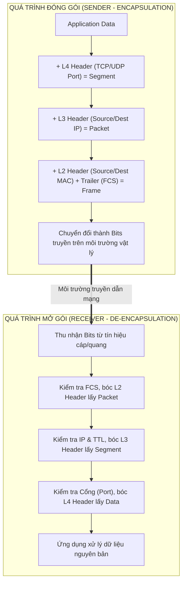

# CHUYÊN ĐỀ 1: NETWORK FUNDAMENTALS (NỀN TẢNG MẠNG CĂN BẢN)

> **Mục tiêu**: Cung cấp kiến thức nền tảng vững chắc về mô hình kiến trúc mạng (OSI 7 tầng & TCP/IP 4 tầng), chu trình đóng gói dữ liệu và kỹ năng quy hoạch địa chỉ IP (IPv4, VLSM, CIDR, RFC 1918) phục vụ trực tiếp cho việc thiết kế phân đoạn mạng và giám sát an toàn thông tin.

---

## 1. MÔ HÌNH OSI (OPEN SYSTEMS INTERCONNECTION - 7 TẦNG)

Mô hình OSI là khung tham chiếu chuẩn quốc tế do ISO phát triển nhằm chuẩn hóa các giao thức truyền thông mạng từ phần cứng vật lý đến ứng dụng người dùng.

### 1.1. Bảng Chi Tiết 7 Tầng Trong Mô Hình OSI

| Tầng (Layer) | Tên Tầng | Đơn vị dữ liệu (PDU) | Chức năng cốt lõi | Giao thức / Tiêu chuẩn tiêu biểu | Thiết bị phần cứng tương ứng |
| :--- | :--- | :--- | :--- | :--- | :--- |
| **Layer 7** | **Application** (Ứng dụng) | Data | Giao diện tương tác trực tiếp với ứng dụng người dùng, định nghĩa dịch vụ mạng | HTTP, HTTPS, DNS, DHCP, SNMP, Syslog, SSH, FTP, NTP | NGFW (App-ID), WAF, SIEM, Syslog Server |
| **Layer 6** | **Presentation** (Trình diễn) | Data | Định dạng, mã hóa/giải mã (Encryption/Decryption), nén dữ liệu | TLS/SSL, ASCII, UTF-8, JPEG, JSON, Base64 | SSL Decryption Engine, Proxy |
| **Layer 5** | **Session** (Phiên) | Data | Thiết lập, duy trì, đồng bộ và giải phóng phiên truyền thông giữa 2 ứng dụng | NetBIOS, RPC, PPTP, SOCKS, NFS | Stateful Firewall, Gateway |
| **Layer 4** | **Transport** (Giao vận) | Segment (TCP) / Datagram (UDP) | Truyền dữ liệu đầu-cuối (End-to-End), điều khiển luồng (Flow Control), phân đoạn & gộp kênh (Multiplexing) | TCP (hướng kết nối), UDP (phi kết nối) | Stateful Firewall (L4 Filter), Load Balancer (L4) |
| **Layer 3** | **Network** (Mạng) | Packet | Định tuyến (Routing), đánh địa chỉ logic toàn cầu (IP Addressing), kiểm tra TTL | IPv4, IPv6, ICMP, IPsec, OSPF, BGP, EIGRP | Router, Layer 3 Switch |
| **Layer 2** | **Data Link** (Liên kết dữ liệu) | Frame | Đánh địa chỉ vật lý (MAC), kiểm soát lỗi (FCS/CRC), truy cập môi trường truyền dẫn | Ethernet 802.3, 802.1Q (VLAN), ARP, STP, LACP | Layer 2 Switch, Bridge, NIC |
| **Layer 1** | **Physical** (Vật lý) | Bit (0, 1) | Chuyển đổi bit thành tín hiệu điện, quang hoặc sóng vô tuyến | Cáp UTP/STP Cat6/Cat6A, Cáp quang Single/Multi-mode, SFP/SFP+ | Hub, Repeater, Bộ chuyển đổi quang điện |

---

### 1.2. Quá Trình Đóng Gói (Encapsulation) & Mở Gói (De-encapsulation)



---

## 2. MÔ HÌNH TCP/IP (4 TẦNG) & ÁNH XẠ GIÁM SÁT AN NINH

Mô hình TCP/IP là kiến trúc thực tế được áp dụng trên mạng Internet toàn cầu, rút gọn từ 7 tầng OSI thành 4 tầng chức năng:

```
+---------------------------------------------------------------------------------------+
|    MÔ HÌNH OSI (7 TẦNG)    |  MÔ HÌNH TCP/IP (4 TẦNG)  |  ÁNH XẠ LOG & GIÁM SÁT AN NINH       |
+----------------------------+---------------------------+--------------------------------------+
| Layer 7: Application       |                           | Syslog (UDP 514 / TCP 6514 TLS)      |
| Layer 6: Presentation      | Application               | SNMP (UDP 161 Polling, 162 Traps)    |
| Layer 5: Session           |                           | NTP (UDP 123 - Đồng bộ Timestamp)    |
+----------------------------+---------------------------+--------------------------------------+
| Layer 4: Transport         | Transport (Host-to-Host)  | TCP Syn/Ack scan, Port Scanning      |
|                            |                           | NetFlow/IPFIX L4 Port tracking       |
+----------------------------+---------------------------+--------------------------------------+
| Layer 3: Network           | Internet                  | IP Spoofing, ICMP Ping Flooding      |
|                            |                           | uRPF checking, ACL drop logs         |
+----------------------------+---------------------------+--------------------------------------+
| Layer 2: Data Link         |                           | MAC Flooding, ARP Poisoning (DAI)    |
| Layer 1: Physical          | Network Access            | DHCP Snooping, Port Security logs    |
+---------------------------------------------------------------------------------------+
```

> **Ý nghĩa thực tiễn trong Giám sát An toàn Mạng**:
> - Khi một cuộc tấn công xảy ra, bản ghi log hoặc cảnh báo SIEM luôn mang các trường thông tin thuộc các tầng này: **MAC nguồn/đích (L2)** $\rightarrow$ **IP nguồn/đích (L3)** $\rightarrow$ **Port dịch vụ (L4)** $\rightarrow$ **Nội dung payload/hành động (L7)**.
> - Hiểu rõ cấu trúc gói tin giúp kỹ sư SOC viết chính xác các luật tương quan sự kiện (Correlation Rules) và bộ lọc Wireshark/Tcpdump.

---

## 3. ĐỊA CHỈ IPV4, SUBNETTING & VLSM

### 3.1. Cấu Trúc Địa Chỉ IPv4
- Gồm **32 bit** nhị phân, biểu diễn dưới dạng 4 số thập phân cách nhau bởi dấu chấm (Dotted Decimal Notation): `X.X.X.X` (Mỗi Octet = 8 bit, giá trị từ 0 đến 255).
- Cấu trúc gồm 2 phần:
  1. **Network ID**: Xác định mạng mà thiết bị trực thuộc.
  2. **Host ID**: Định danh duy nhất thiết bị trong mạng đó.
- **Subnet Mask**: Chuỗi 32-bit gồm các bit `1` liên tiếp (đại diện cho Network) theo sau bởi các bit `0` (đại diện cho Host).

---

### 3.2. Không Gian Địa Chỉ IP Riêng (Private IP - RFC 1918)
Được chuẩn hóa để sử dụng nội bộ trong mạng LAN doanh nghiệp, không thể định tuyến trực tiếp trên mạng Internet công cộng:

| Phân lớp (Class) | Dải địa chỉ RFC 1918 | CIDR Prefix | Số lượng Subnet / Host | Phạm vi triển khai thực tế |
| :--- | :--- | :--- | :--- | :--- |
| **Class A** | `10.0.0.0` - `10.255.255.255` | `10.0.0.0/8` | 1 Mạng / ~16.7 triệu Host | Tập đoàn lớn, quy hoạch mạng tổng thể toàn quốc |
| **Class B** | `172.16.0.0` - `172.31.255.255`| `172.16.0.0/12`| 16 Mạng / ~1.04 triệu Host | Doanh nghiệp vừa và lớn, phân chia theo chi nhánh |
| **Class C** | `192.168.0.0` - `192.168.255.255`| `192.168.0.0/16`| 256 Mạng / 65,536 Host | Doanh nghiệp vừa & nhỏ, Lab, phân đoạn VLAN giám sát |

---

### 3.3. Kỹ Thuật CIDR & Bảng Tra Cứu Subnet Nhanh

Công thức tính:
- **Số lượng địa chỉ IP tổng cộng**: $2^H$ ($H$ là số bit dành cho Host).
- **Số lượng IP khả dụng cho thiết bị**: $2^H - 2$ (Trừ IP Mạng và IP Broadcast).

| Prefix | Subnet Mask | Số Bit Host ($H$) | Tổng số IP | Số IP khả dụng | Mục đích sử dụng tiêu biểu |
| :--- | :--- | :--- | :--- | :--- | :--- |
| `/24` | `255.255.255.0` | 8 | 256 | **254** | Mạng User phòng ban, Server Farm |
| `/25` | `255.255.255.128` | 7 | 128 | **126** | Phân vùng phòng ban vừa |
| `/26` | `255.255.255.192` | 6 | 64 | **62** | Phân vùng IT, R&D |
| `/27` | `255.255.255.224` | 5 | 32 | **30** | Vùng DMZ, Cụm máy chủ Web/Mail |
| `/28` | `255.255.255.240` | 4 | 16 | **14** | **VLAN Management & Monitoring (SIEM/Syslog)** |
| `/29` | `255.255.255.248` | 3 | 8 | **6** | Cụm Firewall HA, Gateway Redundancy |
| `/30` | `255.255.255.252` | 2 | 4 | **2** | Đường truyền Point-to-Point (Router $\leftrightarrow$ Firewall) |
| `/32` | `255.255.255.255` | 0 | 1 | **1 (Host)** | Địa chỉ Loopback Router/Firewall (Định danh Router ID) |

---

### 3.4. Kỹ Thuật Chia Mạng Con Độ Dài Biến Đổi (VLSM - Case Study Đề Tài)

Giả sử doanh nghiệp được cấp khối mạng gốc `192.168.0.0/20` (4096 IPs) hoặc `172.16.0.0/22`. Dưới đây là bài toán thiết kế mạng phân đoạn bảo mật và giám sát:

```
                                  [ INTERNET ]
                                       |
                              [ WAN /30: 203.0.113.0/30 ]
                                       |
                              [ EDGE FIREWALL ]
                                       |
                     +-----------------+-----------------+
                     |                                   |
         [ VLAN 50: DMZ FARM ]               [ CORE SWITCH L3 ]
         192.168.50.0/27 (30 hosts)                      |
                                        +----------------+----------------+
                                        |                                 |
                            [ VLAN 10: USER LAN ]             [ VLAN 999: MONITORING ]
                            192.168.10.0/24 (254 hosts)       192.168.99.0/28 (14 hosts)
                                                              - SIEM: .10
                                                              - Syslog: .11
                                                              - NTP Server: .1
```

#### Bảng Phân Bổ VLSM Chuẩn Cho Mô Hình Giám Sát:

| Phân vùng mạng (Zone / VLAN) | VLAN ID | Địa chỉ Mạng (Network) | Subnet Mask | Dải IP Khả dụng | Default Gateway | Mục đích giám sát |
| :--- | :--- | :--- | :--- | :--- | :--- | :--- |
| **Point-to-Point Uplink** | - | `10.0.0.0/30` | `255.255.255.252` | `.1` - `.2` | `.1` | Tuyến kết nối Router $\leftrightarrow$ Firewall |
| **VLAN Management** | **99** | `192.168.99.0/28` | `255.255.255.240` | `.1` - `.14` | `.1` | Quản trị Out-of-band thiết bị qua SSH |
| **VLAN Monitoring & SIEM** | **999** | `192.168.100.0/28`| `255.255.255.240` | `.1` - `.14` | `.1` | **SIEM Server (Wazuh/ELK), Syslog, SNMP** |
| **VLAN DMZ Server** | **50** | `192.168.50.0/27` | `255.255.255.224` | `.1` - `.30` | `.1` | Web Server, Mail Gateway công khai |
| **VLAN Internal Server** | **60** | `192.168.60.0/26` | `255.255.255.192` | `.1` - `.62` | `.1` | Domain Controller (AD), Database |
| **VLAN Nhân viên Khối 1** | **10** | `192.168.10.0/24` | `255.255.255.0` | `.1` - `.254` | `.1` | Phòng Kế toán / Nhân sự |
| **VLAN Nhân viên Khối 2** | **20** | `192.168.20.0/24` | `255.255.255.0` | `.1` - `.254` | `.1` | Phòng Kỹ thuật / R&D |
