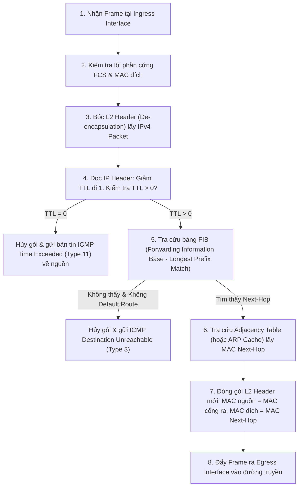

# GIÁO TRÌNH CHUYÊN ĐỀ 2: NETWORK INFRASTRUCTURE (KIẾN TRÚC HẠ TẦNG THIẾT BỊ MẠNG)

> **Mục tiêu học tập**:
> 1. Hiểu sâu sắc kiến trúc phần cứng, nguyên lý chuyển mạch/chuyển tiếp gói tin và các cơ chế bảo vệ cốt lõi trên 4 loại thiết bị: **Router**, **Switch**, **Next-Gen Firewall (NGFW)** và **Enterprise Server**.
> 2. Nắm vững cơ chế vận hành của **Control Plane vs Data Plane**, bảng **CAM vs TCAM**, bảng phiên **State Table**, và công nghệ kiểm tra gói tin sâu **DPI**.
> 3. Cấu hình thực tế các cơ chế phòng thủ: **CoPP**, **uRPF**, **Port Security**, **DHCP Snooping**, **DAI**, và **SPAN Port Mirroring** để nhân bản lưu lượng về cho máy chủ IDS/IPS.
> 4. Làm chủ bảng tra cứu Event ID quan trọng trên máy chủ (Linux Auditd / Windows Event Log) phục vụ việc tích hợp vào SIEM.

---

## BÀI 1: BỘ ĐỊNH TUYẾN DOANH NGHIỆP (ENTERPRISE ROUTER)

```
+-----------------------------------------------------------------------------------+
|                            KIẾN TRÚC PHẦN CỨNG ROUTER                             |
+-----------------------------------------------------------------------------------+
|  CONTROL PLANE (Mặt phẳng điều khiển)     <--->     DATA PLANE (Mặt phẳng dữ liệu)|
|  - Xử lý bởi CPU chính (Central CPU)                - Xử lý bởi chip ASIC / NPU   |
|  - Tính toán thuật toán OSPF, BGP, EIGRP            - Tra cứu bảng FIB tốc độ cao |
|  - Quản lý bảng định tuyến RIB                      - Bảng quan hệ lân cận ADJ    |
|  - Xử lý phiên quản trị SSH, SNMP, Syslog           - Chuyển mạch phần cứng CEF   |
|  - Được bảo vệ bởi bộ lọc CoPP                      - Giảm TTL, đóng gói lại MAC  |
+-----------------------------------------------------------------------------------+
```

### 1.1. Chu Trình Xử Lý & Chuyển Tiếp Gói Tin (De-encapsulation & Re-encapsulation)



---

### 1.2. Các Cơ Chế An Ninh Cốt Lõi Trên Router

#### A. Bảo Vệ CPU Bằng Control Plane Policing (CoPP)
- **Vấn đề**: Kẻ tấn công gửi hàng triệu gói tin DoS nhắm trực tiếp vào IP của Router (ICMP Flood, SSH Brute-force, BGP Flood). Vì các gói tin này có IP đích là chính Router nên Data Plane phải chuyển toàn bộ lên Control Plane (CPU), làm CPU đạt $100\%$ và gây sập toàn bộ hệ thống định tuyến của doanh nghiệp.
- **Giải pháp CoPP**: Đặt một bộ lọc chính sách QoS (MQC - Modular QoS CLI) ngay tại cổng ngõ của Control Plane để phân luồng và giới hạn tốc độ (Rate-limit) lưu lượng:
  - *Traffic định tuyến* (OSPF, BGP): Ưu tiên tuyệt đối, không giới hạn.
  - *Traffic quản trị* (SSH từ VLAN Management 99, SNMP từ VLAN 100): Đảm bảo băng thông nhưng giới hạn tốc độ.
  - *Traffic rủi ro* (ICMP Echo): Giới hạn nghiêm ngặt (VD: tối đa 100 kbps), phần vượt ngưỡng tự động bị Drop.

#### B. Chống Giả Mạo Địa Chỉ IP Nguồn (uRPF - Unicast Reverse Path Forwarding)
- **Strict Mode (`ip verify unicast source reachable-via rx`)**: Router kiểm tra IP nguồn của gói tin đến: nếu tuyến đường quay trở lại IP nguồn đó trong bảng định tuyến **không trỏ ra đúng cổng mà gói tin vừa đi vào**, Router hủy gói tin ngay lập tức.
- **Loose Mode (`ip verify unicast source reachable-via any`)**: Chỉ cần IP nguồn tồn tại trong bảng định tuyến là chấp nhận (dùng cho mạng có định tuyến bất đối xứng Asymmetric Routing).

---

## BÀI 2: BỘ CHUYỂN MẠCH (SWITCH LAYER 2 & LAYER 3)

### 2.1. Cấu Trúc Phần Cứng: Bộ Nhớ CAM vs TCAM
- **CAM (Content Addressable Memory)**: Bộ nhớ tốc độ cao chuyên dụng của Switch Layer 2, tìm kiếm chính xác nhị phân (`0` hoặc `1`) để tra cứu bảng địa chỉ MAC: `(VLAN ID + MAC Address) -> Cổng vật lý`.
- **TCAM (Ternary Content Addressable Memory)**: Bộ nhớ hỗ trợ 3 trạng thái (`0`, `1`, và `X - Don't care`), cho phép tìm kiếm song song hàng nghìn quy tắc Access Control List (ACL) và QoS trong vòng 1 chu kỳ xung nhịp (Clock Cycle) mà không làm suy giảm tốc độ chuyển mạch dây (Wire-speed).

---

### 2.2. Cơ Chế Bảo Vệ Tầng 2 (Layer 2 Security Hardening)

#### A. Port Security (Chống MAC Flooding)
- Giới hạn số lượng địa chỉ MAC tối đa được phép học trên một cổng vật lý (VD: `maximum 2`).
- Ba chế độ xử lý vi phạm (*Violation Modes*):
  - `Protect`: Âm thầm hủy các frame từ MAC lạ, không gửi log.
  - `Restrict`: Hủy frame, tăng bộ đếm vi phạm và **gửi bản tin SNMP Trap + Syslog** về SIEM.
  - `Shutdown` (Mặc định): Lập tức vô hiệu hóa cổng (`err-disable`), gửi log cảnh báo.

#### B. DHCP Snooping & Dynamic ARP Inspection (DAI)
- **DHCP Snooping**: Switch chặn toàn bộ bản tin `DHCP Offer / ACK` từ các cổng `Untrusted` (cổng người dùng), chỉ cho phép từ cổng `Trusted` (nối DHCP Server thật). Đồng thời switch tự động xây dựng cơ sở dữ liệu **DHCP Snooping Binding Table** chứa: `(MAC, IP được cấp, Cổng kết nối, VLAN, Lease Time)`.
- **DAI (Dynamic ARP Inspection)**: Chống tấn công giả mạo ARP (ARP Poisoning / MITM). Mỗi khi nhận được gói tin `ARP Reply`, Switch sẽ so khớp với bảng Binding Table của DHCP Snooping. Nếu IP và MAC trong gói ARP không trùng khớp với bảng dữ liệu xác thực, switch hủy gói ARP và gửi log cảnh báo.

---

### 2.3. Cấu Hình SPAN Port Mirroring (Nhân Bản Lưu Lượng Cho IDS/IPS Sensor)

```
+-----------------------------------------------------------------------------+
|               CƠ CHẾ MIRRORING LƯU LƯỢNG MẠNG (SPAN PORT)                   |
+-----------------------------------------------------------------------------+
|  [ Ingress Port Gi0/1 ] ---> Traffic mạng người dùng ---> [ Core Switch ]    |
|            |                                                    |           |
|            +---> (SPAN Mirroring bản sao dữ liệu)               |           |
|                                |                                v           |
|                                v                         [ Internet ]       |
|                       [ SPAN Port Gi0/24 ]                                  |
|                                |                                            |
|                                v                                            |
|                     [ IDS SENSOR (Suricata) ]                               |
|                                |                                            |
|                      Xuất EVE JSON / Syslog                                 |
|                                v                                            |
|                    [ SIEM WAZUH / LOGSTASH ]                                |
+-----------------------------------------------------------------------------+
```

```cisco
! ==============================================================
! CẤU HÌNH SPAN PORT TRÊN CISCO CATALYST SWITCH
! ==============================================================
Switch(config)# monitor session 1 source interface GigabitEthernet0/1 - 10 both
Switch(config)# monitor session 1 destination interface GigabitEthernet0/24
```

---

## BÀI 3: TƯỜNG LỬA THẾ HỆ MỚI (NEXT-GENERATION FIREWALL - NGFW)

### 3.1. So Sánh Stateful Firewall Truyền Thống vs NGFW Hiện Đại

| Tiêu chí | Stateful Firewall Truyền thống (L3/L4) | Next-Generation Firewall (NGFW - L7) |
| :--- | :--- | :--- |
| **Phạm vi kiểm tra** | Chỉ kiểm tra IP Header và Port TCP/UDP | Kiểm tra sâu toàn bộ phần thân dữ liệu (Deep Packet Inspection - DPI) |
| **Nhận diện ứng dụng** | Phụ thuộc vào Port (VD: Cứ Port 80 là coi là Web) | Nhận diện độc lập với Port (**App-ID** - Phát hiện BitTorrent ngụy trang qua port 443) |
| **Nhận diện danh tính** | Chỉ biết địa chỉ IP (`192.168.10.15`) | Đồng bộ Active Directory (**User-ID** - Định danh rõ `corp\nguyen_van_a`) |
| **Bảo vệ chống mã độc** | Phải mua thêm thiết bị IPS riêng | Tích hợp sẵn **IPS Engine**, **Antivirus theo luồng**, **Sandbox đám mây** |
| **Giải mã SSL/TLS** | Không thể giải mã (Mù trước 90% lưu lượng HTTPS) | Có chip chuyên dụng giải mã **SSL/TLS Decryption** để kiểm tra mã độc |

---

### 3.2. Cấu Trúc Bảng Phiên (State Table) & Chu Trình Kiểm Soát Trạng Thái
Khi máy trạm nội bộ khởi tạo kết nối Web ra Internet, Tường lửa tạo một mục trong State Table:
- `Protocol`: TCP
- `Inside Host`: `192.168.10.15:49152`
- `Outside Host`: `142.250.190.46:443`
- `Connection State`: `ESTABLISHED`
- `TCP Sequence Tracking`: Ghi nhớ số Seq/Ack hợp lệ.

Khi máy chủ ngoài Internet gửi gói tin phản hồi về, Firewall so khớp với State Table:
- Gói tin phản hồi đúng luồng $\rightarrow$ Cho phép đi qua mà không cần viết luật chiều ngược lại.
- Gói tin từ bên ngoài tự ý gửi vào mà không có trong State Table $\rightarrow$ Hủy ngay lập tức (Drop) và ghi log.

---

## BÀI 4: MÁY CHỦ DOANH NGHIỆP (ENTERPRISE SERVER) & NHẬT KÝ AN NINH

### 4.1. Vai Trò Kép Của Máy Chủ Trong Đề Tài
1. **Máy chủ Đối tượng (Target / Monitored Servers)**: Nơi chứa dữ liệu kinh doanh, Domain Controller, Web Application, Database.
2. **Máy chủ Giám sát (SOC Infrastructure)**: Nơi triển khai Wazuh Manager, Wazuh Indexer, Logstash, Elasticsearch, Kibana, Rsyslog Server.

---

### 4.2. Bảng Tra Cứu Windows Security Event IDs Trọng Yếu

Hệ điều hành Windows Server ghi nhận các sự kiện an ninh thông qua mã Event ID chuẩn:

| Event ID | Tên Sự Kiện | Ý Nghĩa An Ninh & Tình Huống Giám Sát |
| :---: | :--- | :--- |
| **`4624`** | An account was successfully logged on | Đăng nhập thành công (Ghi nhận kiểu Logon Type: 2=Local, 3=Network, 10=RDP) |
| **`4625`** | An account failed to log on | **Đăng nhập thất bại** (Dấu hiệu của tấn công dò mật khẩu Brute-force / Password Spraying) |
| **`4720`** | A user account was created | Tạo tài khoản người dùng mới (Phát hiện hacker tạo tài khoản Backdoor) |
| **`4728`** | A member was added to a security group | Thêm người dùng vào nhóm đặc quyền (VD: Nhóm `Domain Admins`) |
| **`1102`** | The audit log was cleared | **Nhật ký an ninh bị xóa** (Hành vi xóa dấu vết nguy hiểm của kẻ xâm nhập) |
| **`7045`** | A new service was installed in the system | Một dịch vụ mới được cài đặt (Dấu hiệu duy trì quyền truy cập - Persistence) |

---

### 4.3. Giám Sát Nhật Ký Trên Máy Chủ Linux (Auditd & Syslog)
- `/var/log/auth.log` (Ubuntu/Debian) hoặc `/var/log/secure` (RHEL/Rocky Linux): Ghi nhận các sự kiện xác thực `sshd`, `sudo`, `su`.
- `Auditd (Linux Audit Daemon)`: Module nhân Linux cho phép ghi vết chi tiết mọi lời gọi hệ thống (System calls), chỉnh sửa file cấu hình nhạy cảm (`/etc/passwd`, `/etc/shadow`), hoặc thực thi lệnh với quyền `root`.

---

## BÀI 5: BỘ CÂU HỎI ÔN TẬP & PHẢN BIỆN HỘI ĐỒNG (VIVA Q&A)

### Câu 1: Tại sao Switch Layer 2 lại dễ bị tấn công tràn bảng CAM (MAC Flooding) và cơ chế Port Security xử lý ra sao?
- **Trả lời**:
  - Dung lượng bộ nhớ CAM của switch là hữu hạn (thường từ 8.000 đến 128.000 địa chỉ). Kẻ tấn công dùng công cụ như `macof` phát sinh hàng triệu địa chỉ MAC giả trong vài giây khiến bảng CAM bị đầy. Khi đó, Switch không thể học thêm MAC mới và buộc phải chuyển sang chế độ **Fail-Open (hoạt động như một Hub)**, đẩy toàn bộ gói tin ra mọi cổng, cho phép hacker bắt trọn gói tin của người khác.
  - **Port Security** ngăn chặn điều này bằng cách đặt ngưỡng giới hạn số MAC tối đa trên cổng và tự động khóa cổng (`shutdown / err-disable`) ngay khi xuất hiện địa chỉ MAC thứ $N+1$.

### Câu 2: Sự khác biệt bản chất giữa SPAN Port (Port Mirroring) và Inline IPS là gì?
- **Trả lời**:
  - `SPAN Port` là giải pháp giám sát thụ động ngoài luồng (Passive / Out-of-band). Switch tạo một bản sao của gói tin để đẩy sang cho cảm biến IDS. Nếu cảm biến bị treo hoặc quá tải, mạng sản xuất của doanh nghiệp **hoàn toàn không bị ảnh hưởng**, nhưng IDS không thể trực tiếp ngăn chặn gói tin độc hại theo thời gian thực.
  - `Inline IPS` đặt thiết bị đứng trực tiếp trên đường truyền chính (Active). Mọi gói tin phải đi xuyên qua IPS để được quét chữ ký. IPS có thể tự động Drop gói tin độc hại ngay lập tức, nhưng nếu IPS bị nghẽn phần cứng, toàn bộ mạng sẽ bị gián đoạn hoặc tăng độ trễ đường truyền.
