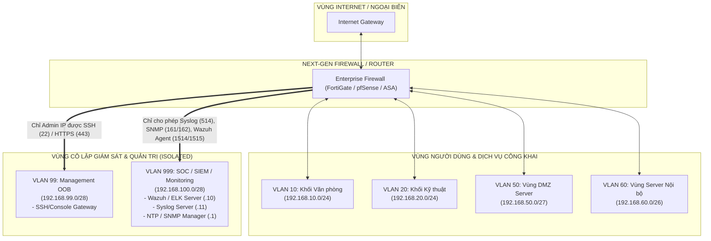

# CHUYÊN ĐỀ 3: NETWORK SEGMENTATION (PHÂN ĐOẠN MẠNG & THIẾT KẾ VLAN GIÁM SÁT)

> **Mục tiêu**: Nắm vững các mô hình phân loại mạng (LAN/WAN/MAN), nguyên lý hoạt động của công nghệ VLAN/Trunking (802.1Q), Inter-VLAN Routing, và phương pháp phân đoạn mạng chuyên biệt (**Management / Monitoring VLAN**) nhằm bảo vệ hệ thống giám sát SIEM trước các nguy cơ tấn công leo thang đặc quyền từ người dùng nội bộ.

---

## 1. PHÂN LOẠI MẠNG THEO PHẠM VI ĐỊA LÝ (LAN / WAN / MAN)

| Tiêu chí | Mạng LAN (Local Area Network) | Mạng MAN (Metropolitan Area Network) | Mạng WAN (Wide Area Network) |
| :--- | :--- | :--- | :--- |
| **Phạm vi địa lý** | Giới hạn trong một phòng, tòa nhà hoặc khuôn viên (Campus) $\le 1-2\text{ km}$ | Phạm vi một thành phố hoặc đô thị lớn ($10-50\text{ km}$) | Liên tỉnh, quốc gia, lục địa hoặc toàn cầu ($> 100\text{ km}$) |
| **Tốc độ truyền dẫn** | Rất cao ($1\text{ Gbps} - 100\text{ Gbps}$) | Trung bình - Cao ($100\text{ Mbps} - 10\text{ Gbps}$) | Phụ thuộc băng thông ISP thuê bao ($10\text{ Mbps} - 10\text{ Gbps}$) |
| **Độ trễ (Latency)** | Cực thấp ($< 1\text{ ms}$) | Thấp ($5 - 20\text{ ms}$) | Cao hơn ($20 - 150\text{ ms}$) |
| **Môi trường & Công nghệ** | Cáp đồng xoắn đôi Cat6/Cat6A, Cáp quang OM3/OM4, Ethernet 802.3 | Metro Ethernet, FTTH, DWDM, Cáp quang đơn mốt | Cáp quang biển, Vệ tinh, Công nghệ MPLS, IPsec VPN, SD-WAN |
| **Quyền sở hữu** | Doanh nghiệp tự trang bị và quản trị | Thuê từ nhà mạng viễn thông (Telco) | Doanh nghiệp thuê hạ tầng truyền dẫn của nhà mạng |

---

## 2. CÔNG NGHỆ MẠNG LAN ẢO (VLAN - VIRTUAL LAN)

### 2.1. Bản Chất & Lợi Ích Của VLAN
- **Thu hẹp Broadcast Domain**: Về mặt mặc định trên Switch Layer 2, mọi cổng thuộc cùng một Broadcast Domain. VLAN chia nhỏ một switch vật lý thành nhiều switch logic, cô lập lưu lượng Broadcast trong từng phân vùng.
- **Tăng cường bảo mật (Security Isolation)**: Các thiết bị thuộc hai VLAN khác nhau không thể giao tiếp trực tiếp ở Layer 2; mọi kết nối bắt buộc phải đi qua thiết bị Layer 3 (Router / Firewall / Layer 3 Switch), nơi áp dụng các chính sách kiểm soát truy cập (ACL / Firewall Rules).
- **Linh hoạt quản trị**: Gom nhóm người dùng theo vai trò, chức năng phòng ban mà không phụ thuộc vào vị trí cổng cắm vật lý.

---

### 2.2. Chuẩn Gắn Thẻ 802.1Q (VLAN Tagging & Trunking)

Khi frame đi qua đường kết nối trung kế (Trunk Link) giữa các Switch hoặc giữa Switch và Router, một trường **802.1Q Tag dài 4 bytes** được chèn vào giữa trường Source MAC và EtherType:

```
+-------------------------------------------------------------------------------+
|                      CẤU TRÚC FRAME ETHERNET CHUẨN 802.1Q                     |
+-------------------------------------------------------------------------------+
| Preamble | Dest MAC | Source MAC |  802.1Q TAG (4 Bytes)  | EtherType | Data | FCS |
+-------------------------------------------------------------------------------+
                                   |
              +--------------------+--------------------+
              | TPID (2B) = 0x8100 | PCP (3b) | DEI (1b)| VID (12 bits) |
              +--------------------+--------------------+---------------+
```

- **TPID (Tag Protocol Identifier)**: Giá trị cố định `0x8100` xác định đây là frame gắn thẻ 802.1Q.
- **PCP (Priority Code Point)**: 3 bit quy định mức độ ưu tiên QoS (0-7) cho gói tin thoại (VoIP) hoặc video.
- **VID (VLAN Identifier)**: 12 bit xác định mã định danh VLAN (từ `1` đến `4094`).
- **Access Port**: Cổng kết nối máy trạm/máy chủ; frame đi ra cổng này sẽ bị bóc thẻ (Untagged).
- **Trunk Port**: Cổng truyền tải lưu lượng của nhiều VLAN cùng lúc; frame bắt buộc phải gắn thẻ (Tagged).
- **Native VLAN**: VLAN duy nhất truyền qua đường Trunk mà **không gắn thẻ** (mặc định là VLAN 1; khuyến nghị chuyển sang VLAN khác như 999 để chống tấn công VLAN Hopping).

---

## 3. THIẾT KẾ PHÂN ĐOẠN MẠNG GIÁM SÁT (MANAGEMENT & MONITORING SEGMENTATION)

> [!IMPORTANT]
> **YÊU CẦU CỐT LÕI CỦA ĐỀ TÀI**: Xây dựng vùng mạng **Management (VLAN 99)** và **Monitoring / SIEM (VLAN 999)** độc lập hoàn toàn với VLAN người dùng thông thường.



### 3.1. Bảng Chi Tiết Phân Đoạn Các Phân Vùng Mạng

| Phân Vùng | VLAN ID | Dải Mạng IP | Thiết Bị Trong Phân Vùng | Quyền Hạn & Chính Sách An Ninh |
| :--- | :--- | :--- | :--- | :--- |
| **User LAN (Khối 1)** | `10` | `192.168.10.0/24` | Máy tính nhân viên hành chính, kế toán | Bị cấm truy cập trực tiếp vào VLAN 99 và VLAN 999; chỉ ra Internet và truy cập dịch vụ nội bộ được cấp phép |
| **User LAN (Khối 2)** | `20` | `192.168.20.0/24` | Máy trạm lập trình viên, kỹ thuật viên | Không thể can thiệp vào máy chủ SIEM; bị kiểm soát bởi IPS |
| **DMZ Server** | `50` | `192.168.50.0/27` | Web Server Nginx, Mail Server, Public DNS | Công khai với Internet; nếu DMZ bị chiếm quyền điều khiển (Compromised), kẻ tấn công **không thể** pivot sang VLAN User hoặc VLAN Monitoring |
| **Internal Server** | `60` | `192.168.60.0/26` | Domain Controller (AD), Database Server | Chỉ chấp nhận kết nối từ các ứng dụng được ủy quyền trong DMZ/LAN |
| **Management (OOB)** | **`99`** | `192.168.99.0/28` | Giao diện quản trị Web GUI / SSH của Router, Switch, Firewall, iDRAC/iLO | **Cô lập hoàn toàn**; chỉ IP của máy trạm quản trị viên an ninh (Security Admin) mới được cấp quyền SSH/HTTPS |
| **Monitoring & SIEM**| **`999`**| `192.168.100.0/28`| **Wazuh Manager, ELK Stack, Syslog Collector, SNMP Manager, NTP Server** | **Chỉ tiếp nhận traffic telemetry một chiều**: Syslog (UDP 514/TLS 6514), SNMP Traps (UDP 162), Wazuh Agent logs (TCP 1514/1515). Nghiêm cấm mọi truy cập tùy tiện từ các dải IP khác |

---

## 4. ĐỊNH TUYẾN LIÊN VLAN (INTER-VLAN ROUTING) & ACL BẢO VỆ

### 4.1. Cấu Hình Inter-VLAN Routing (Router-on-a-Stick) Trên Cisco Router
```cisco
! Interface Trunk kết nối xuống Core Switch
interface GigabitEthernet0/0/0
 no shutdown
!
! Sub-interface cho VLAN 10 (User)
interface GigabitEthernet0/0/0.10
 encapsulation dot1Q 10
 ip address 192.168.10.1 255.255.255.0
!
! Sub-interface cho VLAN 50 (DMZ)
interface GigabitEthernet0/0/0.50
 encapsulation dot1Q 50
 ip address 192.168.50.1 255.255.255.224
!
! Sub-interface cho VLAN 999 (Monitoring & SIEM)
interface GigabitEthernet0/0/0.999
 encapsulation dot1Q 999
 ip address 192.168.100.1 255.255.255.240
! Áp dụng Access Control List chặn người dùng truy cập trái phép vào SIEM
 ip access-group ACL_PROTECT_MONITORING out
```

### 4.2. Cấu Hình Extended ACL Bảo Vệ VLAN Monitoring & SIEM
```cisco
! ==============================================================
! BỘ LẬP CHÍNH SÁCH BẢO VỆ VLAN MONITORING (VLAN 999)
! ==============================================================
ip access-list extended ACL_PROTECT_MONITORING
 ! 1. Cho phép gửi Log Syslog từ tất cả các VLAN về máy chủ Syslog (192.168.100.11)
 permit udp any host 192.168.100.11 eq 514
 permit tcp any host 192.168.100.11 eq 6514
 
 ! 2. Cho phép gửi SNMP Traps từ thiết bị về SIEM Manager (192.168.100.10)
 permit udp any host 192.168.100.10 eq 162
 
 ! 3. Cho phép Agent Wazuh gửi telemetry về Wazuh Manager (TCP 1514, 1515)
 permit tcp any host 192.168.100.10 eq 1514
 permit tcp any host 192.168.100.10 eq 1515

 ! 4. Cho phép máy trạm Admin (192.168.99.10) truy cập Dashboard Kibana / Wazuh Web UI (HTTPS 443 / 5601)
 permit tcp host 192.168.99.10 host 192.168.100.10 eq 443
 permit tcp host 192.168.99.10 host 192.168.100.10 eq 5601
 permit tcp host 192.168.99.10 host 192.168.100.10 eq 22

 ! 5. Cho phép phản hồi phiên TCP đã thiết lập (Established)
 permit tcp any 192.168.100.0 0.0.0.15 established
 
 ! 6. Chặn toàn bộ mọi kết nối khác từ mạng nội bộ vào VLAN Giám sát (Zero-Trust Principle)
 deny ip any 192.168.100.0 0.0.0.15 log
 permit ip any any
```
