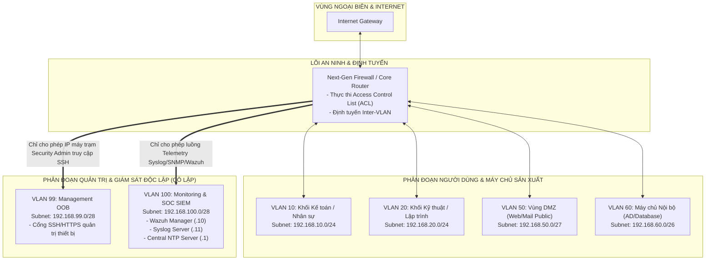

# GIÁO TRÌNH CHUYÊN ĐỀ 3: NETWORK SEGMENTATION (PHÂN ĐOẠN MẠNG & THIẾT KẾ VLAN GIÁM SÁT)

> **Mục tiêu học tập**:
> 1. Hiểu rõ sự khác biệt giữa các mô hình mạng **LAN, MAN, WAN** và vai trò của việc phân đoạn mạng trong kiến trúc phòng thủ chiều sâu (Defense-in-Depth).
> 2. Nắm vững bản chất kỹ thuật của chuẩn đóng gói thẻ mạng **IEEE 802.1Q**, phân biệt cơ chế Access Port, Trunk Port, Native VLAN và các nguy cơ tấn công **VLAN Hopping**.
> 3. Làm chủ phương pháp thiết kế phân đoạn mạng an ninh theo nguyên lý **Zero Trust / Least Privilege**, xây dựng vùng mạng **Management OOB (VLAN 99)** và **Monitoring / SIEM (VLAN 100)** cách ly an toàn.
> 4. Thực hành cấu hình **Inter-VLAN Routing (Router-on-a-Stick & Layer 3 Switch SVI)** và xây dựng bộ chính sách **Extended ACL** bảo vệ hệ thống giám sát.

---

## BÀI 1: PHÂN LOẠI MẠNG & NGUYÊN LÝ PHÂN ĐOẠN MẠNG

### 1.1. So Sánh Các Mô Hình Mạng (LAN vs MAN vs WAN)

```
+-----------------------------------------------------------------------------------------------+
|                    SO SÁNH CÁC MÔ HÌNH MẠNG THEO PHẠM VI ĐỊA LÝ                               |
+-------------------+-------------------------------+-------------------+-----------------------+
| Tiêu Chí          | LAN (Local Area Network)      | MAN (Metropolitan)| WAN (Wide Area Network|
+-------------------+-------------------------------+-------------------+-----------------------+
| Phạm vi địa lý    | Phòng, tòa nhà, Campus (<2km) | Thành phố (10-50km)| Quốc gia, toàn cầu    |
| Băng thông        | Rất lớn (1 Gbps - 100 Gbps)   | Cao (100Mbps - 10G)| Thuê bao ISP (10M-10G)|
| Độ trễ (Latency)  | Cực thấp (< 1 ms)             | Thấp (5 - 20 ms)  | Cao (20 - 150 ms)     |
| Tỷ lệ lỗi bit BER | Rất thấp (10^-9)              | Thấp              | Cao hơn (10^-6)       |
| Quyền sở hữu      | Doanh nghiệp tự sở hữu thiết bị| Thuê của Telco    | Thuê đường truyền ISP |
+-------------------+-------------------------------+-------------------+-----------------------+
```

---

### 1.2. Tại Sao Bắt Buộc Phải Phân Đoạn Mạng (Network Segmentation)?
1. **Thu hẹp miền phát tán bão Broadcast (Broadcast Domain)**: Tránh tình trạng bão broadcast làm tê liệt toàn bộ mạng doanh nghiệp.
2. **Ngăn chặn chuyển động ngang của Hacker (Lateral Movement)**: Nếu một máy trạm trong vùng User bị nhiễm mã độc tống tiền (Ransomware), hacker không thể tự do quét cổng và lây lan trực tiếp sang máy chủ Cơ sở dữ liệu hoặc máy chủ SIEM.
3. **Áp dụng chính sách kiểm soát tối thiểu (Least Privilege)**: Chỉ mở đúng các cổng giao tiếp dịch vụ cần thiết giữa các phân vùng (VD: Máy trạm chỉ được gửi Syslog UDP 514 vào máy chủ Log, cấm mọi truy cập SSH/RDP trái phép).

---

## BÀI 2: CÔNG NGHỆ MẠNG LAN ẢO (VLAN) & CHUẨN IEEE 802.1Q

### 2.1. Cấu Trúc Khung Dữ Liệu Gắn Thẻ Chuẩn 802.1Q
Khi một frame đi qua đường kết nối Trunk giữa hai thiết bị chuyển mạch, switch chèn thêm **4 Bytes (32 bits)** thẻ 802.1Q Tag vào giữa trường *Source MAC* và *EtherType*:

```
+-----------------------------------------------------------------------------------------------+
|                      CẤU TRÚC FRAME ETHERNET CHUẨN 802.1Q (4 BYTES TAG)                       |
+--------------------+---------------------+---------------------+------------------------------+
| Dest MAC (6 Bytes) | Source MAC (6 Bytes)|  802.1Q Tag (4 B)   | EtherType (2 B) | Data | FCS |
+--------------------+---------------------+---------------------+------------------------------+
                                              |
     +----------------------------------------+---------------------------------------+
     | TPID (16 bits) = 0x8100  | PCP (3 bits) | DEI (1 bit) |     VID (12 bits)      |
     +--------------------------+--------------+-------------+------------------------+
```

- **TPID (Tag Protocol Identifier - 16 bits)**: Luôn mang giá trị cố định `0x8100` để báo hiệu cho phần cứng biết frame này đã được gắn thẻ 802.1Q.
- **PCP (Priority Code Point - 3 bits)**: Đánh dấu 8 mức độ ưu tiên chất lượng dịch vụ QoS (0 đến 7) cho các luồng thoại VoIP hoặc video.
- **DEI (Drop Eligible Indicator - 1 bit)**: Cho biết gói tin có thể bị hủy bỏ khi xảy ra nghẽn mạng.
- **VID (VLAN Identifier - 12 bits)**: Định danh VLAN, hỗ trợ tối đa $2^{12} = 4096$ VLANs:
  - `0` và `4095`: Dành riêng cho hệ thống.
  - `1`: VLAN mặc định (Default VLAN).
  - `2` - `1001`: Dải VLAN tiêu chuẩn (Normal Range).
  - `1006` - `4094`: Dải VLAN mở rộng (Extended Range).

---

### 2.2. Phân Loại Cổng Switch & Khái Niệm Native VLAN
- **Access Port**: Cổng dành riêng cho một VLAN duy nhất, nối trực tiếp máy tính người dùng hoặc máy chủ. Khi frame rời khỏi Access Port, Switch **gỡ bỏ hoàn toàn thẻ 802.1Q (Untagged)**.
- **Trunk Port**: Cổng truyền tải đồng thời lưu lượng của nhiều VLAN, nối giữa Switch $\leftrightarrow$ Switch hoặc Switch $\leftrightarrow$ Router. Mọi frame đi qua Trunk Port đều phải **gắn thẻ 802.1Q (Tagged)**.
- **Native VLAN**: Là một VLAN duy nhất trên đường Trunk mà các frame thuộc về nó **không bị gắn thẻ (Untagged)**. 
  - *Mặc định*: Cisco đặt Native VLAN là VLAN 1.
  - *Rủi ro an ninh*: Hacker có thể lợi dụng Native VLAN để tấn công **VLAN Hopping (Double Tagging)** nhảy từ VLAN người dùng sang VLAN nhạy cảm.
  - *Khuyến nghị Hardening*: Đổi Native VLAN sang một VLAN không sử dụng (VD: VLAN 999) trên toàn bộ các cổng Trunk.

---

## BÀI 3: THIẾT KẾ PHÂN ĐOẠN MẠNG GIÁM SÁT AN NINH TOÀN DIỆN



---

### 3.1. Bảng Ma Trận Phân Quyền Truy Cập Giữa Các Vùng (Access Matrix)

| Nguồn \ Đích | Internet | VLAN 10/20 (User) | VLAN 50 (DMZ) | VLAN 60 (Server) | VLAN 99 (Mgmt) | VLAN 100 (Monitoring) |
| :--- | :---: | :---: | :---: | :---: | :---: | :---: |
| **Internet** | - | ❌ DENY | ✅ Chỉ Web/Mail (443/25) | ❌ DENY | ❌ DENY | ❌ DENY |
| **VLAN 10/20 (User)** | ✅ PERMIT | ❌ Cấm chéo giữa các VLAN | ✅ HTTP/HTTPS | ✅ Chỉ dịch vụ được cấp | ❌ DENY | ⚠️ Chỉ gửi Telemetry (Syslog/SNMP) |
| **VLAN 50 (DMZ)** | ✅ PERMIT | ❌ DENY | ❌ DENY | ⚠️ Chỉ truy vấn DB Port 3306 | ❌ DENY | ⚠️ Chỉ gửi Syslog/Agent (1514) |
| **VLAN 99 (Mgmt Admin)** | ✅ PERMIT | ✅ SSH / RDP cứu hộ | ✅ SSH Quản trị | ✅ SSH / RDP Quản trị | ✅ FULL | ✅ HTTPS Web UI (Kibana/Wazuh) |
| **VLAN 100 (SIEM)** | ❌ DENY | ❌ DENY | ❌ DENY | ❌ DENY | ❌ DENY | - (Vùng tiếp nhận dữ liệu 1 chiều) |

---

## BÀI 4: CẤU HÌNH ĐỊNH TUYẾN LIÊN VLAN & CHÍNH SÁCH ACL BẢO VỆ

### 4.1. Cấu Hình Switch Cisco Catalyst (VLAN, Trunking, Port Hardening)
```cisco
! ==============================================================
! 1. KHỞI TẠO CÁC VLAN TRÊN CORE SWITCH
! ==============================================================
Switch# configure terminal
Switch(config)# vlan 10
Switch(config-vlan)# name USER_ZONE_1
Switch(config-vlan)# exit

Switch(config)# vlan 20
Switch(config-vlan)# name USER_ZONE_2
Switch(config-vlan)# exit

Switch(config)# vlan 50
Switch(config-vlan)# name DMZ_SERVERS
Switch(config-vlan)# exit

Switch(config)# vlan 60
Switch(config-vlan)# name INTERNAL_SERVERS
Switch(config-vlan)# exit

Switch(config)# vlan 99
Switch(config-vlan)# name MANAGEMENT_OOB
Switch(config-vlan)# exit

Switch(config)# vlan 100
Switch(config-vlan)# name SOC_MONITORING_SIEM
Switch(config-vlan)# exit

! Tạo VLAN cách ly cho Native VLAN chống VLAN Hopping
Switch(config)# vlan 999
Switch(config-vlan)# name UNUSED_NATIVE_VLAN
Switch(config-vlan)# exit

! ==============================================================
! 2. CẤU HÌNH CỔNG TRUNK KẾT NỐI LÊN ROUTER / FIREWALL
! ==============================================================
Switch(config)# interface GigabitEthernet0/1
 Switch(config-if)# description UPLINK_TO_ROUTER_EDGE
 Switch(config-if)# switchport trunk encapsulation dot1q
 Switch(config-if)# switchport mode trunk
 Switch(config-if)# switchport trunk native vlan 999
 Switch(config-if)# switchport trunk allowed vlan 10,20,50,60,99,100
 Switch(config-if)# no shutdown
 Switch(config-if)# exit
```

---

### 4.2. Cấu Hình Inter-VLAN Routing & Extended ACL Trên Router Cisco
```cisco
! ==============================================================
! 1. CẤU HÌNH SUB-INTERFACES TRÊN ROUTER (ROUTER-ON-A-STICK)
! ==============================================================
Router(config)# interface GigabitEthernet0/0/0
 Router(config-if)# no ip address
 Router(config-if)# no shutdown
 Router(config-if)# exit

! Sub-interface cho VLAN 10 (User)
Router(config)# interface GigabitEthernet0/0/0.10
 Router(config-subif)# encapsulation dot1Q 10
 Router(config-subif)# ip address 192.168.10.1 255.255.255.0
 Router(config-subif)# exit

! Sub-interface cho VLAN 99 (Management OOB)
Router(config)# interface GigabitEthernet0/0/0.99
 Router(config-subif)# encapsulation dot1Q 99
 Router(config-subif)# ip address 192.168.99.1 255.255.255.240
 Router(config-subif)# exit

! Sub-interface cho VLAN 100 (Monitoring & SIEM)
Router(config)# interface GigabitEthernet0/0/0.100
 Router(config-subif)# encapsulation dot1Q 100
 Router(config-subif)# ip address 192.168.100.1 255.255.255.240
 ! Áp dụng Extended ACL bảo vệ vùng giám sát tại chiều ra (Outbound)
 Router(config-subif)# ip access-group ACL_GUARD_MONITORING out
 Router(config-subif)# exit

! ==============================================================
! 2. BỘ LUẬT EXTENDED ACL BẢO VỆ VÙNG GIÁM SÁT (VLAN 100)
! ==============================================================
Router(config)# ip access-list extended ACL_GUARD_MONITORING
 ! 1. Cho phép gửi Syslog từ tất cả các VLAN về máy chủ Syslog (.11)
 permit udp any host 192.168.100.11 eq 514
 permit tcp any host 192.168.100.11 eq 6514
 
 ! 2. Cho phép gửi SNMP Traps từ thiết bị về SIEM Manager (.10)
 permit udp any host 192.168.100.10 eq 162
 
 ! 3. Cho phép Wazuh Agent trên máy chủ/máy trạm đẩy log về Wazuh Server (.10)
 permit tcp any host 192.168.100.10 eq 1514
 permit tcp any host 192.168.100.10 eq 1515

 ! 4. Cho phép các thiết bị đồng bộ thời gian từ Central NTP Server (.1)
 permit udp any host 192.168.100.1 eq 123

 ! 5. Chỉ cho phép duy nhất IP trạm quản trị Admin (.99.10) truy cập Dashboard Web UI & SSH
 permit tcp host 192.168.99.10 host 192.168.100.10 eq 443
 permit tcp host 192.168.99.10 host 192.168.100.10 eq 5601
 permit tcp host 192.168.99.10 host 192.168.100.10 eq 22

 ! 6. Cho phép các gói phản hồi của các phiên TCP hợp lệ đã thiết lập trước đó
 permit tcp any 192.168.100.0 0.0.0.15 established

 ! 7. CHẶN VÀ GHI LOG TOÀN BỘ CÁC TRUY CẬP TRÁI PHÉP KHÁC VÀO VLAN MONITORING
 deny ip any 192.168.100.0 0.0.0.15 log
 permit ip any any
```

---

## BÀI 5: BỘ CÂU HỎI ÔN TẬP & PHẢN BIỆN HỘI ĐỒNG (VIVA Q&A)

### Câu 1: Tại sao phải tách riêng VLAN Management (VLAN 99) và VLAN Monitoring & SIEM (VLAN 100) mà không gộp chung?
- **Trả lời**:
  - `VLAN 99 (Management)` chứa các giao diện điều khiển cấu hình phần cứng có mức độ rủi ro tối cao (SSH CLI, HTTPS Web GUI của Router/Firewall, cổng iDRAC/iLO). Vùng này chỉ trao đổi lưu lượng quản trị hai chiều giữa Security Admin và thiết bị.
  - `VLAN 100 (Monitoring & SIEM)` là vùng lưu trữ chứng cứ số và tiếp nhận khối lượng dữ liệu khổng lồ (Big Data) từ hàng nghìn luồng Syslog/SNMP của toàn mạng. Nếu gộp chung, nguy cơ tắc nghẽn đường truyền quản trị có thể xảy ra khi có sự cố, đồng thời kẻ tấn công nếu xâm nhập được vào máy chủ Syslog sẽ dễ dàng thực hiện tấn công leo thang đặc quyền để kiểm soát toàn bộ hạ tầng mạng.

### Câu 2: Tấn công VLAN Hopping dạng Double Tagging hoạt động thế nào và biện pháp ngăn chặn triệt để?
- **Trả lời**:
  - **Cơ chế**: Hacker gửi frame gắn 2 thẻ 802.1Q tag (Thẻ ngoài là Native VLAN 1, Thẻ trong là VLAN mục tiêu 100). Khi Switch 1 nhận frame, nó bóc thẻ ngoài Native VLAN và đẩy frame sang Switch 2 qua đường Trunk mà không gắn thẻ mới. Khi Switch 2 nhận frame, nó thấy thẻ trong còn nguyên là VLAN 100 nên chuyển tiếp thẳng gói tin vào VLAN 100.
  - **Biện pháp ngăn chặn**:
    1. Không gán bất kỳ máy trạm người dùng nào vào Native VLAN.
    2. Đổi Native VLAN mặc định từ VLAN 1 sang một VLAN rỗng không sử dụng (VD: `switchport trunk native vlan 999`).
    3. Bật tính năng gắn thẻ bắt buộc cho Native VLAN trên toàn switch (`vlan dot1q tag native`).
