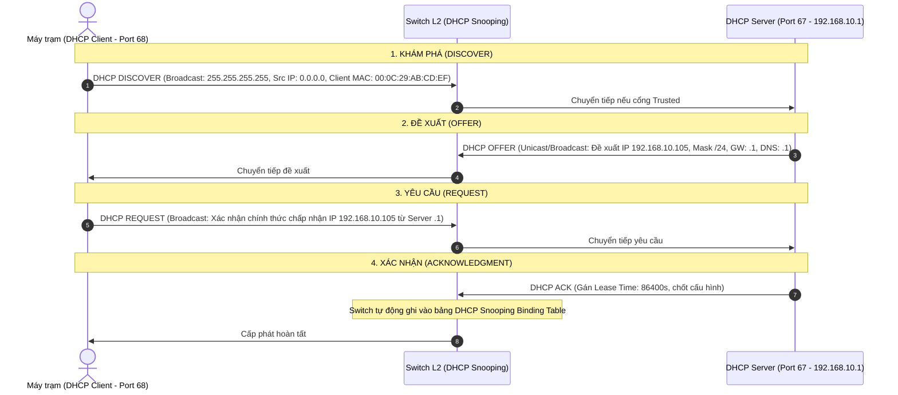
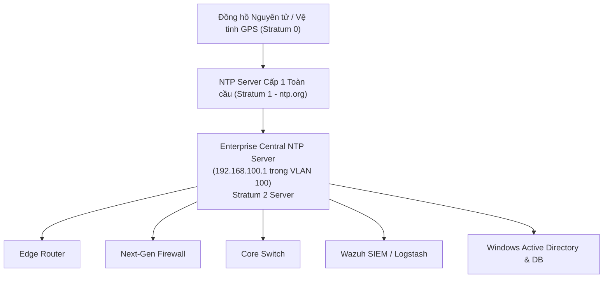

# GIÁO TRÌNH CHUYÊN ĐỀ 4: CORE NETWORK SERVICES (CÁC DỊCH VỤ MẠNG CỐT LÕI & GIÁM SÁT AN NINH)

> **Mục tiêu học tập**:
> 1. Phân tích bản chất vận hành của 4 dịch vụ mạng trọng yếu: **DHCP**, **DNS**, **NAT/PAT**, và **NTP**.
> 2. Nhận diện các hình thức tấn công nguy hiểm nhắm vào dịch vụ cốt lõi: **Rogue DHCP**, **DNS Tunneling**, **DNS Poisoning**, **NTP Spoofing**.
> 3. Nắm vững vai trò mang tính sống còn của **NTP** trong việc bảo đảm tính toàn vẹn và giá trị pháp lý của nhãn thời gian (Timestamp) phục vụ khôi phục dòng sự kiện (**Timeline Reconstruction**) trên hệ thống SIEM.
> 4. Hiểu phương pháp liên kết và đối chiếu nhật ký **NAT Translation Table Logs** với nhật ký Firewall để truy vết địa chỉ IP thực của kẻ tấn công nội bộ.

---

## BÀI 1: DỊCH VỤ CẤP PHÁT ĐỊA CHỈ IP ĐỘNG (DHCP)

### 1.1. Chu Trình 4 Bước DORA Chi Tiết (UDP Port 67/68)



---

### 1.2. Mối Đe Dọa An Ninh & Ý Nghĩa Đối Với Điều Tra Vết (Audit Trail)
- **Tấn công Rogue DHCP Server**: Kẻ gian cắm Router/Laptop phát DHCP lậu vào cổng mạng người dùng. Do tốc độ phản hồi bản tin `DHCP Offer` của máy kẻ tấn công nhanh hơn máy chủ thật, các máy trạm nạn nhân sẽ nhận Default Gateway và DNS Server trỏ thẳng về máy hacker $\rightarrow$ Toàn bộ dữ liệu mật bị nghe lén (Man-In-The-Middle).
- **Phòng thủ bằng DHCP Snooping**: Cấu hình các cổng nối người dùng là `Untrusted` (chặn toàn bộ gói Offer/Ack đi vào) và cổng nối DHCP Server thật là `Trusted`.
- **Ứng dụng trong Điều tra số (Digital Forensics)**: 
  - Trong mạng doanh nghiệp dùng IP động, khi hệ thống IDS/SIEM phát hiện một IP (VD: `192.168.10.105`) thực hiện quét lỗ hổng vào lúc `09:15:32`, SOC bắt buộc phải truy vấn **DHCP Lease Log** để xác định chính xác địa chỉ MAC phần cứng và tên máy tính (Hostname) đã thuê địa chỉ IP đó vào đúng thời điểm trên.

---

## BÀI 2: HỆ THỐNG PHÂN GIẢI TÊN MIỀN (DNS - UDP/TCP PORT 53)

### 2.1. Chu Trình Phân Giải & Các Bản Ghi Cốt Lõi
- **A Record**: Phân giải tên miền sang IPv4.
- **AAAA Record**: Phân giải tên miền sang IPv6.
- **PTR (Pointer) Record**: Phân giải ngược từ địa chỉ IP sang tên miền (Reverse DNS).
- **CNAME**: Bí danh tên miền.
- **MX**: Máy chủ thư điện tử (Mail Exchange).
- **TXT**: Chứa dữ liệu văn bản tùy biến (Dùng cho xác thực SPF, DKIM, DMARC chống giả mạo email).

---

### 2.2. Các Kỹ Thuật Tấn Công Qua DNS & Phương Pháp Giám Sát SIEM

```
+-----------------------------------------------------------------------------------------------+
|                       CÁC MỐI ĐE DỌA AN NINH PHỨC TẠP QUA GIAO THỨC DNS                       |
+-----------------------------------------------------------------------------------------------+
| 1. DNS Tunneling (Tuồn dữ liệu nhạy cảm ra ngoài):                                             |
|    Mã độc chia nhỏ tệp bí mật thành chuỗi Base64 và nhúng vào truy vấn tên miền con:          |
|    "cGFzc3dvcmQxMjM=.attacker-c2-domain.com"                                                  |
|    --> Vượt qua mọi tường lửa truyền thống vì Port 53 UDP luôn được phép thông mạng.           |
|                                                                                               |
| 2. DGA (Domain Generation Algorithm):                                                         |
|    Mã độc sử dụng hạt giống thời gian để sinh hàng nghìn domain ngẫu nhiên mỗi ngày           |
|    (VD: "xq89za12kjhf.biz") để kết nối máy chủ điều khiển Command & Control (C2).              |
|                                                                                               |
| 3. DNS Cache Poisoning (Đầu độc bộ đệm DNS):                                                  |
|    Gửi bản tin DNS Reply giả mạo chèn IP của website lừa đảo vào bộ nhớ tạm của DNS Server.   |
+-----------------------------------------------------------------------------------------------+
```

#### Chiến Lược Giám Sát Nhật Ký DNS Trên SIEM:
1. **Theo dõi độ dài truy vấn (Query Length Anomaly)**: Cảnh báo ngay khi xuất hiện các truy vấn DNS có chiều dài vượt quá 50 ký tự hoặc chứa ký tự Base64/Hexadecimal bất thường (Dấu hiệu DNS Tunneling).
2. **Đối chiếu Threat Intelligence**: Kiểm tra tự động toàn bộ domain được máy trạm truy vấn với danh sách các IOCs (Indicators of Compromise) máy chủ C2 độc hại đã biết.
3. **Phát hiện NXDOMAIN Spike**: Tỷ lệ truy vấn tên miền trả về lỗi không tồn tại (`NXDOMAIN`) tăng đột biến là dấu hiệu của mã độc đang chạy thuật toán DGA để dò tìm máy chủ C2 còn sống.

---

## BÀI 3: DỊCH VỤ BIÊN DỊCH ĐỊA CHỈ MẠNG (NAT / PAT)

### 3.1. Phân Biệt Các Cơ Chế NAT
1. **Static NAT (1:1)**: Ánh xạ 1-1 cố định một IP Private với một IP Public (Dành cho Web Server, Mail Server trong vùng DMZ công khai).
2. **Dynamic NAT (N:M)**: Ánh xạ một nhóm IP Private với một nhóm địa chỉ IP Public khả dụng.
3. **PAT / NAT Overload (N:1)**: Cho phép hàng nghìn máy trạm nội bộ sử dụng chung 1 địa chỉ IP Public duy nhất bằng cách phân biệt thông qua số hiệu cổng giao vận **Layer 4 Source Port**.

```
+-----------------------------------------------------------------------------------------------+
|                       BẢNG BIÊN DỊCH PAT (PORT ADDRESS TRANSLATION)                           |
+-----------------------+-----------------------+-----------------------+-----------------------+
| Inside Local IP (Lan) | Inside Local Port (L4)| Inside Global IP(Wan) | Inside Global Port(L4)|
+-----------------------+-----------------------+-----------------------+-----------------------+
| 192.168.10.15         | 51200 (TCP)           | 203.0.113.10          | 10001 (TCP)           |
| 192.168.10.20         | 51200 (TCP)           | 203.0.113.10          | 10002 (TCP)           |
| 192.168.20.77         | 49800 (TCP)           | 203.0.113.10          | 10003 (TCP)           |
+-----------------------+-----------------------+-----------------------+-----------------------+
```

---

### 3.2. Thách Thức Của NAT Trong Phân Tích Sự Cố & Giải Pháp Tương Quan SIEM
> [!WARNING]
> **TÌNH HUỐNG THỰC TẾ**:
> Một tổ chức cảnh báo an ninh quốc gia (VNCERT) gửi công văn cảnh báo: *"Địa chỉ IP Public `203.0.113.10` xuất phát từ cổng `10002` của công ty bạn đang phát tán mã độc tấn công DoS vào lúc `14:20:15`"*.
> - **Nếu không lưu NAT Log**: Bạn hoàn toàn **bất lực** không thể biết trong số 500 nhân viên của công ty, ai là người sở hữu máy tính phát tán mã độc.
> - **Giải pháp**: Hệ thống SIEM bắt buộc phải thu thập đồng thời cả **NAT Translation Logging** từ Router/Firewall. Khi đối chiếu bản ghi `14:20:15 NAT: 192.168.10.20:51200 -> 203.0.113.10:10002`, SOC sẽ lập tức định danh được máy trạm thủ phạm là `192.168.10.20`.

---

## BÀI 4: GIAO THỨC ĐỒNG BỘ THỜI GIAN CHUẨN (NTP - UDP PORT 123)

> [!CAUTION]
> **YÊU CẦU NỀN TẢNG BẮT BUỘC CỦA MỌI HỆ THỐNG SIEM / SOC**:
> Nếu các thiết bị mạng và máy chủ bị lệch thời gian (Clock Drift) dù chỉ vài giây:
> 1. Toàn bộ các luật tương quan (Correlation Rules) dạng *"Nếu có sự kiện A theo sau bởi sự kiện B trong vòng 10 giây"* sẽ bị **vô hiệu hóa hoàn toàn**.
> 2. Không thể khôi phục chuỗi hành vi xâm nhập của hacker theo trình tự thời gian (**Timeline Reconstruction**).
> 3. Toàn bộ nhật ký số sẽ bị bác bỏ giá trị chứng cứ pháp lý khi giải trình trước tòa án.



---

### 4.1. Mẫu Cấu Hình Chuẩn Hóa NTP & Múi Giờ Trên Cisco IOS
```cisco
! ==============================================================
! CẤU HÌNH ĐỒNG BỘ NTP CHUẨN XÁC ĐẾN MILI-GIÂY
! ==============================================================
Router# configure terminal

! 1. Thiết lập múi giờ Việt Nam (UTC+7)
Router(config)# clock timezone ICT 7 0

! 2. Chuẩn hóa Timestamp cho toàn bộ Syslog và Debug chi tiết đến mili-giây
Router(config)# service timestamps log datetime msec localtime show-timezone
Router(config)# service timestamps debug datetime msec localtime show-timezone
Router(config)# service sequence-numbers

! 3. Chỉ định máy chủ Central NTP Server (Đặt trong VLAN Monitoring 100)
Router(config)# ntp server 192.168.100.1 prefer
Router(config)# ntp source GigabitEthernet0/0/0.100

! 4. Bật cơ chế xác thực MD5 chống tấn công giả mạo nguồn thời gian (NTP Spoofing)
Router(config)# ntp authenticate
Router(config)# ntp authentication-key 1 md5 SecTimeNTPKey2026!
Router(config)# ntp trusted-key 1
```

---

### 4.2. Cấu Hình NTP Client Trên Máy Chủ Linux (Chrony)
```ini
# Tệp cấu hình /etc/chrony/chrony.conf
server 192.168.100.1 iburst prefer
makestep 1.0 3
rtcsync
logdir /var/log/chrony
```
```bash
# Khởi động lại dịch vụ và kiểm tra đồng bộ
sudo systemctl restart chrony
chronyc tracking
chronyc sources -v
```

---

## BÀI 5: BỘ CÂU HỎI ÔN TẬP & PHẢN BIỆN HỘI ĐỒNG (VIVA Q&A)

### Câu 1: Tấn công DNS Tunneling là gì và tại sao tường lửa thông thường không phát hiện được?
- **Trả lời**:
  - `DNS Tunneling` là kỹ thuật đóng gói dữ liệu của các giao thức khác (như SSH, HTTP hoặc dữ liệu đánh cắp) bên trong các bản tin truy vấn DNS chuẩn (`Port 53 UDP`).
  - Tường lửa truyền thống (L3/L4) chỉ kiểm tra số hiệu cổng `53 UDP` và mặc định mở cổng này cho toàn bộ mạng nội bộ để máy trạm phân giải tên miền. Do dữ liệu được mã hóa Base64 và nằm lồng trong trường tên miền con của gói tin DNS hợp lệ, tường lửa thông thường sẽ cho qua mà không phát hiện được bất thường.

### Câu 2: Khái niệm Stratum trong giao thức NTP là gì và Stratum tối đa là bao nhiêu?
- **Trả lời**:
  - `Stratum` là đại lượng đo khoảng cách phân cấp từ một máy chủ NTP đến nguồn xung nhịp thời gian chuẩn gốc:
    - **Stratum 0**: Nguồn thời gian chuẩn nguyên tử (Cesium clock) hoặc tín hiệu vệ tinh định vị GPS.
    - **Stratum 1**: Máy chủ kết nối trực tiếp với thiết bị Stratum 0.
    - **Stratum 2**: Máy chủ đồng bộ từ Stratum 1 (Ví dụ: Máy chủ NTP nội bộ công ty).
    - **Stratum tối đa**: `15` (Mức `16` quy định thiết bị đã mất đồng bộ thời gian hoàn toàn và không được phép sử dụng).
