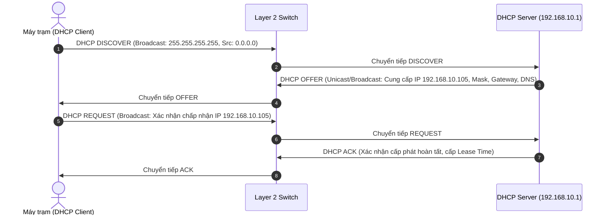
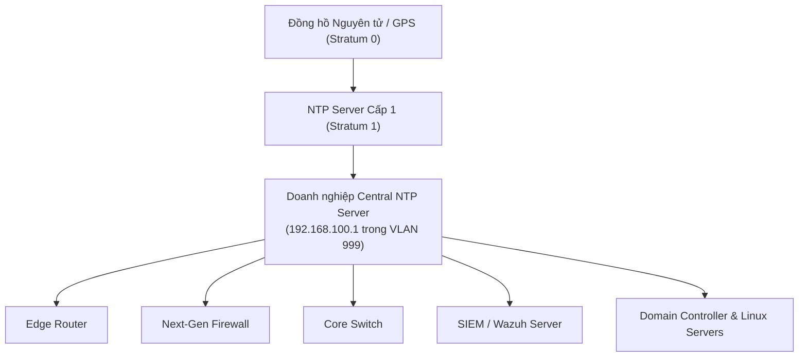

# CHUYÊN ĐỀ 4: CORE NETWORK SERVICES (CÁC DỊCH VỤ MẠNG CỐT LÕI)

> **Mục tiêu**: Phân tích sâu 4 dịch vụ mạng nền tảng: **DHCP**, **DNS**, **NAT** và đặc biệt là **NTP (Đồng bộ thời gian chuẩn)** dưới góc nhìn vận hành an toàn thông tin, phân tích nhật ký (Log Analysis) và phát hiện tấn công trên hệ thống SIEM.

---

## 1. DỊCH VỤ CẤP PHÁT ĐỊA CHỈ IP ĐỘNG (DHCP)

### 1.1. Chu Trình Hoạt Động DORA (Layer 7 - UDP Port 67/68)


### 1.2. Mối Đe Dọa An Ninh & Cơ Chế Giám Sát DHCP
- **Rogue DHCP Server**: Kẻ tấn công cắm thiết bị phát DHCP giả mạo vào mạng nội bộ, cấp Default Gateway và DNS Server trỏ về máy hacker $\rightarrow$ Thực hiện tấn công Man-In-The-Middle (MITM).
- **DHCP Starvation**: Tấn công làm cạn kiệt dải IP của DHCP Server bằng cách gửi hàng triệu gói tin `DHCP Discover` với MAC nguồn giả mạo.
- **Giải pháp bảo vệ & Giám sát**:
  - Bật **DHCP Snooping** trên toàn bộ Switch: Chỉ cho phép bản tin `DHCP Offer / ACK` phát ra từ các cổng `Trusted` (cổng nối DHCP Server thật).
  - **Ý nghĩa trong Điều tra số (Audit Trail)**: Bản ghi nhật ký DHCP Lease (`DHCPACK on 192.168.10.105 to 00:0c:29:ab:cd:ef`) là chứng cứ bắt buộc giúp SOC xác định chính xác địa chỉ IP nào thuộc về máy trạm nào tại từng thời điểm lịch sử.

---

## 2. HỆ THỐNG PHÂN GIẢI TÊN MIỀN (DNS)

### 2.1. Bản Chất Hoạt Động (UDP / TCP Port 53)
DNS chịu trách nhiệm chuyển đổi tên miền dạng người đọc (VD: `internal-portal.corp`, `c2-malicious-domain.com`) sang địa chỉ IP để thiết lập kết nối Layer 3.

```
+-------------------------------------------------------------------------------+
|                       DNS & CÁC KỸ THUẬT TẤN CÔNG NGUY HIỂM                   |
+-------------------------------------------------------------------------------+
| 1. DNS Tunneling (Đánh cắp dữ liệu qua giao thức DNS):                         |
|    Dữ liệu nhạy cảm được mã hóa và chia nhỏ thành các tiền tố domain:         |
|    [user_pass_base64].attacker-controlled-nameserver.com                      |
|    --> Vượt qua hầu hết Firewall truyền thống vì Firewall luôn mở Port 53 UDP.|
|                                                                               |
| 2. C2 Domain Lookup (Botnet Command & Control):                               |
|    Mã độc tự sinh hàng nghìn domain ngẫu nhiên theo thuật toán DGA             |
|    (Domain Generation Algorithm) để liên lạc với máy chủ điều khiển C2.        |
|                                                                               |
| 3. DNS Cache Poisoning / Spoofing:                                            |
|    Làm nhiễm độc bộ nhớ đệm của DNS Server để chuyển hướng người dùng sang    |
|    website lừa đảo (Phishing).                                                |
+-------------------------------------------------------------------------------+
```

### 2.2. Chiến Lược Giám Sát DNS Tại SIEM
- Giám sát **DNS Request Logs**: Bắt buộc mọi máy trạm nội bộ phải truy vấn qua DNS Server của công ty (Chặn mọi truy vấn DNS trực tiếp ra `8.8.8.8` hoặc `1.1.1.1` bằng Firewall Rule).
- Kích hoạt **DNS Threat Intelligence Feeds** trên SIEM/Firewall để tự động cảnh báo khi có máy trạm truy vấn các domain nằm trong danh sách đen (Blacklist).
- Theo dõi các truy vấn DNS có độ dài tên miền bất thường hoặc tần suất truy vấn cao đột biến (Dấu hiệu của DNS Tunneling).

---

## 3. DỊCH VỤ BIÊN DỊCH ĐỊA CHỈ MẠNG (NAT / PAT)

### 3.1. Các Loại NAT & Nguyên Lý Hoạt Động
- **Static NAT (1:1)**: Ánh xạ cố định 1 IP Private với 1 IP Public (thường dùng cho Web/Mail Server trong DMZ).
- **Dynamic NAT (N:M)**: Ánh xạ một nhóm IP Private với một nhóm IP Public khả dụng.
- **PAT / NAT Overload (N:1)**: Kỹ thuật phổ biến nhất, cho phép hàng nghìn máy trạm dùng chung 1 IP Public bằng cách phân biệt thông qua số hiệu cổng **Source Port (Layer 4)**.

```
+-------------------------------------------------------------------------------+
|                  BẢNG ÁNH XẠ PAT (PORT ADDRESS TRANSLATION)                   |
+-------------------+--------------------+------------------+-------------------+
|  Inside Local IP  | Inside Local Port  | Inside Global IP | Inside Global Port|
+-------------------+--------------------+------------------+-------------------+
| 192.168.10.15     | 49152 (TCP)        | 203.0.113.10     | 10001 (TCP)       |
| 192.168.10.20     | 49152 (TCP)        | 203.0.113.10     | 10002 (TCP)       |
| 192.168.10.35     | 51200 (TCP)        | 203.0.113.10     | 10003 (TCP)       |
+-------------------+--------------------+------------------+-------------------+
```

### 3.2. Tác Động Của NAT Đối Với Phân Tích Nhật Ký (Log Correlation)
> [!WARNING]
> Khi máy trạm nội bộ phát tán mã độc ra ngoài Internet, Firewall/Router chỉ ghi nhận địa chỉ IP Public xuất phát (`203.0.113.10:10001`).
> **Để truy vết ra máy trạm gốc (`192.168.10.15`)**, hệ thống SIEM bắt buộc phải thu thập đồng thời cả **NAT Translation Table Logs** và **Firewall Session Logs** để thực hiện tương quan sự kiện theo Timestamp và Source Port.

---

## 4. GIAO THỨC ĐỒNG BỘ THỜI GIAN CHUẨN (NTP - UDP PORT 123)

> [!CAUTION]
> **YÊU CẦU NỀN TẢNG CỦA MỌI HỆ THỐNG SIEM / SOC**:
> Nếu các thiết bị mạng (Router, Switch, Firewall, Servers) không được đồng bộ thời gian từ cùng một máy chủ NTP chuẩn, toàn bộ nhật ký (Logs) sẽ mang các **nhãn thời gian (Timestamps) sai lệch**.
> Khi đó:
> 1. Hệ thống SIEM **không thể liên kết** các sự kiện diễn ra tuần tự (Mất tính năng Correlation).
> 2. Không thể khôi phục lại dòng thời gian sự cố (Timeline Reconstruction).
> 3. Chứng cứ nhật ký mất giá trị pháp lý trong điều tra tội phạm số.



### 4.1. Mẫu Cấu Hình Chuẩn Hóa NTP Trên Thiết Bị Cisco IOS
```cisco
! Đặt múi giờ Việt Nam (UTC+7)
clock timezone ICT 7 0

! Bật chuẩn hóa timestamp chi tiết đến mili-giây cho Log và Debug
service timestamps log datetime msec localtime show-timezone
service timestamps debug datetime msec localtime show-timezone

! Trỏ về máy chủ NTP nội bộ (NTP Server trong VLAN Monitoring 999)
ntp server 192.168.100.1 prefer
ntp source GigabitEthernet0/0/0.999

! Xác thực NTP bằng khóa bảo mật MD5/SHA (Chống tấn công NTP Spoofing)
ntp authenticate
ntp authentication-key 1 md5 NTP_Secret_Key_2026!
ntp trusted-key 1
```

### 4.2. Mẫu Cấu Hình NTP Client Trên Linux (Chrony / NTPd)
```ini
# /etc/chrony/chrony.conf
server 192.168.100.1 iburst prefer
makestep 1.0 3
rtcsync
logdir /var/log/chrony
```
```bash
# Kiểm tra trạng thái đồng bộ thời gian trên Linux
sudo chronyc sources -v
sudo chronyc tracking
```
