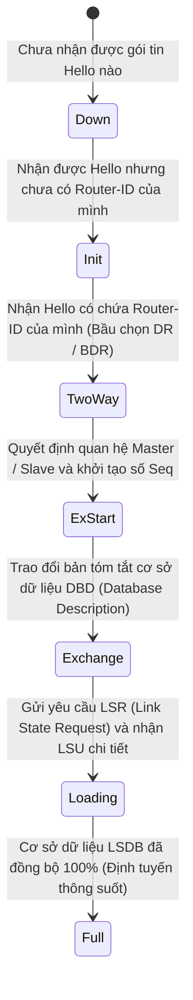

# GIÁO TRÌNH CHUYÊN ĐỀ 5: ROUTING PROTOCOLS (GIAO THỨC ĐỊNH TUYẾN TRONG DOANH NGHIỆP)

> **Mục tiêu học tập**:
> 1. Nắm vững bản chất nguyên lý định tuyến tại Tầng 3 (Network Layer) của mô hình OSI: **Bảng định tuyến (RIB/FIB)**, thuật toán tìm tiền tố dài nhất (**Longest Prefix Match**), và thang đo độ tin cậy **Administrative Distance (AD)**.
> 2. Làm chủ kỹ thuật cấu hình **Static Routing**, **Default Route**, và **Floating Static Route** phục vụ dự phòng đường truyền tự động.
> 3. Hiểu sâu sắc giao thức Link-State chuẩn mở **OSPF**: Thuật toán Dijkstra (SPF), chu trình 7 trạng thái thiết lập láng giềng (**Neighbor Adjacency**), cơ chế bầu chọn **DR/BDR**, và cấu hình mã hóa xác thực MD5 chống tấn công giả mạo định tuyến (**Route Hijacking**).
> 4. Nắm rõ lý do học thuật tại sao đồ án An toàn Mạng lược bỏ RIP và EIGRP để tập trung nghiên cứu OSPF và giám sát định tuyến qua **SIEM Correlation Rule**.

---

## BÀI 1: NGUYÊN LÝ ĐỊNH TUYẾN & ĐỘ TIN CẬY ADMINISTRATIVE DISTANCE

### 1.1. Chu Trình Tra Cứu Longest Prefix Match
Khi một Router nhận được một gói tin có địa chỉ IP đích (VD: `192.168.10.75`), bảng định tuyến FIB có thể chứa nhiều tuyến đường trùng khớp:
1. `192.168.0.0/16` (Cost = 10)
2. `192.168.10.0/24` (Cost = 20)
3. `192.168.10.64/26` (Cost = 50)

> **Quy tắc bất biến**: Router **luôn chọn tuyến có Subnet Mask dài nhất** (cụ thể nhất - cụ thể ở đây là `/26`), bất chấp tuyến đó có chỉ số Metric hay Cost cao hơn các tuyến khác!

---

### 1.2. Bảng Tra Cứu Độ Tin Cậy Administrative Distance (AD)

Khi Router học được cùng một dải mạng đích từ nhiều nguồn giao thức khác nhau, nó sẽ ưu tiên đưa tuyến có giá trị **Administrative Distance nhỏ nhất** vào bảng định tuyến:

```
+-----------------------------------------------------------------------------------------------+
|                    BẢNG THỨ BẬC ƯU TIÊN ADMINISTRATIVE DISTANCE (AD)                          |
+-----------------------------------+-------------------+---------------------------------------+
| Nguồn Thông Tin Định Tuyến        | AD Mặc Định       | Ý Nghĩa Kỹ Thuật                      |
+-----------------------------------+-------------------+---------------------------------------+
| **Directly Connected**            | **`0`**           | Cổng vật lý cắm trực tiếp đang UP     |
| **Static Route**                  | **`1`**           | Quản trị viên cấu hình thủ công       |
| **eBGP** (External BGP)           | **`20`**          | Định tuyến giữa các hệ tự trị AS      |
| **EIGRP (Internal)**              | **`90`**          | Giao thức lai nâng cao của Cisco      |
| **OSPF** (Open Shortest Path)     | **`110`**         | Giao thức Link-State chuẩn mở quốc tế |
| **IS-IS**                         | **`115`**         | Dùng trong mạng nhà cung cấp dịch vụ  |
| **RIP** (Routing Info Protocol)   | **`120`**         | Giao thức Distance Vector cũ          |
| **iBGP** (Internal BGP)           | **`200`**         | BGP chạy bên trong một AS             |
+-----------------------------------+-------------------+---------------------------------------+
```

---

## BÀI 2: ĐỊNH TUYẾN TĨNH (STATIC ROUTING)

### 2.1. Cấu Trúc Lệnh & Các Dạng Cấu Hình Điển Hình

```cisco
! 1. Định tuyến tĩnh tiêu chuẩn (Chỉ định rõ IP của Next-Hop)
Router(config)# ip route 192.168.50.0 255.255.255.224 10.0.0.2

! 2. Tuyến đường mặc định (Default Route - Gateway of Last Resort)
! Chuyển tiếp toàn bộ các gói tin không có trong bảng định tuyến ra Internet Gateway
Router(config)# ip route 0.0.0.0 0.0.0.0 203.0.113.1

! 3. Tuyến dự phòng trôi nổi (Floating Static Route)
! Gán AD = 10 (lớn hơn AD = 1 của đường chính) -> Chỉ xuất hiện khi đường chính bị đứt
Router(config)# ip route 0.0.0.0 0.0.0.0 203.0.113.5 10
```

---

### 2.2. Đánh Giá Ưu & Nhược Điểm Dưới Góc Nhìn An Ninh
- **Ưu điểm an ninh**: Không phát tán bất kỳ bản tin quảng bá định tuyến nào ra môi trường mạng, triệt tiêu hoàn toàn nguy cơ bị hacker nghe lén sơ đồ mạng (Topology Sniffing) hoặc đầu độc bảng định tuyến. Tiêu tốn cực ít tài nguyên CPU.
- **Nhược điểm**: Khả năng chịu lỗi kém, không tự động tìm đường tránh khi liên kết trung gian bị đứt đoạn.

---

## BÀI 3: GIAO THỨC ĐỊNH TUYẾN ĐỘNG OSPF (OPEN SHORTEST PATH FIRST)

### 3.1. Bản Chất Link-State & Thuật Toán Dijkstra (SPF)
OSPF (RFC 2328) hoạt động theo nguyên lý trạng thái đường liên kết:
1. Mỗi Router gửi các gói tin **LSA (Link-State Advertisement)** để mô tả trạng thái và chi phí của các cổng mạng trực tiếp của mình.
2. Các Router trao đổi LSA với nhau để xây dựng một cơ sở dữ liệu trạng thái đường liên kết **LSDB (Link-State Database)** hoàn toàn giống hệt nhau trên toàn vùng (Area).
3. Mỗi Router tự chạy thuật toán **Dijkstra** trên LSDB để tự dựng cây đường đi ngắn nhất (Shortest Path Tree) với chính nó làm gốc, từ đó suy ra các tuyến đường tối ưu đưa vào bảng định tuyến.
4. **Công thức tính Cost**: $\text{Cost} = \frac{\text{Reference Bandwidth (100 Mbps)}}{\text{Interface Bandwidth (bps)}}$.

---

### 3.2. Chu Trình 7 Trạng Thái Thiết Lập Láng Giềng OSPF (Neighbor States)



- **DR (Designated Router) & BDR (Backup Designated Router)**: Được bầu chọn trong mạng Multi-access (Ethernet) để làm trung tâm tiếp nhận và phân phối LSA qua địa chỉ Multicast `224.0.0.6`, giúp giảm số lượng kết nối láng giềng từ $\frac{N(N-1)}{2}$ xuống còn $N$.
- **Địa chỉ Multicast OSPF**:
  - `224.0.0.5`: Gửi tới **tất cả** các OSPF Router (All SPF Routers).
  - `224.0.0.6`: Gửi tới **chỉ DR và BDR** (All DR Routers).

---

### 3.3. Cấu Hình OSPF Kèm Xác Thực Mã Hóa An Toàn (MD5 Authentication)
```cisco
! ==============================================================
! CẤU HÌNH TIẾN TRÌNH OSPF VÀ BẬT BẢO MẬT CHỐNG ROUTE HIJACKING
! ==============================================================
Router# configure terminal
Router(config)# router ospf 1
 ! 1. Khai báo Router ID duy nhất
 Router(config-router)# router-id 1.1.1.1
 
 ! 2. Quảng bá mạng DMZ và Mạng User vào Backbone Area 0
 Router(config-router)# network 192.168.50.0 0.0.0.31 area 0
 Router(config-router)# network 192.168.10.0 0.0.0.255 area 0
 
 ! 3. Bật Passive Interface trên cổng người dùng (Không gửi Hello ra mạng LAN)
 Router(config-router)# passive-interface GigabitEthernet0/0/0.10
 Router(config-router)# exit

! 4. Bật xác thực MD5 trên liên kết kết nối sang Router khác
Router(config)# interface GigabitEthernet0/0/1
 Router(config-if)# ip ospf authentication message-digest
 Router(config-if)# ip ospf message-digest-key 1 md5 SecOSPFKey2026!
 Router(config-if)# exit
```

---

## BÀI 4: LÝ DO LƯỢC BỎ RIP VÀ EIGRP TRONG BỐI CẢNH AN TOÀN MẠNG

```
+-----------------------------------------------------------------------------------------------+
|                    SO SÁNH CÁC GIAO THỨC ĐỊNH TUYẾN ĐỘNG NỘI MIỀN                             |
+-------------------+-----------------------+-----------------------+---------------------------+
| Tiêu Chí          | RIPv2 (Bị lược bỏ)    | EIGRP (Bị lược bỏ)    | OSPF (Được lựa chọn)      |
+-------------------+-----------------------+-----------------------+---------------------------+
| Loại giao thức    | Distance Vector       | Advanced Distance Vec | **Link-State (Chuẩn mở)** |
| Metric sử dụng    | Hop Count (Tối đa 15) | Băng thông + Độ trễ   | **Băng thông (Cost)**     |
| Thời gian hội tụ  | Rất chậm (30 giây)    | Rất nhanh (DUAL)      | **Nhanh**                 |
| Tính mở rộng      | Kém                   | Tốt                   | **Rất tốt (Chia Area)**   |
| Tiêu chuẩn hóa    | Chuẩn mở (Lỗi thời)   | Độc quyền Cisco       | **Chuẩn mở quốc tế (IETF)**|
| Hỗ trợ Multi-vendor| Có                   | Hạn chế               | **Hoàn hảo trên mọi hãng**|
+-------------------+-----------------------+-----------------------+---------------------------+
```

> **Kết luận học thuật**:
> 1. `RIP`: Đã quá lạc hậu, chỉ hỗ trợ tối đa 15 hop, không phản ánh đúng tốc độ băng thông thực tế của mạng gigabit hiện đại.
> 2. `EIGRP`: Mặc dù có hiệu năng cao nhưng mang tính chất độc quyền của Cisco trong lịch sử, không phù hợp cho đồ án an toàn mạng triển khai hệ thống giám sát đa nền tảng (Multi-vendor SIEM monitoring gồm Linux Router, Fortinet Firewall, Cisco Switch).
> 3. `OSPF`: Là giao thức Link-State chuẩn mở toàn cầu, là tiêu chuẩn công nghiệp bắt buộc trong mọi trung tâm dữ liệu và mạng doanh nghiệp.

---

## BÀI 5: GIÁM SÁT AN NINH ĐỊNH TUYẾN TRÊN HỆ THỐNG SIEM

### 5.1. Phân Tích Bản Tin Cảnh Báo Syslog OSPF
Khi một liên kết OSPF bị ngắt quãng bất thường (do đứt cáp, tấn công làm rớt Hello hoặc tấn công giả mạo Router ID), Router Cisco IOS sẽ lập tức bắn bản tin Syslog mức Severity 5 (Notice):

```syslog
%OSPF-5-ADJCHG: Process 1, Nbr 192.168.10.2 on GigabitEthernet0/0/1 from FULL to DOWN, Neighbor Down: Dead timer expired
```

---

### 5.2. Mẫu Rule Wazuh SIEM Giám Sát Sự Cố Định Tuyến
Tệp cấu hình `/var/ossec/etc/rules/local_rules.xml`:

```xml
<group name="cisco_ios,ospf,routing_alert,">
  <!-- Rule mức độ nghiêm trọng 10 (Critical) bắt sự kiện OSPF Neighbor bị DOWN -->
  <rule id="100020" level="10">
    <if_sid>4100</if_sid>
    <match>%OSPF-5-ADJCHG</match>
    <regex>from FULL to DOWN</regex>
    <description>CRITICAL ALERT: OSPF Neighbor Adjacency Lost (FULL to DOWN) on Cisco Router - Potential Physical Link Cut or Route Hijacking Attack!</description>
    <group>network_availability,link_down,</group>
    <mitre>
      <id>T1498</id>
    </mitre>
  </rule>
</group>
```

---

## BÀI 6: BỘ CÂU HỎI ÔN TẬP & PHẢN BIỆN HỘI ĐỒNG (VIVA Q&A)

### Câu 1: Tại sao phải cấu hình lệnh `passive-interface` trên các cổng nối xuống người dùng trong mạng OSPF?
- **Trả lời**:
  - Khi OSPF được kích hoạt trên một cổng, mặc định Router sẽ định kỳ phát các gói tin `Hello OSPF` ra cổng đó.
  - Nếu cổng đó cắm vào mạng người dùng (VLAN 10), kẻ tấn công có thể chạy công cụ bắt gói tin để đọc trộm cấu trúc mạng (Router ID, Area ID, Subnet) hoặc dựng một máy ảo chạy phần mềm định tuyến giả mạo (như Quagga/FRRouting) để kết nối láng giềng với Router thật và bơm bảng định tuyến độc hại (Route Injection).
  - Lệnh `passive-interface` giúp quảng bá mạng đó vào OSPF nhưng **ngăn chặn tuyệt đối việc phát và nhận gói tin Hello** trên cổng đó.

### Câu 2: Thuật toán Dijkstra trên OSPF có ngăn chặn được hiện tượng vòng lặp định tuyến (Routing Loop) không?
- **Trả lời**:
  - **Có, hoàn toàn triệt tiêu vòng lặp bên trong một Area (Intra-area loop-free)**. Do tất cả các Router trong cùng một Area đều sở hữu bản sao cơ sở dữ liệu LSDB giống hệt nhau, thuật toán Dijkstra tính toán cây đường đi ngắn nhất (SPF Tree) đảm bảo cấu trúc dạng cây phân nhánh không có chu trình khép kín.
  - Giữa các Area khác nhau (Inter-area), OSPF áp dụng kiến trúc phân cấp hình sao bắt buộc mọi Area đều phải kết nối qua **Backbone Area 0** để ngăn chặn vòng lặp liên vùng.
