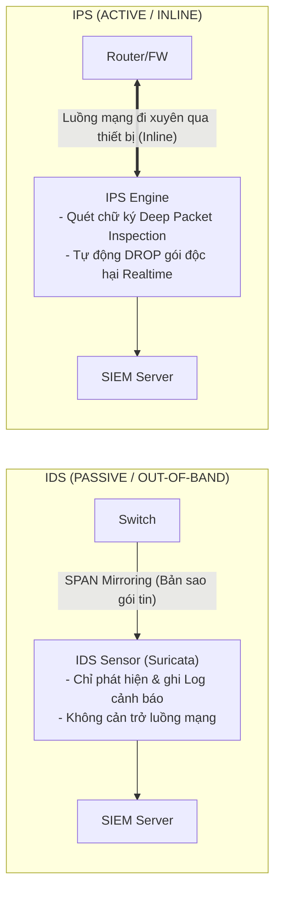

# CHUYÊN ĐỀ 6: NETWORK SECURITY (AN TOÀN MẠNG & CÁC KỊCH BẢN TẤN CÔNG)

> **Mục tiêu**: Nắm vững các công nghệ phòng thủ hạ tầng mạng gồm **Firewall & ACLs**, **VPN (IPsec / SSL-VPN)**, **Hệ thống IDS/IPS (Suricata/Snort)** và nhận diện chính xác các dấu hiệu của **các dạng tấn công mạng phổ biến** thông qua bản ghi nhật ký (Syslog / SIEM Alerts).

---

## 1. TƯỜNG LỬA (FIREWALL) & DANH SÁCH KIỂM SOÁT TRUY CẬP (ACL)

### 1.1. So Sánh Standard ACL vs Extended ACL
- **Standard ACL (1-99, 1300-1999)**: Chỉ kiểm tra **địa chỉ IP nguồn** (Source IP). Thường được đặt ở vị trí gần đích nhất có thể.
- **Extended ACL (100-199, 2000-2699)**: Kiểm tra đa chiều: **Source IP**, **Destination IP**, **Giao thức (TCP/UDP/ICMP)**, **Cổng dịch vụ (Port)** và cờ TCP (`established`). Thường được đặt ở vị trí gần nguồn nhất có thể.

### 1.2. Chính Sách An Ninh Dựa Trên Vùng (Zone-Based Security Policy trên NGFW)
Tường lửa hiện đại hoạt động dựa trên cấu trúc các **Vùng An Ninh (Security Zones)**:

```
+---------------------------------------------------------------------------------------+
|                       ZONE-BASED POLICY RULE STRUCTURE (NGFW)                         |
+---------------------------------------------------------------------------------------+
| [From-Zone]  | [To-Zone]  | [Source]       | [Destination]  | [Application/Port] | [Action] |
+--------------+------------+----------------+----------------+--------------------+----------+
| Trust (LAN)  | Untrust    | Any (User IPs) | Any            | HTTP, HTTPS, DNS   | ACCEPT   |
| Untrust      | DMZ        | Any            | Web-Server-IP  | HTTPS (443)        | ACCEPT   |
| Trust (LAN)  | Monitoring | Admin-Workstat | SIEM-Server-IP | HTTPS, SSH         | ACCEPT   |
| Trust (LAN)  | Monitoring | Any            | Any            | ANY                | DROP+LOG |
+---------------------------------------------------------------------------------------+
```

---

## 2. MẠNG RIÊNG ẢO (VPN - VIRTUAL PRIVATE NETWORK)

### 2.1. IPsec Site-to-Site VPN
- Dùng để thiết lập đường hầm mã hóa an toàn giữa 2 mạng chi nhánh văn phòng qua Internet.
- **IKE Phase 1**: Đàm phán bảo mật kênh điều khiển (Xác thực Pre-Shared Key/RSA, Thuật toán mã hóa AES-256, Băm SHA-256, Nhóm Diffie-Hellman Group 14+).
- **IKE Phase 2**: Đàm phán đường hầm truyền dữ liệu IPsec SA (Giao thức **ESP - Encapsulating Security Payload** đảm bảo tính bí mật và toàn vẹn, mã hóa toàn bộ IP payload).

### 2.2. SSL-VPN (Remote Access VPN)
- Cung cấp quyền truy cập từ xa an toàn cho các kỹ sư SOC và quản trị viên hệ thống để giám sát hạ tầng mạng ngoài giờ làm việc.
- Sử dụng giao thức TLS/SSL qua cổng HTTPS 443 tiêu chuẩn, dễ dàng vượt qua các tường lửa trung gian của nhà mạng.

---

## 3. HỆ THỐNG PHÁT HIỆN & NGĂN CHẶN XÂM NHẬP (IDS / IPS)



| Tiêu chí so sánh | Hệ thống IDS (Intrusion Detection) | Hệ thống IPS (Intrusion Prevention) |
| :--- | :--- | :--- |
| **Vị trí triển khai** | Nằm ngoài đường truyền (Out-of-band / SPAN Mirror Port) | Đặt trực tiếp trên đường truyền (Inline) |
| **Hành động phản ứng** | Gửi cảnh báo (Alert), xuất bản ghi Log về SIEM | Cảnh báo + Tự động Drop gói tin độc hại ngay lập tức |
| **Ảnh hưởng hệ thống** | Không làm tăng độ trễ (Latency) của mạng nếu IDS quá tải | Có thể làm chậm mạng hoặc gây ngắt quãng nếu cấu hình sai chữ ký (False Positive Drop) |
| **Vai trò với SIEM** | Cung cấp nguồn log phân tích hành vi tấn công | Cung cấp log ngăn chặn thành công và nguồn IP tấn công |

---

## 4. CÁC DẠNG TẤN CÔNG PHỔ BIẾN & DẤU HIỆU NHẬN DIỆN TRÊN SIEM

| Dạng Tấn Công | Kỹ Thuật & Công Cụ Thường Dùng | Dấu Hiệu Nhận Diện Cốt Lõi Trên Log / SIEM | Giải Pháp Ngăn Chặn |
| :--- | :--- | :--- | :--- |
| **Brute-Force Đăng nhập** | `Hydra`, `Medusa`, `Patator` vét cạn mật khẩu SSH, RDP, Web Login | • Hàng loạt bản tin `%SEC_LOGIN-4-LOGIN_FAILED` hoặc Windows `Event ID 4625` liên tiếp trong thời gian ngắn.<br>• Xuất hiện $\ge 5$ lần thất bại/phút từ cùng 1 IP nguồn. | • Khóa tài khoản sau 5 lần sai (Account Lockout).<br>• Bật xác thực 2 yếu tố (MFA).<br>• Cấu hình Fail2ban tự động block IP. |
| **ARP Poisoning / Spoofing** | `Ettercap`, `Arpspoof`, `Bettercap` gửi ARP Reply giả mạo để MITM | • Bản tin cảnh báo từ Switch: `%SW_DAI-4-PACKET_DROPPED: Denied ARP packet`.<br>• Cùng 1 IP nhưng ánh xạ thay đổi liên tục giữa 2 địa chỉ MAC khác nhau trong bảng ARP. | • Bật **Dynamic ARP Inspection (DAI)** kết hợp **DHCP Snooping** trên Switch. |
| **MAC Address Flooding** | `Macof` gửi hàng trăm nghìn frame mang MAC nguồn ngẫu nhiên | • CAM Table của switch tăng vọt lên mức tối đa ($100\%$ dung lượng).<br>• Switch chuyển sang chế độ Hub (Fail-open) khiến lưu lượng bị phát tán toàn mạng. | • Bật **Port Security** (Giới hạn tối đa 1-2 MAC/port, action: `shutdown`). |
| **DoS / DDoS (SYN Flood, ICMP)** | `hping3`, `LOIC`, `Scapy` gửi bão gói tin SYN không gửi lại ACK | • Traffic băng thông tăng đột biến trên biểu đồ NetFlow.<br>• CPU Router/Firewall vọt lên $90-100\%$.<br>• Bảng State Table / Half-open Connections trên Firewall bị đầy. | • Bật **TCP SYN Flood Protection / SYN Cookies**.<br>• Cấu hình **CoPP** và Rate-limiting ICMP. |
| **Port Scanning / Reconnaissance** | `Nmap` (SYN Scan `-sS`), `Masscan` quét toàn bộ dải cổng | • Firewall / IDS ghi nhận 1 IP nguồn liên tục gửi gói tin tới hàng loạt cổng khác nhau (`21, 22, 23, 80, 443, 445, 3389...`) trong vài giây. | • IDS/IPS Rule tự động phát hiện Port Scan.<br>• Block IP quét cổng bằng Firewall Dynamic Blacklist. |
| **Thay Đổi Cấu Hình Trái Phép** | Can thiệp trái phép vào CLI của Router / Switch / Firewall | • Syslog ghi nhận: `%SYS-5-CONFIG_I: Configured from console by admin`.<br>• Diễn ra ngoài giờ làm việc hành chính hoặc từ IP không thuộc VLAN Management 99. | • Bật tính năng AAA Authentication (RADIUS/TACACS+).<br>• Bật Rule tương quan SIEM cảnh báo biến động config. |
