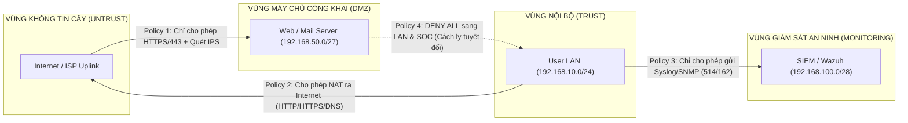
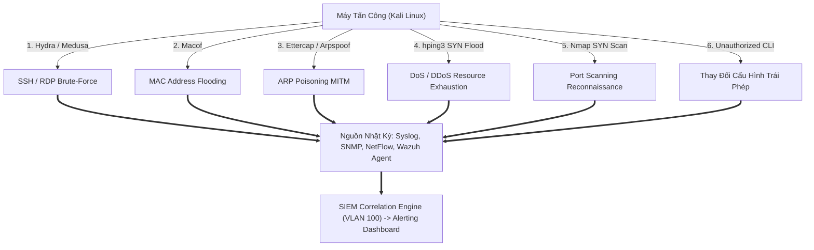

# GIÁO TRÌNH CHUYÊN ĐỀ 6: NETWORK SECURITY (AN TOÀN MẠNG & CÁC KỊCH BẢN TẤN CÔNG)

> **Mục tiêu học tập**:
> 1. Hiểu sâu sắc cơ chế hoạt động của các công nghệ phòng thủ hạ tầng mạng: **Firewall & ACLs**, **VPN (IPsec / SSL-VPN)**, và hệ thống **IDS/IPS (Suricata / Snort)**.
> 2. Phân biệt rõ sự khác nhau giữa hai chế độ hoạt động của cảm biến an ninh: **Passive (SPAN Mirroring IDS)** và **Active (Inline IPS)**.
> 3. Nắm vững kỹ thuật và dấu hiệu nhận diện trong bản ghi nhật ký (**Log Signatures**) của 6 dạng tấn công mạng kinh điển: **Brute-Force**, **MAC Flooding**, **ARP Poisoning**, **DoS/DDoS**, **Port Scanning**, và **Unauthorized Configuration**.
> 4. Làm chủ bộ câu hỏi phản biện chuyên sâu phục vụ bảo vệ đồ án trước Hội đồng chấm thi.

---

## BÀI 1: TƯỜNG LỬA (FIREWALL) & ACCESS CONTROL LISTS (ACL)

### 1.1. So Sánh Chi Tiết Standard ACL vs Extended ACL

```
+-----------------------------------------------------------------------------------------------+
|                      SO SÁNH BỘ LỌC ACCESS CONTROL LIST (ACL) TRÊN CISCO                      |
+-------------------+-----------------------------------+---------------------------------------+
| Tiêu Chí          | Standard ACL (1-99, 1300-1999)    | Extended ACL (100-199, 2000-2699)     |
+-------------------+-----------------------------------+---------------------------------------+
| Phạm vi kiểm tra  | **Chỉ kiểm tra IP Nguồn**         | **Source IP, Dest IP, Protocol, Port**|
| Kiểm soát Layer 4 | Không (Không phân biệt TCP/UDP)   | Có (Kiểm tra Port 80, 443, 22, 514...) |
| Kiểm soát cờ TCP  | Không                             | Có (`established` - kiểm tra cờ ACK)  |
| Vị trí đặt tối ưu | **Đặt gần ĐÍCH nhất có thể**      | **Đặt gần NGUỒN nhất có thể**         |
| Tiêu hao tài nguyên| Rất thấp                          | Trung bình (Được tăng tốc bởi TCAM)   |
+-------------------+-----------------------------------+---------------------------------------+
```

---

### 1.2. Chính Sách An Ninh Dựa Trên Vùng (Zone-Based Security Policy)
Trong các dòng Next-Gen Firewall (như FortiGate, Palo Alto, Cisco Firepower), chính sách không gán vào từng cổng vật lý đơn lẻ mà gán vào các **Vùng An Ninh (Security Zones)**:



---

## BÀI 2: MẠNG RIÊNG ẢO (VPN - VIRTUAL PRIVATE NETWORK)

### 2.1. IPsec Site-to-Site VPN (Kết Nối Liên Chi Nhánh)
IPsec hoạt động tại Tầng 3 (Network Layer) thông qua hai giai đoạn đàm phán bảo mật:

1. **IKE Phase 1 (Internet Key Exchange - ISAKMP Tunnel)**:
   - Mục đích: Thiết lập kênh truyền điều khiển bảo mật hai chiều giữa 2 Gateway.
   - Các tham số đàm phán (**HAGLE**):
     - **H**ash: SHA-256 / SHA-512.
     - **A**uthentication: Pre-Shared Key (PSK) hoặc Digital Certificate (RSA).
     - **G**roup (Diffie-Hellman): DH Group 14 (2048-bit) hoặc DH Group 19/20 (Elliptic Curve).
     - **L**ifetime: 86400 giây (24 giờ).
     - **E**ncryption: AES-256 hoặc AES-GCM.
2. **IKE Phase 2 (IPsec SA - Data Tunnel)**:
   - Sử dụng giao thức **ESP (Encapsulating Security Payload - Protocol 50)** để mã hóa toàn bộ gói tin IP người dùng và xác thực tính toàn vẹn (HMAC-SHA).

---

### 2.2. SSL-VPN (Remote Access VPN Cho Đội Ngũ SOC & Quản Trị)
- Cung cấp kết nối từ xa bảo mật cho quản trị viên an ninh truy cập vào VLAN Management 99 / VLAN Monitoring 100 ngoài giờ làm việc.
- Hai chế độ triển khai:
  - **Web Mode (Clientless)**: Truy cập giao diện quản trị qua trình duyệt Web HTTPS.
  - **Tunnel Mode (Client-based)**: Cài đặt phần mềm VPN Client (FortiClient, OpenVPN) tạo card mạng ảo (Virtual NIC) truy cập toàn diện mạng nội bộ.

---

## BÀI 3: HỆ THỐNG PHÁT HIỆN & NGĂN CHẶN XÂM NHẬP (IDS / IPS)

```
+-----------------------------------------------------------------------------------------------+
|                         SO SÁNH TOÀN DIỆN HỆ THỐNG IDS VÀ IPS                                 |
+-------------------+-----------------------------------+---------------------------------------+
| Tiêu Chí          | IDS (Intrusion Detection System)  | IPS (Intrusion Prevention System)     |
+-------------------+-----------------------------------+---------------------------------------+
| Vị trí triển khai | **Ngoại tuyến (Out-of-band / SPAN)**| **Trực tiếp trên đường truyền (Inline)**|
| Cơ chế bắt gói    | Switch nhân bản 1 bản sao gói tin | Gói tin thật đi xuyên qua phần cứng   |
| Tác động trễ mạng | **Hoàn toàn 0% ảnh hưởng mạng**   | Thêm độ trễ xử lý (1-5 ms)            |
| Khả năng can thiệp| Chỉ gửi cảnh báo (Alert) về SIEM  | **Tự động hủy gói tin độc hại (Drop)**|
| Rủi ro hệ thống   | Kẻ tấn công có thể kịp khai thác  | Rủi ro chặn nhầm dịch vụ thật (FP Drop)|
| Phần mềm mã nguồn | **Suricata, Snort, Zeek**         | **Suricata (Inline mode), Snort DAQ** |
+-------------------+-----------------------------------+---------------------------------------+
```

---

### 3.1. Cấu Trúc Bản Ghi Cảnh Báo Của IDS Sensor (Suricata EVE JSON)
Khi phát hiện lưu lượng quét cổng hoặc khai thác lỗ hổng, Suricata đẩy bản ghi định dạng JSON về Logstash/SIEM:

```json
{
  "timestamp": "2026-09-16T14:30:15.123456+0700",
  "flow_id": 1087293847291823,
  "event_type": "alert",
  "src_ip": "192.168.10.77",
  "src_port": 49152,
  "dest_ip": "192.168.50.10",
  "dest_port": 80,
  "proto": "TCP",
  "alert": {
    "action": "allowed",
    "gid": 1,
    "signature_id": 2010935,
    "rev": 3,
    "signature": "ET SCAN Suspicious Nmap User-Agent Detected",
    "category": "Attempted Information Leak",
    "severity": 2
  }
}
```

---

## BÀI 4: BẢNG PHÂN TÍCH CHUYÊN SÂU 6 DẠNG TẤN CÔNG MẠNG KINH ĐIỂN



---

### Bảng Chi Tiết Kỹ Thuật, Dấu Hiệu Nhật Ký & Giải Pháp Phòng Ngự:

| Dạng Tấn Công | Công Cụ & Kỹ Thuật Tấn Công | Dấu Hiệu Nhận Diện Cốt Lõi Trên Log / SIEM | Quy Tắc Tương Quan (SIEM Rule) & Giải Pháp |
| :--- | :--- | :--- | :--- |
| **1. Brute-Force Đăng Nhập** | `Hydra`, `Medusa`, `Patator` vét cạn từ điển SSH (22), RDP (3389) | • Linux: `Failed password for root from 192.168.10.77 port 49152 ssh2`.<br>• Windows: `Event ID 4625 (Logon Failure)`. | • **Rule SIEM**: $\ge 5$ lần failed login trong 60 giây từ 1 IP $\rightarrow$ Cảnh báo Level 12.<br>• **Phòng vệ**: Bật xác thực MFA, Fail2ban tự động block IP. |
| **2. MAC Flooding** | `macof` phát sinh hàng trăm nghìn frame mang địa chỉ MAC nguồn ngẫu nhiên | • CAM Table của switch đạt $100\%$ dung lượng trong 2 giây.<br>• Switch phát sinh bản tin `%SW_DAI-4-PACKET_DROPPED` hoặc chuyển chế độ Hub. | • **Rule SIEM**: Bắt biến động dung lượng CAM Table qua SNMP OID.<br>• **Phòng vệ**: Bật **Port Security** (`switchport port-security maximum 2`, `violation shutdown`). |
| **3. ARP Poisoning (MITM)** | `Ettercap`, `Arpspoof` gửi bản tin Gratuitous ARP Reply giả mạo IP Gateway | • Switch Syslog: `%SW_DAI-4-PACKET_DROPPED: Denied ARP packet on Gi0/5`.<br>• Trạm nạn nhân ghi nhận cùng 1 IP Gateway nhưng MAC thay đổi liên tục. | • **Rule SIEM**: Tương quan sự kiện gói tin ARP bị drop từ Switch DAI.<br>• **Phòng vệ**: Bật **Dynamic ARP Inspection (DAI)** kết hợp **DHCP Snooping**. |
| **4. DoS / DDoS (SYN Flood)** | `hping3 -S --flood -p 80` gửi bão gói tin SYN không phản hồi ACK | • NetFlow: Lưu lượng Inbound tăng vọt bất thường.<br>• Tỷ lệ cờ TCP SYN cao áp đảo ($>95\%$) so với cờ ACK/FIN.<br>• CPU Router/Firewall đạt ngưỡng $100\%$. | • **Rule SIEM**: Tương quan lưu lượng NetFlow Top Talkers và CPU OID SNMP.<br>• **Phòng vệ**: Bật **TCP SYN Cookies / SYN Protection**, cấu hình **CoPP**. |
| **5. Port Scanning (Recon)** | `nmap -sS -p 1-1000 -T4` quét trinh sát toàn bộ dải cổng mở | • Firewall Traffic Log: 1 IP nguồn liên tục gửi gói tin tới hàng trăm Destination Port khác nhau trong vòng vài giây.<br>• Suricata Alert: `ET SCAN Suspicious Nmap`. | • **Rule SIEM**: 1 Source IP gửi gói tin tới $\ge 15$ Destination Ports khác nhau trong 10s $\rightarrow$ Cảnh báo Port Scan.<br>• **Phòng vệ**: Đưa IP vào Blacklist động. |
| **6. Thay Đổi Config Trái Phép** | Kẻ gian hoặc nhân viên nội bộ can thiệp vào CLI thiết bị ngoài thẩm quyền | • Cisco Syslog: `%SYS-5-CONFIG_I: Configured from console by admin`.<br>• Thời gian phát sinh: Ngoài giờ hành chính (sau 18h) hoặc từ IP ngoài VLAN 99. | • **Rule SIEM**: Bắt bản tin `%SYS-5-CONFIG_I` ngoài khung giờ làm việc $\rightarrow$ Cảnh báo Level 10.<br>• **Phòng vệ**: Triển khai AAA TACACS+/RADIUS, cấm ghi đè cấu hình. |

---

## BÀI 5: BỘ CÂU HỎI ÔN TẬP & PHẢN BIỆN HỘI ĐỒNG (VIVA Q&A)

### Câu 1: Tại sao kẻ tấn công lại ưa chuộng kỹ thuật quét cổng TCP SYN Scan (`nmap -sS`) hơn là TCP Connect Scan (`nmap -sT`)?
- **Trả lời**:
  - `TCP Connect Scan (-sT)` hoàn thành đầy đủ chu trình bắt tay 3 bước (SYN $\rightarrow$ SYN-ACK $\rightarrow$ ACK) với hệ điều hành máy đích. Do kết nối TCP được thiết lập trọn vẹn, ứng dụng máy chủ (như Nginx, Apache) sẽ ghi nhận đầy đủ bản ghi nhật ký truy cập (Access Log), khiến hacker dễ dàng bị phát hiện.
  - `TCP SYN Scan (-sS)` là kỹ thuật quét nửa vời (Half-open Scanning). Khi máy đích phản hồi `SYN-ACK` (chứng tỏ cổng đang mở), máy tấn công lập tức gửi gói tin `RST` (Reset) để ngắt kết nối ngay lập tức mà không gửi lại ACK. Hệ điều hành máy đích không coi đây là phiên kết nối hoàn chỉnh nên ứng dụng không ghi nhận log, giúp hacker tàng hình trước các máy chủ không có IDS.

### Câu 2: Tấn công ARP Poisoning cho phép kẻ tấn công làm được những gì trong mạng nội bộ?
- **Trả lời**:
  - Bằng cách đầu độc bảng ARP Cache của máy trạm nạn nhân và Default Gateway, hacker biến máy tính của mình thành thiết bị trung chuyển bắt buộc (Man-In-The-Middle - MITM).
  - Từ vị trí này, hacker có thể:
    1. **Nghe lén toàn bộ dữ liệu bản rõ (Sniffing)**: Mật khẩu Telnet, HTTP, FTP.
    2. **Chiếm đoạt phiên làm việc (Session Hijacking)**: Đánh cắp Cookie/Session Token.
    3. **Chỉnh sửa dữ liệu trên đường truyền (Tampering)**: Bơm mã độc vào các luồng tải file của người dùng.
    4. **Thực hiện tấn công DoS cục bộ**: Hủy bỏ âm thầm toàn bộ gói tin khiến nạn nhân mất mạng.
