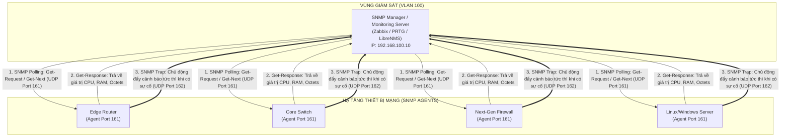
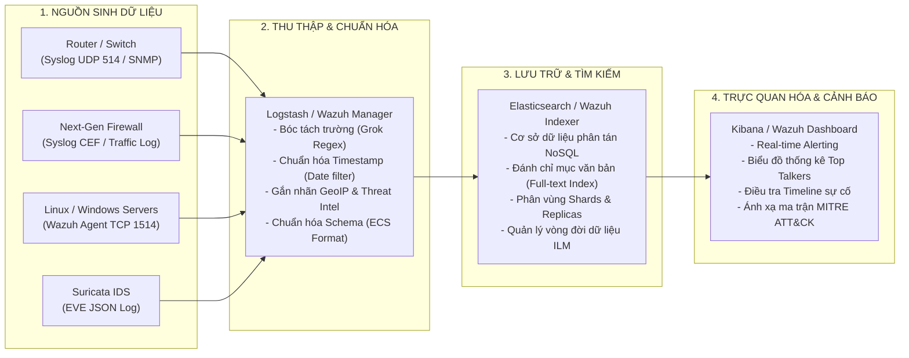
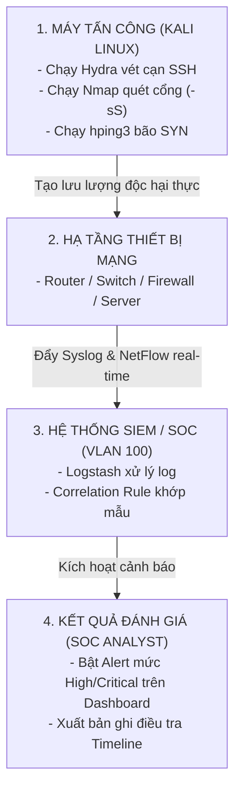

# GIÁO TRÌNH CHUYÊN ĐỀ 7: MONITORING & LOGGING (HỆ THỐNG GIÁM SÁT & QUẢN LÝ NHẬT KÝ TẬP TRUNG - TRỌNG TÂM ĐỀ TÀI)

> **Mục tiêu học tập**:
> 1. Đây là **chuyên đề cốt lõi trọng tâm của toàn bộ đồ án**, cung cấp kiến thức học thuật chuyên sâu và kỹ năng thực hành xây dựng Trung tâm điều hành an ninh mạng (**SOC / SIEM**).
> 2. Nắm vững bản chất kỹ thuật của giao thức **SNMP (v1/v2c/v3)**, cấu trúc cây **MIB & OID**, phân biệt chu trình **Polling** và **Traps/Informs**, cấu hình an ninh chuẩn **SNMPv3 USM (authPriv)**.
> 3. Làm chủ chuẩn nhật ký hệ thống **Syslog (RFC 5424)**, công thức tính toán **Priority (PRI)**, phân cấp **8 mức Severity (0-7)**, bảng **Facilities (0-23)**, và cơ chế truyền tin an toàn qua **TCP/TLS Port 6514**.
> 4. Hiểu rõ kiến trúc **Pipeline xử lý dữ liệu lớn (ELK Stack / Wazuh SIEM)** từ bước thu thập (Ingestion), bóc tách trường dữ liệu (Parsing/Normalization bằng Grok Regex), lưu trữ đánh chỉ mục (Elasticsearch Indexing) đến trực quan hóa và phát hiện cảnh báo trên Dashboard (Kibana/Wazuh).
> 5. Thành thạo kỹ năng viết các **Luật tương quan sự kiện (SIEM Correlation Rules)** đa tầng, ánh xạ khung ma trận tấn công **MITRE ATT&CK**, và triển khai kịch bản kiểm thử giả lập tấn công thực tế (**Hydra, Nmap, hping3**) để đo lường các chỉ số hiệu năng an ninh mạng (**KPIs: Detection Time, False Positive Rate, Traceability**).

---

## BÀI 1: GIAO THỨC QUẢN LÝ MẠNG SNMP (SIMPLE NETWORK MANAGEMENT PROTOCOL)



---

### 1.1. So Sánh Chi Tiết Các Phiên Bản SNMP

| Tiêu Chí | SNMPv1 (RFC 1157) | SNMPv2c (RFC 1901) | SNMPv3 (RFC 3411-3418) - **Khuyến Nghị Đồ Án** |
| :--- | :--- | :--- | :--- |
| **Xác thực danh tính** | Community String (Bản rõ Plaintext) | Community String (Bản rõ Plaintext) | Tên người dùng (**Username**) + Mã băm xác thực (**HMAC-SHA-256**) |
| **Bảo mật dữ liệu** | Không có (Bản rõ Plaintext) | Không có (Bản rõ Plaintext) | **Mã hóa đối xứng AES-128 / AES-256** |
| **Tính toàn vẹn (Integrity)**| Không bảo vệ | Không bảo vệ | Chống giả mạo gói tin (Message Authentication Code) |
| **Mức độ an ninh (USM)** | Không hỗ trợ | Không hỗ trợ | • `noAuthNoPriv`: Không xác thực, không mã hóa.<br>• `authNoPriv`: Có xác thực (SHA), không mã hóa.<br>• `authPriv`: **Xác thực (SHA) + Mã hóa (AES)**. |
| **Giao thức mở rộng** | Cơ bản | Bổ sung lệnh `GetBulkRequest` | Kế thừa `GetBulk` + Bổ sung tầng an ninh USM & VACM |

---

### 1.2. Cây Cơ Sở Dữ Liệu Quản Lý (MIB) & Bảng Tra Cứu OID Cốt Lõi
- **MIB (Management Information Base)**: Cấu trúc phân cấp hình cây quy định định danh tham số quản lý.
- **OID (Object Identifier)**: Chuỗi số thập phân định vị chính xác nhánh tham số trên cây MIB.

```
                         [ iso(1) ]
                             |
                         [ org(3) ]
                             |
                         [ dod(6) ]
                             |
                      [ internet(1) ]
                             |
             +---------------+---------------+
             |                               |
       [ mgmt(2) ]                     [ private(4) ]
             |                               |
        [ mib-2(1) ]                  [ enterprises(1) ]
             |                               |
    +--------+--------+               [ cisco(9) ]
    |        |        |                      |
[system(1)] [ip(4)] [interfaces(2)]   [ciscoMgmt(9)]
```

#### Bảng OID Giám Sát An Ninh Chuẩn:
| Tham Số Giám Sát | Chuỗi OID Chuẩn (Standard OID) | Mô Tả & Ý Nghĩa An Ninh |
| :--- | :--- | :--- |
| **System Description** | `.1.3.6.1.2.1.1.1.0` | Tên hệ điều hành, phiên bản phần mềm (Tra cứu lỗ hổng CVE) |
| **System Uptime** | `.1.3.6.1.2.1.1.3.0` | Thời gian chạy liên tục (Phát hiện thiết bị khởi động lại do tấn công DoS) |
| **Interface Admin Status** | `.1.3.6.1.2.1.2.2.1.7.{ifIndex}` | Trạng thái cổng do quản trị viên gán (`1=up`, `2=down`) |
| **Interface Oper Status** | `.1.3.6.1.2.1.2.2.1.8.{ifIndex}` | Trạng thái hoạt động vật lý thực tế của cổng (`1=up`, `2=down`) |
| **Inbound Traffic Octets** | `.1.3.6.1.2.1.2.2.1.10.{ifIndex}` | Tổng số byte nhận vào (Tính toán lưu lượng và phát hiện nghẽn) |
| **Outbound Traffic Octets**| `.1.3.6.1.2.1.2.2.1.16.{ifIndex}` | Tổng số byte đẩy ra (Phát hiện rò rỉ dữ liệu Data Exfiltration) |
| **Cisco CPU 5-min Load** | `.1.3.6.1.4.1.9.9.109.1.1.1.1.5.1` | Tỷ lệ phần trăm chiếm dụng CPU trung bình 5 phút của Cisco Router |

---

### 1.3. Mẫu Cấu Hình SNMPv3 Bảo Mật Toàn Diện (authPriv) Trên Cisco IOS
```cisco
! ==============================================================
! CẤU HÌNH SNMPv3 VỚI XÁC THỰC SHA VÀ MÃ HÓA AES-256
! ==============================================================
Router# configure terminal

! 1. Tạo Access Control List chỉ cho phép máy chủ Monitoring (VLAN 100) truy vấn SNMP
Router(config)# ip access-list standard ACL_SNMP_NMS
 Router(config-std-nacl)# permit 192.168.100.10
 Router(config-std-nacl)# exit

! 2. Tạo SNMP View giới hạn các nhánh MIB được phép đọc
Router(config)# snmp-server view VIEW_MONITORING iso included

! 3. Tạo SNMP Group với quyền đọc (read-only) và gán chính sách an ninh authPriv
Router(config)# snmp-server group GRP_SOC_ADMIN v3 priv read VIEW_MONITORING access ACL_SNMP_NMS

! 4. Tạo SNMP User với thuật toán xác thực SHA và mã hóa AES
Router(config)# snmp-server user usr_soc_admin GRP_SOC_ADMIN v3 auth sha AuthPass_SHA2026! priv aes 256 PrivKey_AES2026!

! 5. Cấu hình gửi bản tin SNMP Traps tức thì về máy chủ Monitoring khi có sự cố
Router(config)# snmp-server enable traps
Router(config)# snmp-server host 192.168.100.10 version 3 priv usr_soc_admin
```

---

## BÀI 2: CHUẨN NHẬT KÝ HỆ THỐNG SYSLOG (RFC 3164 VS RFC 5424)

### 2.1. Cấu Trúc Khung Nhật Ký Chuẩn Hiện Đại (RFC 5424)
Bản tin Syslog chuẩn RFC 5424 được cấu trúc hóa rõ ràng thành các trường:

```
<PRI>VERSION TIMESTAMP HOSTNAME APP-NAME PROCID MSGID [STRUCTURED-DATA] MSG
```

- **Ví dụ thực tế**:
  `<134>1 2026-09-16T14:35:22.105+07:00 R1-Edge sshd 2045 ID49 [exampleSDID@32473 iut="3" eventSource="Application"] Failed password for invalid user admin from 192.168.10.77 port 49152 ssh2`

---

### 2.2. Công Thức Tính Priority (PRI) & Bảng 8 Mức Severity

$$\text{PRI} = (\text{Facility} \times 8) + \text{Severity}$$

- **Ví dụ tính toán**: Một bản tin sinh ra từ dịch vụ xác thực an ninh (**Facility = 4 / authpriv**) có mức độ cảnh báo nguy kịch (**Severity = 2 / Critical**) sẽ mang giá trị PRI là:
  $$\text{PRI} = (4 \times 8) + 2 = 34 \implies \text{Tiêu đề gói tin: } \mathbf{<34>}$$

#### Bảng Phân Cấp 8 Mức Severity Chuẩn:
| Mức | Tên Mức (Severity) | Từ Khóa | Mô Tả Tình Huống Kỹ Thuật |
| :---: | :--- | :--- | :--- |
| **`0`** | **Emergency** | `emerg` | Hệ thống sập hoàn toàn, không thể sử dụng (Kernel panic, mất nguồn) |
| **`1`** | **Alert** | `alert` | Cần can thiệp khẩn cấp tức thì (Hỏng cơ sở dữ liệu an ninh, IPS engine sập) |
| **`2`** | **Critical** | `crit` | Tình trạng nguy kịch (Hỏng phần cứng module mạng, rớt đường truyền chính) |
| **`3`** | **Error** | `err` | Điều kiện lỗi (Không thể kết nối dịch vụ, lỗi phân quyền truy cập file) |
| **`4`** | **Warning** | `warning` | Cảnh báo rủi ro tiềm ẩn (Dung lượng RAM hoặc Disk đạt ngưỡng $90\%$) |
| **`5`** | **Notice** | `notice` | Sự kiện thông thường nhưng đáng chú ý (**Cổng mạng UP/DOWN, OSPF láng giềng thay đổi**) |
| **`6`** | **Informational** | `info` | Bản tin thông tin hoạt động bình thường (**User đăng nhập thành công**) |
| **`7`** | **Debug** | `debug` | Thông tin chi tiết phục vụ lập trình viên và gỡ lỗi chuyên sâu |

---

### 2.3. Bảng Phân Loại Nguồn Sinh Nhật Ký (Facilities)
| Facility ID | Tên Mã (Keyword) | Nguồn Sinh Nhật Ký |
| :---: | :--- | :--- |
| `0` | `kern` | Nhân hệ điều hành (Kernel) |
| `1` | `user` | Tiến trình ứng dụng người dùng |
| `3` | `daemon` | Các dịch vụ chạy nền của hệ thống (DNS daemon, NTP daemon) |
| `4` | `auth` / `authpriv` | **Xác thực an ninh và cấp quyền (SSH login, sudo)** |
| `16 - 23` | `local0` - `local7` | **Dành riêng cho thiết bị mạng**: `local4` (Cisco IOS), `local7` (Next-Gen Firewall) |

---

### 2.4. So Sánh Giao Thức Truyền: UDP Port 514 vs TCP/TLS Port 6514

```
+-----------------------------------------------------------------------------------------------+
|                    SO SÁNH CƠ CHẾ TRUYỀN TẢI SYSLOG (UDP VS TCP/TLS)                          |
+-------------------+-----------------------------------+---------------------------------------+
| Tiêu Chí          | Syslog UDP Port 514               | Syslog qua TCP / TLS Port 6514        |
+-------------------+-----------------------------------+---------------------------------------+
| Độ tin cậy        | Không đảm bảo (Có thể mất gói)    | **Đảm bảo 100% không mất gói tin (TCP)**|
| Tính bí mật       | Dữ liệu gửi dạng rõ (Dễ bị sniff) | **Mã hóa toàn bộ đường truyền bằng TLS**|
| Tiêu hao tài nguyên| Cực kỳ nhẹ, thiết bị mạng gửi nhanh| Yêu cầu phiên TLS và tài nguyên CPU   |
| Ứng dụng thực tế  | Switch, Router nội bộ             | **Firewall biên, Máy chủ chứa dữ liệu nhạy cảm** |
+-------------------+-----------------------------------+---------------------------------------+
```

---

## BÀI 3: THỐNG KÊ LUỒNG DỮ LIỆU MẠNG (FLEXIBLE NETFLOW / IPFIX)

- **Nguyên lý**: Khác với giải pháp bắt trọn gói tin (Full Packet Capture - tốn hàng chục Terabyte lưu trữ), NetFlow chỉ ghi nhận siêu dữ liệu (Metadata) của luồng truyền thông.
- **7 Thông số định danh luồng (Flow Keys)**:
  1. `Source IP Address`
  2. `Destination IP Address`
  3. `Source Port (Layer 4)`
  4. `Destination Port (Layer 4)`
  5. `Layer 3 Protocol (TCP, UDP, ICMP)`
  6. `Ingress Interface (Cổng đi vào)`
  7. `Type of Service (IP ToS / DSCP)`

```cisco
! ==============================================================
! CẤU HÌNH FLEXIBLE NETFLOW TRÊN CISCO ROUTER ĐẨY VỀ SIEM
! ==============================================================
Router(config)# flow record FLOW_REC_SECURITY
 Router(config-flow-record)# match ipv4 source address
 Router(config-flow-record)# match ipv4 destination address
 Router(config-flow-record)# match ipv4 protocol
 Router(config-flow-record)# match transport source-port
 Router(config-flow-record)# match transport destination-port
 Router(config-flow-record)# collect counter bytes long
 Router(config-flow-record)# collect counter packets long
 Router(config-flow-record)# collect timestamp sys-uptime first
 Router(config-flow-record)# collect timestamp sys-uptime last
 Router(config-flow-record)# exit

Router(config)# flow exporter FLOW_EXP_SIEM
 Router(config-flow-exporter)# destination 192.168.100.10
 Router(config-flow-exporter)# source GigabitEthernet0/0/0.100
 Router(config-flow-exporter)# transport udp 2055
 Router(config-flow-exporter)# version 9
 Router(config-flow-exporter)# exit

Router(config)# flow monitor FLOW_MON_SECURITY
 Router(config-flow-monitor)# record FLOW_REC_SECURITY
 Router(config-flow-monitor)# exporter FLOW_EXP_SIEM
 Router(config-flow-monitor)# cache timeout active 60
 Router(config-flow-monitor)# exit

Router(config)# interface GigabitEthernet0/0/0.10
 Router(config-subif)# ip flow monitor FLOW_MON_SECURITY input
 Router(config-subif)# exit
```

---

## BÀI 4: HỆ THỐNG QUẢN LÝ THÔNG TIN & SỰ KIỆN AN NINH (SIEM)

### 4.1. Kiến Trúc Pipeline Thu Thập, Xử Lý & Trực Quan Hóa (ELK Stack & Wazuh)



---

### 4.2. Các Giai Đoạn Xử Lý Dữ Liệu Trong SIEM Pipeline
1. **Thu thập (Ingestion)**: Tiếp nhận các luồng dữ liệu thô qua nhiều cổng mạng và giao thức khác nhau.
2. **Chuẩn hóa (Normalization / Parsing)**: Chuyển đổi các định dạng log không đồng nhất của nhiều hãng (Cisco, Fortinet, Windows Event Log, Linux Auth) về một lược đồ chuẩn chung (**Elastic Common Schema - ECS**), gồm các trường thống nhất: `source.ip`, `destination.ip`, `event.action`, `user.name`.
3. **Tương quan sự kiện (Event Correlation)**: Động cơ phân tích đối chiếu chuỗi sự kiện theo thời gian thực để phát hiện các mẫu hành vi tấn công phức tạp.
4. **Cảnh báo (Alerting)**: Tự động gửi thông báo khẩn cấp (Email, Telegram, Webhook) cho kỹ sư SOC khi một luật tương quan bị vi phạm.
5. **Lưu trữ lâu dài & Tuân thủ (Compliance)**: Lưu trữ log an toàn theo mô hình **WORM (Write Once, Read Many)** để phục vụ điều tra số.

---

## BÀI 5: TẬP LUẬT TƯƠNG QUAN SỰ KIỆN THỰC TẾ (SIEM CORRELATION RULES)

> [!IMPORTANT]
> **HƯỚNG DẪN KỸ THUẬT KHI TRIỂN KHAI TRÊN WAZUH SIEM**:
> 1. Mọi luật tùy biến do người dùng tự viết (**Custom Rules**) bắt buộc phải khai báo trong tệp `/var/ossec/etc/rules/local_rules.xml` với giá trị **`id >= 100000`** để tránh trùng lặp với bộ rule hệ thống.
> 2. Các tham số `if_sid` trong mẫu (như `5710`, `4100`) là ID rule cha mẫu. Khi triển khai trên phiên bản Wazuh thực tế, kỹ sư SOC cần tra cứu chính xác Rule ID bằng lệnh:
>    `grep -rn "Failed password" /var/ossec/ruleset/rules/` hoặc kiểm tra trực tiếp trên giao diện **Wazuh Management > Rules**.

---

### 5.1. Use Case 1: Tấn Công Vét Cạn Mật Khẩu SSH (Brute-Force Attack)
- **Logic phát hiện**: Phát hiện từ 5 lần đăng nhập SSH thất bại trở lên trong vòng 60 giây xuất phát từ cùng một địa chỉ IP nguồn.

```xml
<group name="syslog,sshd,attack_detection,">
  <!-- Rule cơ sở: Bắt sự kiện 1 lần đăng nhập SSH thất bại (khớp rule cha 5710 trong sshd_rules.xml) -->
  <rule id="100001" level="5">
    <if_sid>5710</if_sid>
    <match>Failed password for</match>
    <description>Single SSH Authentication Failure Detected.</description>
    <group>authentication_failed,</group>
  </rule>

  <!-- Rule tương quan: Bắt tần suất lặp lại >= 5 lần trong 60 giây từ cùng IP nguồn -->
  <rule id="100002" level="12" frequency="5" timeframe="60">
    <if_matched_sid>100001</if_matched_sid>
    <same_source_ip />
    <description>CRITICAL ALERT: SSH Brute-Force Attack in Progress from IP: $(srcip)</description>
    <mitre>
      <id>T1110.001</id>
    </mitre>
  </rule>
</group>
```

---

### 5.2. Use Case 2: Thay Đổi Cấu Hình Thiết Bị Mạng Trái Phép Ngoài Giờ Hành Chính
- **Logic phát hiện**: Bản tin Syslog ghi nhận lệnh thay đổi cấu hình `%SYS-5-CONFIG_I` xuất hiện ngoài khung giờ làm việc hành chính (từ 18h tối hôm trước đến 7h sáng hôm sau) hoặc vào các ngày cuối tuần.

```xml
<group name="cisco_ios,compliance,">
  <!-- Rule bắt sự kiện thay đổi cấu hình thiết bị Cisco ngoài giờ làm việc -->
  <rule id="100010" level="10">
    <if_sid>4100</if_sid>
    <match>%SYS-5-CONFIG_I</match>
    <time>6:00 pm - 7:00 am</time>
    <description>SECURITY WARNING: Unauthorized Network Device Configuration Change Detected After Hours by User: $(dstuser)</description>
    <mitre>
      <id>T1059.008</id>
    </mitre>
  </rule>
</group>
```

---

### 5.3. Use Case 3: Thiết Bị Mạng Mất Kết Nối (Heartbeat / Device Down)
- **Logic phát hiện**: Một thiết bị mạng định kỳ gửi bản tin SNMP Traps hoặc Syslog thông thường, nếu hệ thống SIEM không nhận được bất kỳ telemetry nào trong vòng 5 phút liên tục $\rightarrow$ Kích hoạt cảnh báo `Host Offline / Link Disruption`.

---

## BÀI 6: KỊCH BẢN KIỂM THỬ THỰC TẾ & TIÊU CHÍ ĐÁNH GIÁ SOC



### 6.1. Các Lệnh Thực Hành Giả Lập Tấn Công (Test Commands)
```bash
# 1. Kịch bản Brute-force SSH vào máy chủ Linux:
hydra -l root -P /usr/share/wordlists/rockyou.txt ssh://192.168.10.50 -t 4

# 2. Kịch bản Quét cổng trinh sát mạng (Port Scanning):
nmap -sS -p 1-1000 -T4 192.168.10.1

# 3. Kịch bản Giả lập DoS SYN Flood:
sudo hping3 -S --flood -p 80 192.168.50.10
```

---

### 6.2. Bộ Chỉ Số Đánh Giá Hiệu Quả Hệ Thống (SOC Key Performance Indicators)

1. **Detection Time (Thời gian phát hiện)**: Khoảng thời gian từ khi máy tấn công gửi gói tin đầu tiên đến khi màn hình Dashboard SIEM xuất hiện cảnh báo (Mục tiêu đồ án: $< 5\text{ giây}$).
2. **False Positive Rate (Tỷ lệ cảnh báo giả)**: Tỷ lệ các cảnh báo sai khi người dùng hợp lệ thao tác nhầm (Mục tiêu: $< 1\%$).
3. **Traceability (Khả năng truy vết ngược)**: Từ một dòng cảnh báo trên SIEM, kiểm tra xem báo cáo có thể truy vết đầy đủ chuỗi thông tin:
   $$\text{NTP Timestamp} \longrightarrow \text{IP Nguồn} \longrightarrow \text{IP Đích} \longrightarrow \text{Tài khoản đích} \longrightarrow \text{Payload gốc}$$

---

## BÀI 7: BỘ CÂU HỎI ÔN TẬP & PHẢN BIỆN HỘI ĐỒNG (VIVA Q&A)

### Câu 1: Tại sao SNMPv3 lại được coi là tiêu chuẩn bắt buộc cho an toàn mạng thay vì SNMPv2c?
- **Trả lời**:
  - `SNMPv2c` truyền toàn bộ thông tin quản trị và mật khẩu (Community String) dưới dạng bản rõ (Plaintext). Bất kỳ kẻ tấn công nào bắt được gói tin SNMPv2c trên đường truyền đều có thể đọc trộm các tham số nhạy cảm hoặc thậm chí dùng lệnh `SetRequest` để chiếm quyền điều khiển và thay đổi cấu hình thiết bị mạng.
  - `SNMPv3` bổ sung mô hình bảo mật người dùng (**USM - User-based Security Model**) cung cấp đầy đủ 3 trụ cột an toàn thông tin:
    1. **Xác thực (Authentication)**: Dùng hàm băm SHA-256 xác thực người dùng.
    2. **Mã hóa bí mật (Privacy / Encryption)**: Mã hóa toàn bộ gói tin bằng chuẩn AES-256 chống nghe lén.
    3. **Kiểm tra tính toàn vẹn (Integrity Check)**: Ngăn chặn kẻ tấn công chỉnh sửa gói tin trên đường truyền.

### Câu 2: Sự khác nhau cơ bản giữa Hệ thống Quản lý Nhật ký tập trung (Centralized Log Management - CLM) và Hệ thống SIEM là gì?
- **Trả lời**:
  - `CLM (Centralized Log Management)` (như Rsyslog, Syslog-ng thông thường): Chỉ đóng vai trò là một kho lưu trữ tập trung dữ liệu thô. Nó nhận log từ các thiết bị và lưu vào ổ cứng, hỗ trợ tìm kiếm cơ bản nhưng **không có khả năng hiểu ngữ cảnh hoặc phân tích tương quan**.
  - `SIEM (Security Information and Event Management)` (như Wazuh, ELK Stack): Là hệ thống thông minh hơn rất nhiều. Sau khi nhận log, SIEM sẽ **chuẩn hóa dữ liệu**, đưa qua **động cơ tương quan (Correlation Engine)** để xâu chuỗi nhiều sự kiện rời rạc lại với nhau, tự động phát hiện hành vi tấn công phức tạp và kích hoạt cảnh báo theo thời gian thực.
