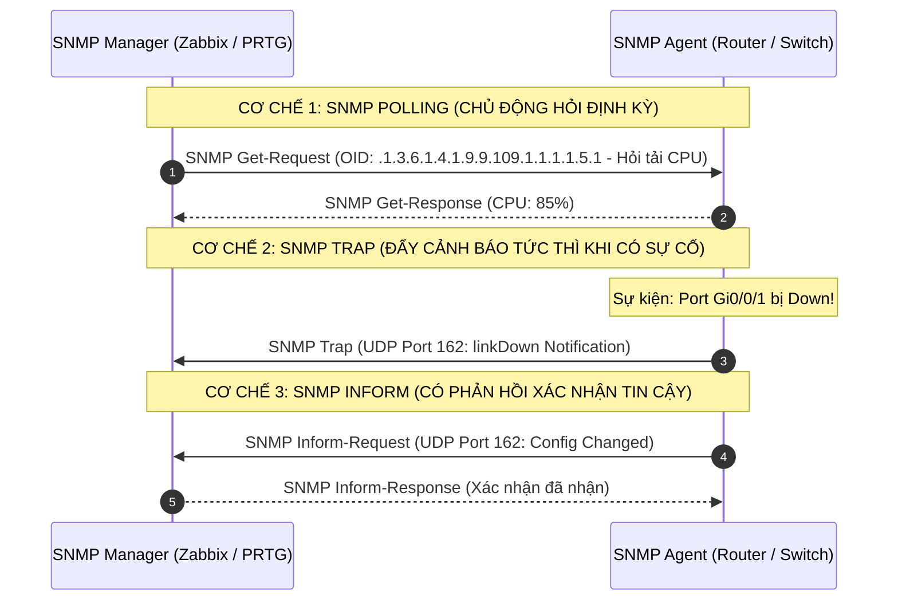
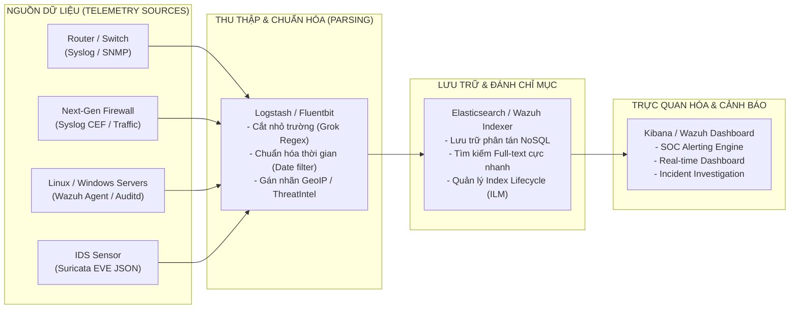
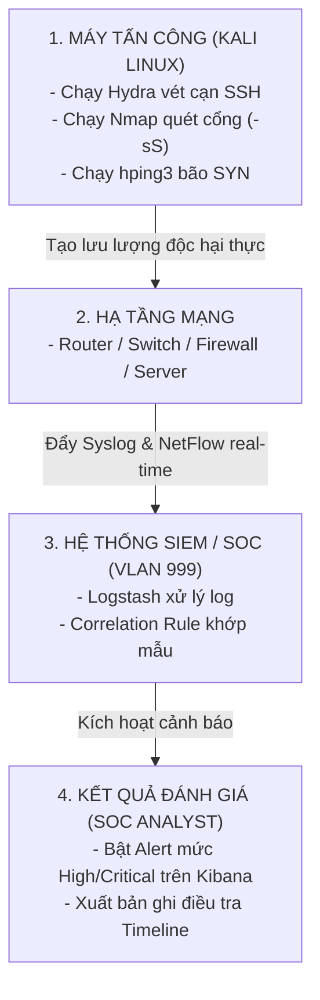

# CHUYÊN ĐỀ 7: MONITORING & LOGGING (GIÁM SÁT & QUẢN LÝ NHẬT KÝ TẬP TRUNG - TRỌNG TÂM ĐỀ TÀI)

> **Mục tiêu**: Đây là **nội dung trọng tâm cốt lõi của đề tài**, cung cấp toàn bộ kiến thức chuyên sâu và hướng dẫn kỹ thuật triển khai về **SNMP (v1/v2c/v3, MIB/OID)**, **Syslog (RFC 5424, Facilities, Severities, TLS)**, **NetFlow/IPFIX**, **Hệ thống SIEM (ELK Stack / Wazuh / Graylog)**, **Tập luật tương quan sự kiện (Correlation Rules)** và **Quy trình kiểm thử đánh giá hệ thống SOC**.

---

## 1. GIAO THỨC QUẢN LÝ MẠNG SNMP (SIMPLE NETWORK MANAGEMENT PROTOCOL)

### 1.1. So Sánh Các Phiên Bản SNMP

| Tiêu chí | SNMPv1 (RFC 1157) | SNMPv2c (RFC 1901) | SNMPv3 (RFC 3411-3418) - **Khuyến nghị cho Đồ án** |
| :--- | :--- | :--- | :--- |
| **Cơ chế xác thực** | Community String dạng Plaintext (`public` / `private`) | Community String dạng Plaintext | Tên người dùng (Username) + Thuật toán băm xác thực (**HMAC-MD5 / SHA-256**) |
| **Mã hóa dữ liệu** | Không có (Dễ bị Sniffing trên đường truyền) | Không có | Mã hóa toàn bộ gói tin bằng **AES-128 / AES-256** |
| **Tính toàn vẹn** | Không bảo vệ | Không bảo vệ | Chống giả mạo gói tin (Data Integrity Check) |
| **Mức độ an ninh (USM)** | Không hỗ trợ | Không hỗ trợ | • `noAuthNoPriv`: Không xác thực, không mã hóa.<br>• `authNoPriv`: Có xác thực (SHA), không mã hóa.<br>• `authPriv`: **Xác thực (SHA) + Mã hóa (AES)**. |

---

### 1.2. Cây Thông Tin Quản Lý (MIB) & Mã Định Danh Đối Tượng (OID)
- **MIB (Management Information Base)**: Là cơ sở dữ liệu phân cấp dạng cây (Tree structure) quy định tất cả các tham số có thể giám sát trên thiết bị.
- **OID (Object Identifier)**: Là chuỗi số thập phân ngăn cách bởi dấu chấm đại diện cho vị trí của một tham số cụ thể trong cây MIB.

```
                         [ iso(1) ]
                             |
                         [ org(3) ]
                             |
                         [ dod(6) ]
                             |
                      [ internet(1) ]
                             |
             +---------------+---------------+
             |                               |
       [ mgmt(2) ]                     [ private(4) ]
             |                               |
        [ mib-2(1) ]                  [ enterprises(1) ]
             |                               |
    +--------+--------+               [ cisco(9) ]
    |        |        |                      |
[system(1)] [ip(4)] [interfaces(2)]   [ciscoMgmt(9)]
```

#### Bảng OID Giám Sát Cốt Lõi:
| Đối tượng giám sát | Chuỗi OID chuẩn (Standard OID) | Mô tả & Ý nghĩa an ninh |
| :--- | :--- | :--- |
| **System Description** | `.1.3.6.1.2.1.1.1.0` | Tên hệ điều hành, phiên bản phần mềm (Kiểm tra lỗ hổng CVE) |
| **System Uptime** | `.1.3.6.1.2.1.1.3.0` | Thời gian thiết bị hoạt động liên tục (Phát hiện khởi động lại bất thường) |
| **Interface Admin Status** | `.1.3.6.1.2.1.2.2.1.7.{ifIndex}` | Trạng thái cổng do Admin gán (`1=up`, `2=down`) |
| **Interface Oper Status** | `.1.3.6.1.2.1.2.2.1.8.{ifIndex}` | Trạng thái hoạt động thực tế của cổng (`1=up`, `2=down`) |
| **Inbound Traffic Octets**| `.1.3.6.1.2.1.2.2.1.10.{ifIndex}` | Tổng số byte nhận vào (Tính toán băng thông Inbound) |
| **Outbound Traffic Octets**| `.1.3.6.1.2.1.2.2.1.16.{ifIndex}`| Tổng số byte gửi đi (Tính toán băng thông Outbound) |
| **Cisco CPU 5-min Load** | `.1.3.6.1.4.1.9.9.109.1.1.1.1.5.1` | Tỷ lệ tải CPU trung bình 5 phút trên Router/Switch Cisco |

---

### 1.3. Cơ Chế Thu Thập: SNMP Polling vs SNMP Trap / Inform



---

## 2. CHUẨN NHẬT KÝ HỆ THỐNG SYSLOG (RFC 3164 VS RFC 5424)

### 2.1. Cấu Trúc Bản Tin Syslog Chuẩn Hiện Đại (RFC 5424)
Bản tin Syslog chuẩn RFC 5424 có cấu trúc phân đoạn rõ ràng:

```
<PRI>VERSION TIMESTAMP HOSTNAME APP-NAME PROCID MSGID [STRUCTURED-DATA] MSG
```

- **PRI (Priority Code)**: Đại diện cho mức độ ưu tiên tổng hợp, tính theo công thức:
  $$\text{PRI} = (\text{Facility} \times 8) + \text{Severity}$$

### 2.2. Bảng 8 Cấp Độ Nghiêm Trọng (Severity Levels)

| Mức (Level) | Tên Mức (Severity) | Từ khóa | Mô tả tình huống thực tế |
| :---: | :--- | :--- | :--- |
| **`0`** | **Emergency** | `emerg` | Hệ thống sập hoàn toàn, không thể sử dụng (Kernel panic, sập nguồn) |
| **`1`** | **Alert** | `alert` | Hành động cần can thiệp khẩn cấp (Hỏng cơ sở dữ liệu bảo mật, IPS sập) |
| **`2`** | **Critical** | `crit` | Tình trạng nguy kịch (Hỏng phần cứng, mất kết nối đường truyền chính) |
| **`3`** | **Error** | `err` | Điều kiện lỗi (Không thể kết nối dịch vụ, lỗi I/O) |
| **`4`** | **Warning** | `warning` | Cảnh báo nguy cơ tiềm ẩn (Tài nguyên bộ nhớ đạt ngưỡng $90\%$) |
| **`5`** | **Notice** | `notice` | Sự kiện bình thường nhưng quan trọng (**Cổng mạng UP/DOWN, OSPF neighbor thay đổi**) |
| **`6`** | **Informational** | `info` | Bản tin thông tin hoạt động thông thường (**User đăng nhập SSH thành công**) |
| **`7`** | **Debug** | `debug` | Thông tin chi tiết phục vụ lập trình viên và gỡ lỗi chuyên sâu |

---

### 2.3. Bảng Phân Loại Nguồn Sinh Nhật Ký (Syslog Facilities)

| Facility ID | Tên Mã (Keyword) | Ý Nghĩa Nguồn Nhật Ký |
| :---: | :--- | :--- |
| `0` | `kern` | Nhật ký Nhân hệ điều hành (Kernel messages) |
| `1` | `user` | Tiến trình người dùng thông thường |
| `3` | `daemon` | Các dịch vụ chạy ngầm của hệ thống (DNS, NTP daemon) |
| `4` | `auth` / `authpriv` | Xác thực an ninh và cấp quyền (SSH login, sudo privilege) |
| `16 - 23` | `local0` - `local7` | **Dành riêng cho thiết bị mạng**: `local4` (Cisco Router), `local7` (Firewall) |

---

## 3. THỐNG KÊ LUỒNG DỮ LIỆU MẠNG (NETFLOW / IPFIX)

- Không thu thập toàn bộ nội dung gói tin (giảm tải dung lượng lưu trữ), chỉ ghi nhận thống kê siêu dữ liệu của luồng (Flow Metadata).
- **7 Thông số định danh luồng (Flow Keys)**:
  1. `Source IP Address`
  2. `Destination IP Address`
  3. `Source Port (L4)`
  4. `Destination Port (L4)`
  5. `Layer 3 Protocol (TCP/UDP/ICMP)`
  6. `Ingress Interface`
  7. `Type of Service (IP ToS / DSCP)`
- **Ứng dụng an ninh**: Phát hiện các đợt bùng nổ lưu lượng DoS/DDoS, phát hiện máy trạm nội bộ bị nhiễm botnet đang gửi dữ liệu ra ngoài cho máy chủ C2 (Top Talkers).

---

## 4. HỆ THỐNG QUẢN LÝ THÔNG TIN & SỰ KIỆN AN NINH (SIEM)

### 4.1. Kiến Trúc Pipeline Thu Thập & Xử Lý (ELK Stack & Wazuh)



---

### 4.2. Xây Dựng Tập Luật Tương Quan Sự Kiện (SIEM Correlation Rules)

#### Use Case 1: Tấn Công Vét Cạn Mật Khẩu SSH (Brute-Force Attack)
- **Logic phát hiện**: Xuất hiện từ 5 bản tin đăng nhập thất bại trở lên trong vòng 60 giây xuất phát từ cùng một địa chỉ IP nguồn.
- **Mẫu Rule định dạng Wazuh XML (`/var/ossec/etc/rules/local_rules.xml`)**:

```xml
<group name="syslog,sshd,attack_detection,">
  <!-- Rule cơ sở: Bắt sự kiện 1 lần SSH login failed -->
  <rule id="100001" level="5">
    <if_sid>5710</if_sid>
    <match>Failed password for</match>
    <description>Single SSH Authentication Failure Detected.</description>
    <group>authentication_failed,</group>
  </rule>

  <!-- Rule tương quan: Bắt tần suất lặp lại >= 5 lần trong 60s -->
  <rule id="100002" level="12" frequency="5" timeframe="60">
    <if_matched_sid>100001</if_matched_sid>
    <same_source_ip />
    <description>CRITICAL ALERT: SSH Brute-Force Attack in Progress from IP: $(srcip)</description>
    <mitre>
      <id>T1110.001</id>
    </mitre>
  </rule>
</group>
```

---

#### Use Case 2: Thay Đổi Cấu Hình Thiết Bị Mạng Trái Phép Ngoài Giờ Hành Chính
- **Logic phát hiện**: Bản tin Syslog ghi nhận `%SYS-5-CONFIG_I: Configured from console` xuất hiện trong khoảng thời gian từ `18:00:00` hôm trước đến `07:00:00` sáng hôm sau hoặc vào thứ Bảy / Chủ Nhật.

```xml
<group name="cisco_ios,compliance,">
  <rule id="100010" level="10">
    <if_sid>4100</if_sid>
    <match>%SYS-5-CONFIG_I</match>
    <time>6:00 pm - 7:00 am</time>
    <description>SECURITY WARNING: Unauthorized Network Device Configuration Change Detected After Hours by User: $(dstuser)</description>
  </rule>
</group>
```

---

#### Use Case 3: Thiết Bị Mạng Mất Kết Nối (Heartbeat / Device Down)
- **Logic phát hiện**: Một thiết bị mạng định kỳ gửi bản tin SNMP Traps hoặc Syslog thông thường, nếu hệ thống SIEM không nhận được bất kỳ telemetry nào trong vòng 5 phút liên tục $\rightarrow$ Kích hoạt cảnh báo `Host Offline / Link Disruption`.

---

## 5. KỊCH BẢN KIỂM THỬ THỰC TẾ & TIÊU CHÍ ĐÁNH GIÁ



### 5.1. Các Lệnh Thực Hành Giả Lập Tấn Công (Test Commands)
```bash
# 1. Kịch bản Brute-force SSH vào máy chủ Linux:
hydra -l root -P /usr/share/wordlists/rockyou.txt ssh://192.168.10.50 -t 4

# 2. Kịch bản Quét cổng trinh sát mạng (Port Scanning):
nmap -sS -p 1-1000 -T4 192.168.10.1

# 3. Kịch bản Giả lập DoS SYN Flood:
sudo hping3 -S --flood -p 80 192.168.50.10
```

### 5.2. Các Tiêu Chí Đánh Giá Hiệu Quả Hệ Thống (KPIs)
1. **Detection Time (Thời gian phát hiện)**: Khoảng thời gian từ khi máy tấn công bắt đầu gửi gói tin đầu tiên đến khi màn hình SOC/SIEM Dashboard xuất hiện cảnh báo (Mục tiêu đồ án: $< 5\text{ giây}$).
2. **False Positive Rate (Tỷ lệ cảnh báo giả)**: Hệ thống không bị báo động nhầm khi người dùng hợp lệ đăng nhập sai 1-2 lần do gõ nhầm phím.
3. **Traceability (Khả năng truy vết ngược)**: Từ một cảnh báo trên SIEM, kiểm tra xem báo cáo có hiển thị đầy đủ: `Timestamp chính xác (NTP)` $\rightarrow$ `IP Nguồn` $\rightarrow$ `IP Đích` $\rightarrow$ `Tài khoản bị nhắm tới` $\rightarrow$ `Payload gốc`.
