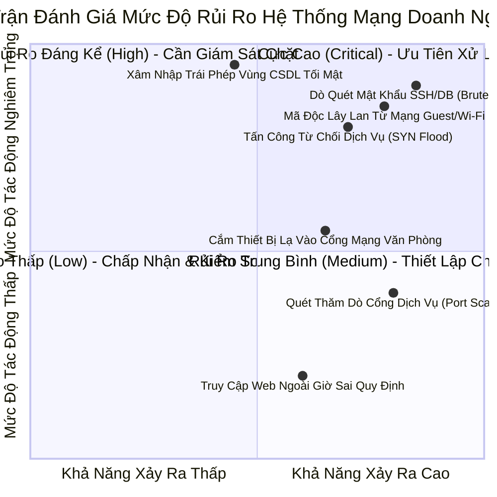
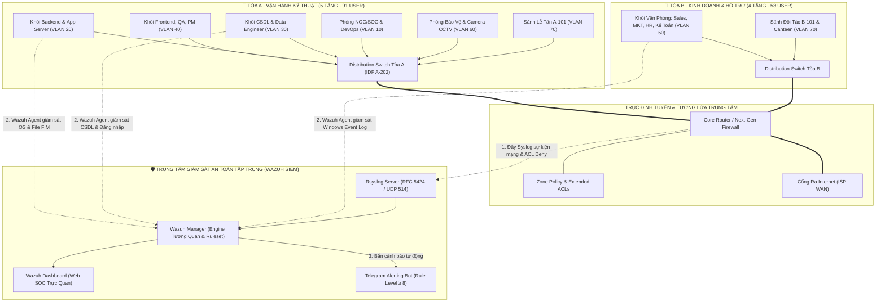

# ĐỒ ÁN: PHÂN TÍCH VÀ THIẾT KẾ HỆ THỐNG MẠNG AN TOÀN CHO DOANH NGHIỆP CÔNG NGHỆ
*(Enterprise Network Security Architecture, Zone-based Segmentation & Centralized SIEM/SOC Monitoring)*

> **Học phần:** Phân tích và Thiết kế An toàn Mạng Máy tính  
> **Chủ đề lựa chọn:** Mô hình Công ty Phần mềm & Dịch vụ Công nghệ (Tech Enterprise - 2 Tòa nhà A & B, ~288 Endpoints)  
> **Kiến trúc cốt lõi:** Phân vùng an ninh Zero Trust / Zone-based Segmentation, 3-Tier Core-Distribution-Access, Wazuh SIEM, RFC 5424 Syslog, Extended ACLs, Telegram Alerting & SOC Operations.

---

## 📑 MỤC LỤC TỔNG THỂ

1. [CHƯƠNG 1. GIỚI THIỆU DOANH NGHIỆP & PHÂN TÍCH NHU CẦU](#chương-1-giới-thiệu-doanh-nghiệp--phân-tích-nhu-cầu)
   - [1.1 Giới thiệu quy mô & Mô hình hoạt động](#11-giới-thiệu-quy-mô--mô-hình-hoạt-động)
   - [1.2 Cơ cấu tổ chức & Bảng phân bổ phòng ban (Tòa A & B)](#12-cơ-cấu-tổ-chức--bảng-phân-bổ-phòng-ban-tòa-a--b)
   - [1.3 Dịch vụ CNTT hiện hành & Mục tiêu an toàn thông tin](#13-dịch-vụ-cntt-hiện-hành--mục-tiêu-an-toàn-thông-tin)
2. [CHƯƠNG 2. KHẢO SÁT HIỆN TRẠNG & ĐÁNH GIÁ RỦI RO HỆ THỐNG](#chương-2-khảo-sát-hiện-trạng--đánh-giá-rủi-ro-hệ-thống)
   - [2.1 Hiện trạng hạ tầng & Thiết bị](#21-hiện-trạng-hạ-tầng--thiết-bị)
   - [2.2 Phân tích Ma trận Rủi ro & Lỗ hổng (Risk Matrix)](#22-phân-tích-ma-trận-rủi-ro--lỗ-hổng-risk-matrix)
   - [2.3 Yêu cầu chuyển đổi sang hệ thống bảo mật mới](#23-yêu-cầu-chuyển-đổi-sang-hệ-thống-bảo-mật-mới)
3. [CHƯƠNG 3. THIẾT KẾ TỔNG THỂ HỆ THỐNG MẠNG & BẢO MẬT](#chương-3-thiết-kế-tổng-thể-hệ-thống-mạng--bảo-mật)
   - [3.1 Kiến trúc tổng thể 3 lớp (Core - Distribution - Access)](#31-kiến-trúc-tổng-thể-3-lớp-core---distribution---access)
   - [3.2 Phân vùng an ninh (Security Zones: Guest, User, App, Data, Infra)](#32-phân-vùng-an-ninh-security-zones-guest-user-app-data-infra)
   - [3.3 Sơ đồ kiến trúc logic & Luồng dữ liệu giám sát SIEM](#33-sơ-đồ-kiến-trúc-logic--luồng-dữ-liệu-giám-sát-siem)
4. [CHƯƠNG 4. THIẾT KẾ CHI TIẾT & KẾ HOẠCH TRIỂN KHAI](#chương-4-thiết-kế-chi-tiết--kế-hoạch-triển-khai)
   - [4.1 Thiết kế Địa chỉ IP & Quy hoạch VLAN (IP & VLAN Plan)](#41-thiết-kế-địa-chỉ-ip--quy-hoạch-vlan-ip--vlan-plan)
   - [4.2 Thiết kế Định tuyến & Dịch vụ Cốt lõi (Routing, DHCP, NTP)](#42-thiết-kế-định-tuyến--dịch-vụ-cốt-lõi-routing-dhcp-ntp)
   - [4.3 Thiết kế Bảo mật Hạ tầng & Ma trận ACLs](#43-thiết-kế-bảo-mật-hạ-tầng--ma-trận-acls)
   - [4.4 Thiết kế Hệ thống Giám sát & Quản lý Nhật ký Tập trung (Wazuh SIEM)](#44-thiết-kế-hệ-thống-giám-sát--quản-lý-nhật-ký-tập-trung-wazuh-siem)
   - [4.5 Đảm bảo Tính sẵn sàng cao & Dự phòng (High Availability)](#45-đảm-bảo-tính-sẵn-sàng-cao--dự-phòng-high-availability)
   - [4.6 Kịch bản Kiểm thử & Diễn tập An ninh (Test Cases)](#46-kịch-bản-kiểm-thử--diễn-tập-an-ninh-test-cases)
5. [TỔ CHỨC DỰ ÁN, PHÂN CÔNG NHIỆM VỤ & MA TRẬN RACI](#tổ-chức-dự-án-phân-công-nhiệm-vụ--ma-trận-raci)
6. [DANH MỤC SẢN PHẨM BÀN GIAO & TÀI LIỆU CHUYÊN ĐỀ](#danh-mục-sản-phẩm-bàn-giao--tài-liệu-chuyên-đề)

---

## CHƯƠNG 1. GIỚI THIỆU DOANH NGHIỆP & PHÂN TÍCH NHU CẦU

### 1.1 Giới thiệu quy mô & Mô hình hoạt động
* **Tên doanh nghiệp:** Công ty Cổ phần Công nghệ & Dịch vụ Số TechCorp (Doanh nghiệp mẫu).
* **Lĩnh vực hoạt động:** Phát triển phần mềm, gia công ứng dụng di động, giải pháp đám mây và xử lý dữ liệu lớn.
* **Cơ sở hạ tầng vật lý:** Khuôn viên gồm **2 Tòa nhà cao tầng** kết nối trục cáp quang nội bộ:
  - **Tòa A (Trung tâm Nghiên cứu & Vận hành Kỹ thuật - 5 Tầng):** 91 nhân sự cố định, hệ thống phòng máy/lab.
  - **Tòa B (Trung tâm Kinh doanh & Dịch vụ Hỗ trợ - 4 Tầng):** 53 nhân sự khối nghiệp vụ.
* **Quy mô Endpoints:** ~**288 thiết bị** bao gồm máy trạm nhân viên, laptop cá nhân, máy chủ thử nghiệm, máy chủ CSDL, thiết bị mạng, camera an ninh CCTV và Wi-Fi khách.

---

### 1.2 Cơ cấu tổ chức & Bảng phân bổ phòng ban (Tòa A & B)
*(Dữ liệu chuẩn hóa trực tiếp từ [Bang_Phan_Bo_Phong_Ban.xlsx](file:///d:/School/PTTK_AnToanMang/Bang_Phan_Bo_Phong_Ban.xlsx))*

#### 🏢 TÒA A - VẬN HÀNH KỸ THUẬT (5 TẦNG)

| Tầng | Mã phòng | Tên bộ phận / Phòng | Số người | Zone | Risk Level | Quyền truy cập | Ghi chú vận hành |
| :---: | :---: | :--- | :---: | :---: | :---: | :---: | :--- |
| **1** | `A-101` | Sảnh lễ tân | 2 | **Guest** | `Untrusted` | Internet only | Lễ tân, đón khách vãng lai |
| **1** | `A-102` | Phòng bảo vệ / Kiểm soát ra vào | 2 | **Infra** | `High` | Admin only | Camera giám sát, Access Control cửa |
| **2** | `A-201` | Phòng Lab / Dev - Test | 10 | **User** | `Medium/High` | App | Thử nghiệm phần mềm, cách ly Prod |
| **2** | `A-202` | Phòng máy chủ tầng (IDF/Server) | 0 | **Infra** | `Critical` | Admin only | Tủ Rack mạng, Core thiết bị tầng |
| **2** | `A-203` | Phòng IT Helpdesk nội bộ | 4 | **Infra** | `High` | Admin only | Hỗ trợ người dùng, cấp phát máy |
| **3** | `A-301` | Phòng Backend Developer | 15 | **App** | `High` | DB | Lập trình logic, API & Core Service |
| **3** | `A-302` | Phòng Database / Data Engineer | 8 | **Data** | `Critical` | Internal only | Quản trị CSDL nhạy cảm nhất |
| **3** | `A-303` | Phòng Frontend Developer | 15 | **User** | `Medium` | App | Lập trình giao diện Web & Mobile |
| **4** | `A-401` | Phòng QA / Tester | 10 | **User** | `Medium` | App | Kiểm thử chất lượng phần mềm |
| **4** | `A-402` | Phòng UI/UX Designer | 6 | **User** | `Medium` | App | Thiết kế đồ họa và trải nghiệm |
| **4** | `A-403` | Phòng DevOps / SysAdmin | 8 | **Infra** | `Critical` | Admin only | Vận hành máy chủ, CI/CD Pipeline |
| **4** | `A-404` | Phòng NOC/SOC (Giám sát) | 4 | **Infra** | `Critical` | Admin only | Trực ca theo dõi an ninh hệ thống |
| **5** | `A-501` | Phòng Sản phẩm (Product Manager) | 5 | **User** | `Medium` | App | Quản lý kế hoạch & tính năng |
| **5** | `A-502` | Phòng CEO / CTO | 2 | **User** | `Medium/High` | App | Ban Điều hành cấp cao |
| **5** | `A-503` | Phòng họp Ban Giám đốc | 0 | **User** | `Medium` | App | Sức chứa 10 người |
| **CỘNG** | | **Tổng nhân sự Tòa A** | **91** | | | | |

#### 🏢 TÒA B - KINH DOANH & HỖ TRỢ (4 TẦNG)

| Tầng | Mã phòng | Tên bộ phận / Phòng | Số người | Zone | Risk Level | Quyền truy cập | Ghi chú vận hành |
| :---: | :---: | :--- | :---: | :---: | :---: | :---: | :--- |
| **1** | `B-101` | Sảnh tiếp khách hàng / Đối tác | 2 | **Guest** | `Untrusted` | Internet only | Tiếp đón đối tác bên ngoài |
| **1** | `B-102` | Phòng họp với đối tác | 0 | **Guest** | `Untrusted` | Internet only | Sức chứa 8 người |
| **2** | `B-201` | Phòng Kinh doanh (Sales) | 12 | **User** | `Medium` | App | Khai thác khách hàng, dùng CRM |
| **2** | `B-202` | Phòng Marketing | 8 | **User** | `Medium` | App | Quảng bá, truyền thông |
| **3** | `B-301` | Phòng Nhân sự (HR) | 5 | **User** | `Medium/High` | App | Dữ liệu nhân sự & định danh |
| **3** | `B-302` | Phòng Kế toán / Tài chính | 6 | **User** | `High` | App | Dữ liệu tài chính, kế toán tối mật |
| **3** | `B-303` | Phòng Pháp chế / Hành chính | 3 | **User** | `Medium` | App | Văn bản pháp lý & hợp đồng |
| **3** | `B-304` | Phòng Chăm sóc khách hàng (CSKH) | 10 | **User** | `Medium` | App | Tổng đài hỗ trợ người dùng |
| **4** | `B-401` | Phòng Triển khai dự án (PM/BA) | 7 | **User** | `Medium` | App | Phân tích nghiệp vụ khách hàng |
| **4** | `B-402` | Phòng đào tạo nội bộ | 0 | **User** | `Low` | App | Đào tạo, hội thảo (20 chỗ) |
| **4** | `B-403` | Canteen / Khu nghỉ nhân viên | 0 | **Guest** | `Untrusted` | Internet only | Không đặt thiết bị cố định |
| **CỘNG** | | **Tổng nhân sự Tòa B** | **53** | | | | |
| **TỔNG** | | **QUY MÔ TOÀN DOANH NGHIỆP** | **288** | *(Bao gồm nhân viên cố định, thiết bị di động, hệ thống server & IoT/Khách)* | | | |

---

### 1.3 Dịch vụ CNTT hiện hành & Mục tiêu an toàn thông tin
* **Dịch vụ CNTT nòng cốt:** Web Portal, Git/CI-CD Server, Database Server (PostgreSQL/MySQL), File Storage, Active Directory/LDAP, ERP & CRM nội bộ.
* **Mục tiêu an toàn thông tin cốt lõi (CIA Triad):**
  - **Confidentiality (Tính bí mật):** Bảo vệ mã nguồn phần mềm, CSDL khách hàng và báo cáo tài chính; cô lập dữ liệu theo nguyên tắc đặc quyền tối thiểu (*Least Privilege*).
  - **Integrity (Tính toàn vẹn):** Đảm bảo tính toàn vẹn của mã nguồn, file cấu hình hệ thống máy chủ và nhật ký an ninh không bị chỉnh sửa trái phép (giám sát qua *Wazuh FIM*).
  - **Availability (Tính sẵn sàng):** Đảm bảo mạng hoạt động 24/7, có đường truyền dự phòng (HA), tự động phát hiện và cảnh báo sớm các cuộc tấn công làm tê liệt dịch vụ (DoS/DDoS, SYN Flood).

---

## CHƯƠNG 2. KHẢO SÁT HIỆN TRẠNG & ĐÁNH GIÁ RỦI RO HỆ THỐNG

### 2.1 Hiện trạng hạ tầng & Thiết bị
* **Hạ tầng truyền thống (Flat Network):** Trước khi nâng cấp, mạng nội bộ sử dụng dải IP phẳng chung (`192.168.1.0/24`), không chia VLAN, các phòng ban (Dev, Kế toán, Khách vãng lai) có thể nhìn thấy và ping thông suốt sang nhau.
* **Hệ thống định tuyến & tường lửa:** Chỉ có 1 Router Gateway nhà mạng cơ bản, thiếu Firewall chuyên dụng và thiếu bộ lọc kiểm soát truy cập (ACLs).
* **Quản lý nhật ký:** Log nằm phân tán trên từng máy trạm và máy chủ, không có máy chủ thu thập tập trung; khi xảy ra sự cố không có dữ liệu đối soát.

### 2.2 Phân tích Ma trận Rủi ro & Lỗ hổng (Risk Matrix)

### 2.3 Yêu cầu chuyển đổi sang hệ thống bảo mật mới
1. **Phân vùng mạng theo vùng rủi ro (Zone-based Network Segmentation):** Chia tách 7 VLAN riêng biệt cho từng khối phòng ban và mức độ nhạy cảm dữ liệu.
2. **Triển khai Tường lửa & ACLs nghiêm ngặt:** Chặn tuyệt đối luồng dữ liệu từ mạng Guest và User thông thường truy cập trực tiếp vào vùng Database (VLAN 30) và Quản trị (VLAN 10).
3. **Bảo vệ an toàn cổng mạng Access:** Kích hoạt Port Security, DHCP Snooping và DAI trên toàn bộ Switch truy cập.
4. **Xây dựng Trung tâm Giám sát SIEM tập trung:** Triển khai **Wazuh All-in-One** kết hợp **Rsyslog (RFC 5424)** và cảnh báo tức thời qua **Telegram Bot**.

---

## CHƯƠNG 3. THIẾT KẾ TỔNG THỂ HỆ THỐNG MẠNG & BẢO MẬT

### 3.1 Kiến trúc tổng thể 3 lớp (Core - Distribution - Access)
* **Core Layer:** Đảm nhận chức năng định tuyến tốc độ cao, kết nối Tòa A và Tòa B với Internet Gateway và Tường lửa trung tâm.
* **Distribution Layer:** Đặt tại phòng Tủ mạng IDF (A-202 và B-IDF), thực hiện Inter-VLAN Routing, áp dụng Access Control Lists (ACLs) và QoS.
* **Access Layer:** Kết nối trực tiếp máy trạm của 14 phòng ban Tòa A và 11 phòng ban Tòa B, áp dụng các tính năng bảo mật Port Security, 802.1Q Tagging.

### 3.2 Phân vùng an ninh (Security Zones)
* 🔴 **Data Zone (Risk: Critical):** Vùng cơ sở dữ liệu tối mật (A-302, DB Server).
* 🟠 **Infra Zone (Risk: Critical/High):** Vùng hạ tầng mạng, quản trị, NOC/SOC, DevOps, Tủ mạng IDF, Camera an ninh.
* 🟡 **App Zone (Risk: High):** Vùng máy chủ ứng dụng nội bộ, Backend Dev, Wazuh SIEM Server.
* 🟢 **User Zone (Risk: Medium/Low):** Vùng máy trạm kỹ thuật (Frontend, QA, UI/UX, PM) và văn phòng (Sales, MKT, HR, Kế toán).
* ⚪ **Guest Zone (Risk: Untrusted):** Vùng sảnh lễ tân, phòng họp khách, canteen và Wi-Fi vãng lai *(Internet Only)*.

---

### 3.3 Sơ đồ kiến trúc logic & Luồng dữ liệu giám sát SIEM

---

## CHƯƠNG 4. THIẾT KẾ CHI TIẾT & KẾ HOẠCH TRIỂN KHAI

### 4.1 Thiết kế Địa chỉ IP & Quy hoạch VLAN (IP & VLAN Plan)

| VLAN ID | Tên Phân Vùng | Phạm Vi Phòng Ban & Thiết Bị | Subnet IP | Gateway | Mức Rủi Ro | Chính Sách & Ghi Chú |
| :---: | :--- | :--- | :---: | :---: | :---: | :--- |
| **VLAN 10** | `Infra_Mgmt` | Quản trị thiết bị mạng, IDF A-202, NOC/SOC A-404, DevOps A-403, Helpdesk A-203 | `192.168.10.0/24` | `192.168.10.1` | `Critical` | Chỉ IP phòng NOC/SOC được phép SSH/HTTPS quản trị thiết bị. |
| **VLAN 20** | `App_Server` | Máy chủ Web/App nội bộ, Backend Dev A-301, Máy chủ Wazuh SIEM | `192.168.20.0/24` | `192.168.20.1` | `High` | Mở port dịch vụ 80, 443, 514 (Syslog), 1514 (Wazuh Agent). Cho phép kết nối sang VLAN 30 qua port DB. |
| **VLAN 30** | `Data_Zone` | Phòng CSDL, Data Engineer A-302, Máy chủ CSDL PostgreSQL / MySQL | `192.168.30.0/24` | `192.168.30.1` | `Critical` | **Tối Mật:** Chỉ chấp nhận kết nối từ IP Backend Server (VLAN 20) và IP Admin Data (A-302). Cấm ra Internet. |
| **VLAN 40** | `Tech_Dev_Zone` | Frontend A-303, QA/Test A-401, UI/UX A-402, Lab Dev-Test A-201, PM A-501, Ban Giám đốc A-502/503 | `192.168.40.0/24` | `192.168.40.1` | `Medium / High` | Truy cập App Server (VLAN 20) và Internet. Chặn hoàn toàn truy cập trực tiếp vào VLAN 10 và VLAN 30. |
| **VLAN 50** | `Biz_Office_Zone` | Toàn bộ Khối Văn phòng Tòa B (Sales, MKT, HR B-301, Kế toán B-302, CSKH B-304, PM/BA B-401, Pháp chế B-303) | `192.168.50.0/24` | `192.168.50.1` | `Medium / High` | Truy cập ứng dụng nội bộ (ERP, CRM trên VLAN 20) và Internet. Giám sát máy trạm nhạy cảm bằng Wazuh Agent. |
| **VLAN 60** | `Security_IoT` | Phòng Bảo vệ A-102, Hệ thống Camera quan sát NVR/CCTV, Kiểm soát cửa Access Control | `192.168.60.0/24` | `192.168.60.1` | `High` | Cô lập luồng video camera nội bộ, chỉ cho phép phòng A-102 truy xuất hình ảnh. Cấm ra Internet. |
| **VLAN 70** | `Guest_Untrusted` | Sảnh lễ tân A-101 & B-101, Phòng họp đối tác B-102, Canteen B-403, Wi-Fi Khách vãng lai | `192.168.70.0/24` | `192.168.70.1` | `Untrusted` | **Chỉ truy cập Internet (NAT ra ngoài)**; Bật Client Isolation; Chặn toàn bộ kết nối tới các VLAN 10-60. |

---

### 4.2 Thiết kế Định tuyến & Dịch vụ Cốt lõi (Routing, DHCP, NTP)
1. **Định tuyến:** Triển khai Inter-VLAN Routing trên Core Switch/Router kết hợp Static Routing ra cổng WAN và OSPF MD5 Authentication trên mạng lõi.
2. **DHCP Server:** Cấu hình cấp phát IP động tự động theo từng phân vùng VLAN (VLAN 40, 50, 70), đặt thời gian Lease Time phù hợp (Guest: 2 giờ; Office: 24 giờ).
3. **NTP Server (Network Time Protocol):**
   > [!IMPORTANT]
   > Tất cả Router, Switch, Firewall và máy chủ Linux/Windows bắt buộc phải đồng bộ thời gian từ cùng 1 máy chủ NTP chung (Stratum 2) để đảm bảo chuỗi thời gian (Timestamps) của Log trên Wazuh SIEM đồng nhất 100%.

---

### 4.3 Thiết kế Bảo mật Hạ tầng & Ma trận ACLs
* **Port Security:** Giới hạn tối đa 1 địa chỉ MAC trên mỗi cổng kết nối tại sảnh lễ tân và bàn làm việc nhân viên (`switchport port-security violation restrict/shutdown`).
* **DHCP Snooping & Dynamic ARP Inspection (DAI):** Ngăn chặn rogue DHCP Server và chống tấn công Man-in-the-Middle (ARP Poisoning).
* **Ma trận Extended ACLs (Tóm tắt chính sách):**
  - `ACL_GUEST`: `permit ip 192.168.70.0/24 any` (chỉ ra Internet), `deny ip 192.168.70.0/24 192.168.0.0/16` (chặn toàn bộ mạng nội bộ).
  - `ACL_USER_TO_DATA`: `deny ip 192.168.40.0/24 192.168.30.0/24`, `deny ip 192.168.50.0/24 192.168.30.0/24`.
  - `ACL_APP_TO_DATA`: `permit tcp 192.168.20.0/24 192.168.30.0/24 eq 5432` (Postgres) / `eq 3306` (MySQL), `deny ip any 192.168.30.0/24`.

---

### 4.4 Thiết kế Hệ thống Giám sát & Quản lý Nhật ký Tập trung (Wazuh SIEM)
1. **Thu thập Log Thiết bị mạng (Network Telemetry):** Cấu hình Cisco IOS `logging host 192.168.20.50 transport udp port 514` và `logging trap informational`.
2. **Giám sát Máy chủ (Host-based Telemetry):** Cài đặt Wazuh Agent trên máy chủ Backend/Database Linux (giám sát xác thực SSH, phân tích log Nginx/Postgres, kích hoạt File Integrity Monitoring FIM).
3. **Giám sát Máy trạm Người dùng (Endpoint Security):** Cài đặt Wazuh Agent trên máy trạm Windows khối Kế toán/HR (theo dõi Windows Event ID 4625 - Đăng nhập thất bại, Event ID 4720 - Tạo tài khoản mới).
4. **Tích hợp Cảnh báo Tức thời (Telegram Alerting):**
   - Tích hợp Custom Webhook trên Wazuh Server tự động gửi tin nhắn báo động về nhóm Telegram của đội ngũ SOC khi xuất hiện các sự kiện nguy hiểm (Rule Level ≥ 8: Phát hiện Port Scan, Brute-Force SSH, Xâm nhập vùng Database).

---

### 4.5 Đảm bảo Tính sẵn sàng cao & Dự phòng (High Availability)
* **Dự phòng định tuyến Gateway:** Cấu hình HSRP (Hot Standby Router Protocol) hoặc VRRP trên cặp Core Switch.
* **Dự phòng liên kết (Link Aggregation):** Cấu hình LACP (802.3ad) gộp nhiều đường cáp quang giữa Core Switch và Distribution Switch.
* **Hệ thống Nguồn điện dự phòng:** Trang bị Bộ lưu điện (UPS) và máy phát điện tự động cho phòng máy chủ Tòa A (IDF A-202).

---

### 4.6 Kịch bản Kiểm thử & Diễn tập An ninh (Test Cases)

| Mã TC | Phân Vùng Mục Tiêu | Kịch Bản Thử Nghiệm | Công Cụ & Thao Tác | Kết Quả Ghi Nhận Trên Wazuh SIEM | Người Phụ Trách |
| :---: | :--- | :--- | :--- | :--- | :---: |
| **TC-01** | `Infra_Mgmt` | Trạng thái cổng Switch thay đổi bất thường | Lệnh `shutdown` / `no shutdown` trên cổng Switch | Nhận log Syslog `LINK-3-UPDOWN` tức thời | Minh Trí |
| **TC-02** | `Guest` ➡️ `Data_Zone` | Chặn truy cập trái phép từ vùng Guest sang Database | Máy từ VLAN 70 quét/kết nối sang IP VLAN 30 | Bị ACL Drop, Switch đẩy log `SEC-6-IPACCESSLOGP` | Minh Trí |
| **TC-03** | `App_Server` | Quét dò tìm cổng dịch vụ máy chủ Web/App | Dùng Kali Linux chạy `nmap -sS -p 1-1000 <IP_Server>` | Wazuh SIEM phát hiện hành vi Port Scanning đa cổng | Thành Đạt |
| **TC-04** | `App_Server` | Dò quét mật khẩu tài khoản quản trị SSH | Dùng `hydra -l root -P pass.txt ssh://<IP_Server>` | Kích hoạt cảnh báo *SSH authentication failed / Brute-force* | Thành Đạt |
| **TC-05** | `Biz_Office` | Đăng nhập thất bại liên tiếp trên máy tính Kế toán | Nhập sai mật khẩu Windows 5 lần liên tiếp | Wazuh Agent thu thập Event ID 4625 (Logon Failure) | Tuấn Anh |
| **TC-06** | `Toàn hệ thống` | Phát hiện sự cố mức nghiêm trọng và gửi tin nhắn | Tấn công tạo sự kiện kích hoạt Rule Level ≥ 8 | Bot Telegram tự động gửi thông báo chi tiết vào nhóm SOC | Anh Xuân |
| **TC-07** | `Phòng NOC/SOC` | Trực quan hóa dữ liệu giám sát an ninh toàn công ty | Mở trình duyệt truy cập Wazuh Dashboard | Biểu đồ phân bổ sự cố theo Zone, Top IP vi phạm và trạng thái Agent | Tuấn Anh |

---

## TỔ CHỨC DỰ ÁN, PHÂN CÔNG NHIỆM VỤ & MA TRẬN RACI

### 👑 Phân công nhiệm vụ chi tiết từng thành viên:
1. **Nguyễn Anh Xuân (Trưởng nhóm - SIEM & SOC Lead):**
   - Chủ trì kiến trúc an toàn hệ thống, triển khai Máy chủ Wazuh All-in-One, cấu hình tiếp nhận Syslog RFC 5424, viết tập luật tương quan và cấu hình tích hợp Bot Telegram báo động.
2. **Nguyễn Phúc Vượng (Kỹ sư Mạng 1 - Topology & Routing):**
   - Thiết kế sơ đồ mạng 2 tòa nhà A & B trên Packet Tracer / EVE-NG, cấu hình Inter-VLAN Routing, định tuyến Core, cấu hình dịch vụ DHCP theo phân vùng và NTP Server đồng bộ thời gian.
3. **Nguyễn Minh Trí (Kỹ sư Mạng 2 - Bảo mật Thiết bị & Syslog Forwarding):**
   - Cấu hình Port Security, DHCP Snooping, Dynamic ARP Inspection trên Switch truy cập; thiết lập bộ lọc phân vùng Extended ACLs cô lập Data/Infra; cấu hình đẩy Syslog thiết bị mạng về Wazuh.
4. **Nguyễn Thành Đạt (Chuyên viên ATTT 1 - Giám sát Máy chủ & Pentest):**
   - Cài đặt Wazuh Agent trên máy chủ Linux (Web/DB), bật FIM; thực hiện các kịch bản diễn tập tấn công bằng Kali Linux (Nmap Port Scan, Hydra Brute-force SSH, SYN Flood DoS); đối soát Rule ID cảnh báo trên SIEM.
5. **Lê Tuấn Anh (Chuyên viên ATTT 2 - An ninh Máy trạm & Báo cáo):**
   - Cài đặt Wazuh Agent trên máy trạm Windows khối văn phòng; thử nghiệm các hành vi bất thường trên Endpoint (đăng nhập sai, tạo user); thiết kế Dashboard trực quan hóa SOC và hoàn thiện tài liệu Báo cáo Word & Slide bảo vệ.

---

### 📊 Ma trận Trách nhiệm (RACI Matrix)

| Giai đoạn & Hạng mục công việc | Nguyễn Anh Xuân (Lead) | Nguyễn Phúc Vượng (Net 1) | Nguyễn Minh Trí (Net 2) | Nguyễn Thành Đạt (Security 1) | Lê Tuấn Anh (Security 2) |
| :--- | :---: | :---: | :---: | :---: | :---: |
| 1. Khảo sát phân vùng phòng ban 2 Tòa A-B & Thiết kế Sơ đồ mạng | C | **R / A** | C | I | I |
| 2. Cấu hình Inter-VLAN Routing, DHCP theo Zone & Đồng bộ NTP | C | **R / A** | C | I | I |
| 3. Cấu hình Extended ACLs, Port Security & Đẩy Syslog từ Switch/Router | C | C | **R / A** | I | I |
| 4. Cài đặt Máy chủ Wazuh SIEM & Tích hợp Bot Cảnh báo Telegram | **R / A** | I | C | C | I |
| 5. Cài Wazuh Agent Máy chủ Linux & Diễn tập Tấn công (Nmap, Hydra) | C | I | I | **R / A** | C |
| 6. Cài Wazuh Agent Máy trạm Windows & Test hành vi nội bộ (Logon Fail) | C | I | I | **A** | **R** |
| 7. Thiết kế Dashboard SOC trực quan hóa & Phân tích Sự cố | **A** | I | I | C | **R** |
| 8. Soạn thảo Báo cáo Đồ án Tổng thể & Thiết kế Slide Bảo vệ | **A** | C | C | C | **R** |

> **Quy ước:** **R** (*Responsible*) = Người trực tiếp thực hiện; **A** (*Accountable*) = Người kiểm tra, nghiệm thu; **C** (*Consulted*) = Người hỗ trợ, cố vấn; **I** (*Informed*) = Người theo dõi tiến độ.

---

## DANH MỤC SẢN PHẨM BÀN GIAO & TÀI LIỆU CHUYÊN ĐỀ

### 📦 Sản phẩm bàn giao nghiệm thu đồ án:
1. **Báo cáo chuyên đề hoàn chỉnh (Đóng quyển 50 ÷ 70 trang):** Soạn thảo chuẩn cấu trúc 4 Chương theo đề cương môn học.
2. **Slide thuyết trình bảo vệ (10 ÷ 15 slide):** Trình bày trực quan, đầy đủ luận điểm kiến trúc và kết quả thử nghiệm.
3. **File thiết kế sơ đồ mạng:** File Microsoft Visio / Draw.io chi tiết cấu trúc 2 tòa nhà A & B.
4. **Bảng địa chỉ IP & VLAN Plan:** Bảng quy hoạch IP chi tiết kèm dải cấp phát DHCP.
5. **Danh sách chính sách an toàn (Security Policy Catalog):** Tập hợp bảng ACLs, cấu hình Port Security và Rule cảnh báo Wazuh.
6. **File mô phỏng thực nghiệm:** File Cisco Packet Tracer / EVE-NG / Docker Compose sẵn sàng chạy demo.
7. **Nhật ký làm việc & Video Demo:** Video ghi hình diễn tập tấn công và phản ứng của hệ thống SIEM.

---

### 📚 Tài liệu Giáo trình Kỹ thuật Chuyên sâu (7 Chuyên đề):
Toàn bộ hướng dẫn lý thuyết và cấu hình mẫu dòng lệnh chi tiết được lưu trữ tại thư mục [Documents/](file:///d:/School/PTTK_AnToanMang/Documents):

1. [01_Network_Fundamentals.md](file:///d:/School/PTTK_AnToanMang/Documents/01_Network_Fundamentals.md)
   - **Nền tảng mạng & Kiến trúc giao thức:** Mô hình OSI/TCP-IP trong môi trường doanh nghiệp, Ánh xạ dữ liệu giám sát vào từng tầng mạng, Subnetting & Quy hoạch VLSM cho 2 tòa nhà.
2. [02_Network_Infrastructure.md](file:///d:/School/PTTK_AnToanMang/Documents/02_Network_Infrastructure.md)
   - **Kiến trúc hạ tầng thiết bị mạng:** Router (Control/Data Plane), Switch L2/L3 phân tầng, Kỹ thuật bảo vệ Access Layer (Port Security, DHCP Snooping, DAI, SPAN Port).
3. [03_Network_Segmentation.md](file:///d:/School/PTTK_AnToanMang/Documents/03_Network_Segmentation.md)
   - **Phân đoạn mạng & Thiết kế VLAN phân vùng rủi ro:** Chuẩn 802.1Q Trunking, Inter-VLAN Routing, Ma trận kiểm soát truy cập (ACLs) cô lập vùng tối mật (Data Zone, Infra Zone).
4. [04_Core_Network_Services.md](file:///d:/School/PTTK_AnToanMang/Documents/04_Core_Network_Services.md)
   - **Dịch vụ mạng cốt lõi & Giám sát:** DHCP Audit Trail, DNS Security, NAT/PAT Log Correlation, **NTP Synchronization** (Đồng bộ thời gian chuẩn cho SIEM).
5. [05_Routing_Protocols.md](file:///d:/School/PTTK_AnToanMang/Documents/05_Routing_Protocols.md)
   - **Giao thức định tuyến & Bảo mật:** Static Route, Dynamic Routing OSPF với xác thực MD5, Giám sát và phát hiện bất thường định tuyến qua Syslog/SIEM.
6. [06_Network_Security.md](file:///d:/School/PTTK_AnToanMang/Documents/06_Network_Security.md)
   - **An toàn mạng & Phòng thủ theo chiều sâu:** Firewall Zone-based, IPsec/SSL VPN, NIDS Suricata/Snort, Nhận diện và ngăn chặn các kỹ thuật tấn công phổ biến.
7. [07_Monitoring_And_Logging.md](file:///d:/School/PTTK_AnToanMang/Documents/07_Monitoring_And_Logging.md)
   - **TRỌNG TÂM ĐỀ TÀI - Hệ thống Giám sát & Quản lý Nhật ký An toàn Tập trung:** Wazuh SIEM Architecture, Syslog RFC 5424, Wazuh Ruleset, Kịch bản diễn tập an ninh và Tích hợp Telegram Alerting.

---

> [!TIP]
> Mỗi chuyên đề đều cung cấp đầy đủ: **Cơ sở lý thuyết học thuật** ➔ **Sơ đồ chu trình xử lý** ➔ **Mẫu cấu hình dòng lệnh chuẩn thực tế (Cisco IOS, Linux Rsyslog, Wazuh Rules)** ➔ **Bộ câu hỏi ôn tập & phản biện bảo vệ đồ án (Viva Q&A)**.
