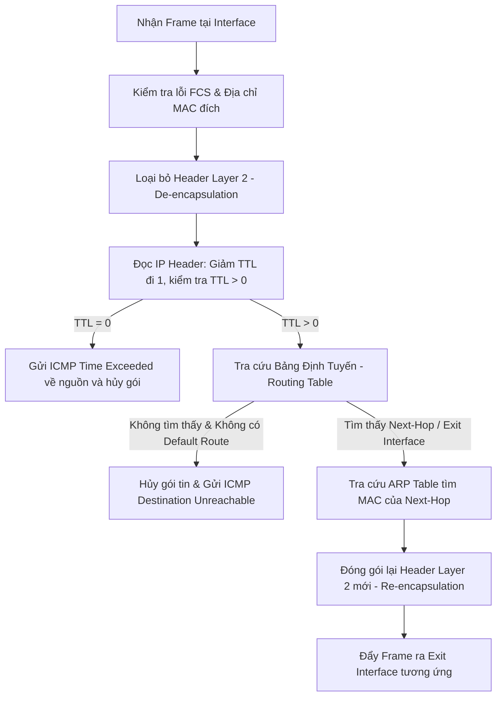

# TÀI LIỆU TOÀN TẬP VỀ ROUTER (BỘ ĐỊNH TUYẾN MẠNG)
> **Chuyên đề**: Kiến trúc mạng, Nguyên lý định tuyến, Cấu hình và Bảo mật Router trong Doanh nghiệp.

---

## 1. Tổng Quan Về Router (Bộ Định Tuyến)

### 1.1. Router là gì?
**Router (Bộ định tuyến)** là một thiết bị mạng hoạt động tại **Tầng 3 (Network Layer)** của mô hình OSI (hoặc Internet Layer trong mô hình TCP/IP). Nhiệm vụ cốt lõi của Router là **chuyển tiếp các gói tin (packets)** giữa các mạng khác nhau (khác dải IP subnet) và **tìm ra đường đi tối ưu nhất** để dữ liệu đến được đích.

```
+-------------------------------------------------------------------+
|                        MÔ HÌNH OSI & ROUTER                       |
+-------------------------------------------------------------------+
| Layer 7: Application  | HTTP, DNS, SSH, SNMP                      |
| Layer 6: Presentation | TLS/SSL, Data formatting                  |
| Layer 5: Session      | NetBIOS, RPC                              |
| Layer 4: Transport    | TCP, UDP, Port numbers                    |
| Layer 3: Network      | IP, ICMP, IPsec ---> [ ROUTER HOẠT ĐỘNG ] |
| Layer 2: Data Link    | Ethernet, MAC, Frame ---> [ Switch L2 ]   |
| Layer 1: Physical     | Cáp mạng, Cáp quang, Bit, Tín hiệu        |
+-------------------------------------------------------------------+
```

### 1.2. Vai trò của Router trong hệ thống mạng
- **Kết nối các mạng không đồng nhất**: Kết nối mạng LAN nội bộ với Internet (WAN), hoặc liên kết các chi nhánh văn phòng (Branch offices) qua mạng WAN/VPN.
- **Phân chia Broadcast Domain**: Mỗi cổng (interface) trên Router tạo thành một Broadcast Domain độc lập, giúp ngăn chặn hiện tượng nghẽn mạng do bão Broadcast (Broadcast Storm).
- **Lựa chọn đường đi (Path Selection)**: Sử dụng các thuật toán định tuyến để chọn tuyến đường ngắn nhất, nhanh nhất hoặc tin cậy nhất.
- **Bảo mật và Kiểm soát truy cập**: Cung cấp tường lửa cơ bản, lọc gói tin (ACL), NAT/PAT để che giấu cấu trúc mạng nội bộ.

---

## 2. Nguyên Lý Hoạt Động Của Router

### 2.1. Quy trình xử lý gói tin (Packet Forwarding Process)

Khi một gói tin đi vào một Interface của Router, quy trình xử lý diễn ra theo các bước sau:



1. **Bóc tách Header Layer 2 (De-encapsulation)**: Router nhận Frame Ethernet, kiểm tra xem địa chỉ MAC đích có phải của cổng Router hay không. Nếu đúng, Router loại bỏ Header và Trailer Layer 2 để lấy gói tin IP (Layer 3).
2. **Kiểm tra IP Header & TTL (Time To Live)**:
   - Router kiểm tra Checksum của Header IP.
   - Giảm giá trị `TTL` đi 1 đơn vị. Nếu `TTL = 0`, gói tin bị hủy và Router gửi bản tin `ICMP Time Exceeded` về máy nguồn (cơ chế chống vòng lặp định tuyến).
3. **Tra cứu Bảng Định Tuyến (Longest Prefix Match)**:
   - Router so khớp địa chỉ IP đích với các mục (routes) trong bảng định tuyến.
   - Áp dụng nguyên tắc **Longest Prefix Match** (ưu tiên tiền tố mạng dài nhất / subnet mask chi tiết nhất).
4. **Xác định Next-Hop và Interface xuất**:
   - Nếu tìm thấy đường đi, Router xác định cổng ra (Exit Interface) và địa chỉ IP kế tiếp (Next-Hop IP).
5. **Đóng gói Layer 2 mới (Re-encapsulation)**:
   - Router tra bảng **ARP Cache** để lấy địa chỉ MAC của Next-Hop (hoặc MAC của thiết bị đích nếu cùng mạng trực tiếp).
   - Đóng gói IP packet vào Frame mới với MAC nguồn là MAC cổng ra của Router, MAC đích là MAC của Next-Hop.
6. **Đẩy Frame ra cổng đích (Forwarding)**.

---

## 3. Kiến Trúc Phần Cứng & Các Mặt Phẳng Hoạt Động

### 3.1. Phân tách Control Plane và Data Plane

Router hiện đại tách biệt rõ ràng giữa hai mặt phẳng chức năng:

```
+-------------------------------------------------------------+
|               CONTROL PLANE (Mặt phẳng điều khiển)          |
|  - Chạy các giao thức định tuyến: OSPF, BGP, EIGRP, RIP    |
|  - Xây dựng Bảng thông tin định tuyến (RIB - Routing Table) |
|  - Xử lý bản tin quản trị (SSH, SNMP, Telnet, NTP)         |
|  - Xử lý bởi CPU chính (General Purpose CPU)                |
+-------------------------------------------------------------+
                              |
                     Biên dịch thành FIB/LFIB
                              v
+-------------------------------------------------------------+
|                 DATA PLANE (Mặt phẳng dữ liệu)              |
|  - Chuyển tiếp gói tin tốc độ cao (Forwarding)              |
|  - Bảng Forwarding Information Base (FIB) & Adjacency Table |
|  - Xử lý bởi phần cứng chuyên dụng: ASIC / FPGA / NPU       |
|  - Cơ chế tăng tốc: Cisco Express Forwarding (CEF)          |
+-------------------------------------------------------------+
```

### 3.2. Các thành phần phần cứng bên trong
- **CPU**: Xử lý khởi động, cấu hình, chạy các tiến trình định tuyến thuộc Control Plane.
- **RAM (Random Access Memory)**: Lưu trữ cấu hình đang chạy (`running-config`), bảng định tuyến (RIB), ARP cache, bộ đệm gói tin (packet buffer). Dữ liệu mất khi mất điện.
- **NVRAM (Non-Volatile RAM)**: Lưu trữ cấu hình khởi động (`startup-config`), thanh ghi cấu hình (Configuration Register).
- **Bộ nhớ Flash**: Lưu trữ hệ điều hành mạng (Cisco IOS, Junos, RouterOS,...), tệp sao lưu.
- **ROM (Read-Only Memory)**: Chứa mã vi chương trình ROMMON (ROM Monitor) phục vụ phục hồi hệ điều hành và kiểm tra POST phần cứng lúc khởi động.
- **Interfaces (Giao diện mạng)**: Cổng Ethernet (FastEthernet, GigabitEthernet, 10G/40G/100G SFP+), cổng Serial (WAN cũ), Cổng Console/Aux phục vụ cấu hình trực tiếp.

---

## 4. Các Giao Thức Định Tuyến (Routing Protocols)

### 4.1. Định tuyến Tĩnh (Static Routing) vs Định tuyến Động (Dynamic Routing)

| Tiêu chí | Định tuyến Tĩnh (Static Route) | Định tuyến Động (Dynamic Route) |
| :--- | :--- | :--- |
| **Cách thiết lập** | Quản trị viên nhập tay từng tuyến đường | Các Router tự trao đổi thông tin định tuyến với nhau |
| **Tải tài nguyên** | Rất nhẹ, không tốn CPU/RAM | Tốn CPU, RAM và băng thông để duy trì láng giềng |
| **Khả năng mở rộng** | Kém (phù hợp mạng nhỏ, Topology đơn giản) | Tốt (phù hợp mạng quy mô vừa đến cực lớn) |
| **Thích ứng sự cố** | Không tự động chuyển hướng khi đứt tuyến | Tự động tính toán lại đường đi (Re-convergence) |
| **Bảo mật** | Cao vì không truyền tin quảng bá định tuyến | Cần cấu hình xác thực (MD5/SHA) giữa các Router |

### 4.2. Phân loại Giao thức Định tuyến Động

```
                    CÁC GIAO THỨC ĐỊNH TUYẾN
                               |
        +----------------------+----------------------+
        |                                             |
   IGP (Interior Gateway)                     EGP (Exterior Gateway)
(Định tuyến nội miền AS)                    (Định tuyến liên miền AS)
        |                                             |
   +----+----+                                        v
   |         |                                      BGP
Distance   Link-State                           (Path Vector)
 Vector      |
   |       +-+----+
   v       |      |
  RIP    OSPF   IS-IS
```

#### A. Giao thức Distance Vector (Vectơ khoảng cách)
- **Đại diện**: RIPv1, RIPv2, RIPng (EIGRP là dạng Advanced Distance Vector / Hybrid).
- **Nguyên lý**: Định tuyến theo "tin đồn" (Routing by rumor). Router định kỳ gửi toàn bộ bảng định tuyến cho các router lân cận.
- **Metric**: Hop count (số chặng nhảy, RIP tối đa 15 hops).

#### B. Giao thức Link-State (Trạng thái liên kết)
- **Đại diện**: **OSPF (Open Shortest Path First)**, **IS-IS**.
- **Nguyên lý**:
  1. Router gửi thông tin về trạng thái các cổng của mình (LSA - Link State Advertisement) tới toàn bộ các router trong vùng (Area).
  2. Mỗi router xây dựng bản đồ toàn cảnh mạng (Topology Database / LSDB).
  3. Áp dụng thuật toán **Dijkstra (Shortest Path First - SPF)** để tính đường đi ngắn nhất đến mọi mạng đích.
- **Metric**: Cost (tính dựa trên băng thông đường truyền: $Cost = \frac{\text{Reference Bandwidth}}{\text{Interface Bandwidth}}$).

#### C. Giao thức Path Vector
- **Đại diện**: **BGP (Border Gateway Protocol)** - Giao thức "xương sống" của mạng Internet toàn cầu.
- **Nguyên lý**: Định tuyến dựa trên danh sách các Autonomous System (AS-Path) và các thuộc tính chính sách (Path Attributes: Weight, Local Preference, AS-Path, MED).

### 4.3. Administrative Distance (AD) và Metric
Khi một Router học cùng một dải mạng đích từ nhiều nguồn khác nhau, nó sử dụng **Administrative Distance (AD)** để chọn nguồn đáng tin cậy nhất đưa vào bảng định tuyến:

| Nguồn tuyến (Route Source) | Administrative Distance (AD mặc định trên Cisco) |
| :--- | :---: |
| **Connected Interface** (Kết nối trực tiếp) | **0** |
| **Static Route** (Tuyến tĩnh) | **1** |
| **eBGP** (External BGP) | **20** |
| **EIGRP** (Nội bộ) | **90** |
| **OSPF** | **110** |
| **IS-IS** | **115** |
| **RIP** | **120** |
| **iBGP** (Internal BGP) | **200** |

---

## 5. Các Tính Năng Quan Trọng Của Router

### 5.1. NAT / PAT (Network Address Translation)
- **Mục đích**: Giải quyết sự cạn kiệt địa chỉ IPv4 và bảo vệ mạng nội bộ.
- **Cơ chế**:
  - **Static NAT**: Ánh xạ 1-1 cố định giữa 1 IP Private và 1 IP Public (dùng cho Web Server, Mail Server).
  - **Dynamic NAT**: Ánh xạ nhóm IP Private sang nhóm IP Public khả dụng.
  - **PAT (Port Address Translation / NAT Overload)**: Ánh xạ hàng ngàn IP Private ra một địa chỉ IP Public duy nhất bằng cách phân biệt qua **Port Layer 4**.

### 5.2. Inter-VLAN Routing (Định tuyến giữa các VLAN)
- **Router-on-a-Stick**: Sử dụng một cổng vật lý duy nhất, chia thành nhiều **Sub-interfaces** (cổng con logic), đóng gói chuẩn **802.1Q trunking** để định tuyến giữa các VLAN.
- **Layer 3 Switch (SVI - Switched Virtual Interface)**: Chuyển mạch và định tuyến gói tin ở tốc độ phần cứng (ASIC) bên trong Switch L3.

### 5.3. First Hop Redundancy Protocols (FHRP)
Đảm bảo tính sẵn sàng cao (High Availability) cho Default Gateway của máy trạm:
- **HSRP (Hot Standby Router Protocol)**: Độc quyền của Cisco.
- **VRRP (Virtual Router Redundancy Protocol)**: Tiêu chuẩn mở quốc tế (RFC 5798).
- **GLBP (Gateway Load Balancing Protocol)**: Vừa dự phòng vừa cân bằng tải lưu lượng.

---

## 6. Vai Trò Của Router Trong An Toàn Mạng & Giám Sát (Security & Monitoring)

### 6.1. Bảo vệ tầng biên và Kiểm soát truy cập (Access Control)
- **ACL (Access Control List)**:
  - *Standard ACL*: Lọc gói tin chỉ dựa trên địa chỉ IP nguồn (Layer 3).
  - *Extended ACL*: Lọc gói tin chi tiết dựa trên IP nguồn, IP đích, Protocol (TCP/UDP/ICMP), Port nguồn và Port đích (Layer 3 + Layer 4).
  - *Time-based ACL*: Áp dụng chính sách kiểm soát theo khung giờ làm việc.
- **Zone-Based Policy Firewall (ZFW)**: Biến Router thành Tường lửa nhận biết trạng thái kết nối (Stateful Inspection) bằng cách phân chia các vùng mạng (Inside, Outside, DMZ) và quy tắc kiểm tra qua lại.

### 6.2. Chống giả mạo và Tấn công từ chối dịch vụ (DDoS/Spoofing Mitigation)
- **uRPF (Unicast Reverse Path Forwarding)**: Kiểm tra xem IP nguồn của gói tin đến có hợp lệ trong bảng định tuyến hay không. Giúp ngăn chặn các đòn tấn công IP Spoofing.
- **Bogon Filtering / Blackhole Routing (RTBH - Remote Triggered Black Hole)**: Hủy bỏ lưu lượng rác đến từ các dải IP chưa được cấp phát hoặc dải IP của mạng botnet tấn công.
- **CoPP (Control Plane Policing)**: Giới hạn lưu lượng (Rate-limiting) hướng về CPU của Router, ngăn chặn kẻ tấn công làm quá tải CPU Router bằng bản tin giả mạo (SSH brute-force, OSPF packet flood, ICMP flood).

### 6.3. Giám sát Lưu lượng mạng (Network Telemetry & Monitoring)
- **NetFlow / IPFIX / sFlow**: Router thu thập siêu dữ liệu (Metadata) về mọi luồng kết nối (Flow: IP nguồn, IP đích, Port, Protocol, Băng thông, Thời gian) và gửi về hệ thống giám sát tập trung (như Splunk, ELK, SolarWinds, PRTG).
- **SNMP (Simple Network Management Protocol v3)**: Giám sát trạng thái CPU, RAM, băng thông cổng, lỗi CRC interface, cảnh báo khi link down qua SNMP Traps.
- **SPAN / RSPAN / ERSPAN**: Nhân bản lưu lượng (Port Mirroring) từ router đưa về các thiết bị phân tích an toàn mạng như IDS/IPS (Snort, Suricata) hoặc Network Packet Broker.

---

## 7. Phân Loại Router Trong Thực Tế

```
+-------------------------------------------------------------------------------+
| LOẠI ROUTER        | ĐẶC ĐIỂM & VỊ TRÍ TRIỂN KHAI                             |
+--------------------+----------------------------------------------------------+
| Core Router        | - Đặt tại lõi mạng ISP hoặc Data Center lớn.             |
|                    | - Năng lực định tuyến cực khủng (hàng chục Tbps).        |
|                    | - Tập trung tối đa vào tốc độ và bảng định tuyến BGP lớn.|
+--------------------+----------------------------------------------------------+
| Edge / Border      | - Đặt tại ranh giới kết nối giữa mạng nội bộ và bên ngoài|
| Router             | - Thực thi chính sách bảo mật, NAT, BGP đa nhà mạng.     |
+--------------------+----------------------------------------------------------+
| Distribution       | - Nằm giữa Core và Access, tổng hợp tuyến đường nội bộ,  |
| Router             |   áp dụng chính sách QoS, Inter-VLAN Routing.            |
+--------------------+----------------------------------------------------------+
| Branch / SOHO      | - Thiết bị tích hợp (All-in-One: Router + Switch + Wi-Fi)|
| Router             | - Phục vụ gia đình, văn phòng nhỏ, kết nối VPN về Trụ sở |
+--------------------+----------------------------------------------------------+
| Virtual Router     | - Router ảo hóa dạng phần mềm (VyOS, Cisco CSR1000v,     |
| (vRouter / NFV)    |   pfSense, Mikrotik CHR) chạy trên VMware, KVM, AWS/Azure|
+--------------------+----------------------------------------------------------+
```

---

## 8. Bảng So Sánh Router, Switch và Firewall

| Tiêu chí | Router (Bộ định tuyến) | Switch Layer 2 (Bộ chuyển mạch) | Next-Gen Firewall (Tường lửa thế hệ mới) |
| :--- | :--- | :--- | :--- |
| **Tầng OSI chính** | **Layer 3** (Network) | **Layer 2** (Data Link) | **Layer 3 đến Layer 7** (Application) |
| **Địa chỉ xử lý** | Địa chỉ IP (IP Packet) | Địa chỉ MAC (Ethernet Frame) | IP, Port, Ứng dụng, User Identity |
| **Mục đích chính** | Định tuyến giữa các mạng khác nhau | Kết nối các thiết bị trong cùng 1 mạng LAN | Bảo mật sâu, lọc ứng dụng, ngăn chặn mã độc & xâm nhập |
| **Cơ chế chuyển tiếp**| Dựa vào Bảng định tuyến (FIB/RIB) | Dựa vào Bảng MAC Address (CAM Table) | Dựa vào Security Policies, App-ID, IPS, Antivirus |
| **Kiểm tra trạng thái**| Thường là Stateless (trừ khi bật ZFW) | Không kiểm tra trạng thái | **Stateful & Deep Packet Inspection (DPI)** |

---

## 9. Cấu Hình Mẫu Thực Tế (Cisco IOS)

### 9.1. Cấu hình cơ bản, IP và Định tuyến tĩnh (Static Route)
```cisco
! Đặt tên và cấu hình bảo mật quản trị
Router> enable
Router# configure terminal
Router(config)# hostname R1-Edge
R1-Edge(config)# service password-encryption
R1-Edge(config)# enable secret P@ssw0rdSecure!

! Cấu hình địa chỉ IP cổng mạng LAN và WAN
R1-Edge(config)# interface GigabitEthernet0/0/0
R1-Edge(config-if)# description Ket_Noi_Mang_LAN
R1-Edge(config-if)# ip address 192.168.10.1 255.255.255.0
R1-Edge(config-if)# no shutdown
R1-Edge(config-if)# exit

R1-Edge(config)# interface GigabitEthernet0/0/1
R1-Edge(config-if)# description Ket_Noi_ISP_WAN
R1-Edge(config-if)# ip address 203.0.113.2 255.255.255.252
R1-Edge(config-if)# no shutdown
R1-Edge(config-if)# exit

! Cấu hình Default Route ra Internet qua cổng ISP Next-Hop
R1-Edge(config)# ip route 0.0.0.0 0.0.0.0 203.0.113.1
```

### 9.2. Cấu hình Định tuyến Động OSPF Đơn Vùng (Single Area)
```cisco
R1-Edge(config)# router ospf 1
R1-Edge(config-router)# router-id 1.1.1.1
! Quảng bá dải mạng LAN và mạng liên kết vào Area 0
R1-Edge(config-router)# network 192.168.10.0 0.0.0.255 area 0
R1-Edge(config-router)# network 10.0.0.0 0.0.0.3 area 0
! Cổng LAN không gửi bản tin OSPF vô ích để tiết kiệm tài nguyên và bảo mật
R1-Edge(config-router)# passive-interface GigabitEthernet0/0/0
```

### 9.3. Cấu hình PAT (NAT Overload) cho mạng nội bộ ra ngoài
```cisco
! Xác định cổng Inside và Outside
R1-Edge(config)# interface GigabitEthernet0/0/0
R1-Edge(config-if)# ip nat inside
R1-Edge(config-if)# exit

R1-Edge(config)# interface GigabitEthernet0/0/1
R1-Edge(config-if)# ip nat outside
R1-Edge(config-if)# exit

! Định nghĩa ACL cho phép dải mạng LAN được NAT
R1-Edge(config)# access-list 1 permit 192.168.10.0 0.0.0.255

! Áp dụng NAT Overload vào cổng WAN
R1-Edge(config)# ip nat inside source list 1 interface GigabitEthernet0/0/1 overload
```

### 9.4. Cấu hình NetFlow giám sát an toàn mạng
```cisco
! Kích hoạt NetFlow v9 trên cổng vào
R1-Edge(config)# interface GigabitEthernet0/0/0
R1-Edge(config-if)# ip flow ingress
R1-Edge(config-if)# ip flow egress
R1-Edge(config-if)# exit

! Cấu hình đẩy dữ liệu Flow về máy chủ SIEM / NetFlow Collector
R1-Edge(config)# ip flow-export version 9
R1-Edge(config)# ip flow-export destination 192.168.10.100 2055
```

---

## 10. Tổng Kết & Lộ Trình Học Tập Chuyên Sâu

1. **Nền tảng mạng (Foundations)**: Nắm vững mô hình OSI, TCP/IP, địa chỉ IPv4/IPv6, chia subnetting (VLSM, CIDR).
2. **Kỹ năng cốt lõi (Core Routing)**:
   - Thành thạo cấu hình Static Route, Default Route.
   - Hiểu sâu và làm chủ giao thức **OSPF** (LSAs, Areas, DR/BDR) và **BGP** (AS-Path, Peering, BGP Attributes).
3. **Dịch vụ mạng phụ trợ**: Nắm vững NAT/PAT, DHCP, DNS, Inter-VLAN Routing, FHRP (HSRP/VRRP).
4. **An toàn mạng trên Router (Security Engineering)**:
   - Xây dựng hệ thống phân quyền AAA, TACACS+/RADIUS.
   - Thiết lập Access Control List (Standard, Extended, Named ACL).
   - Thiết lập đường hầm bảo mật **IPsec VPN (Site-to-Site, Remote Access)**.
   - Cấu hình Unicast RPF, CoPP và phân tích lưu lượng qua NetFlow/IPFIX để phát hiện bất thường.
5. **Công cụ thực hành**: Cài đặt và thực hành mô phỏng trên **Cisco Packet Tracer**, **GNS3**, **EVE-NG** hoặc triển khai máy ảo định tuyến **VyOS / pfSense / MikroTik RouterOS**.
