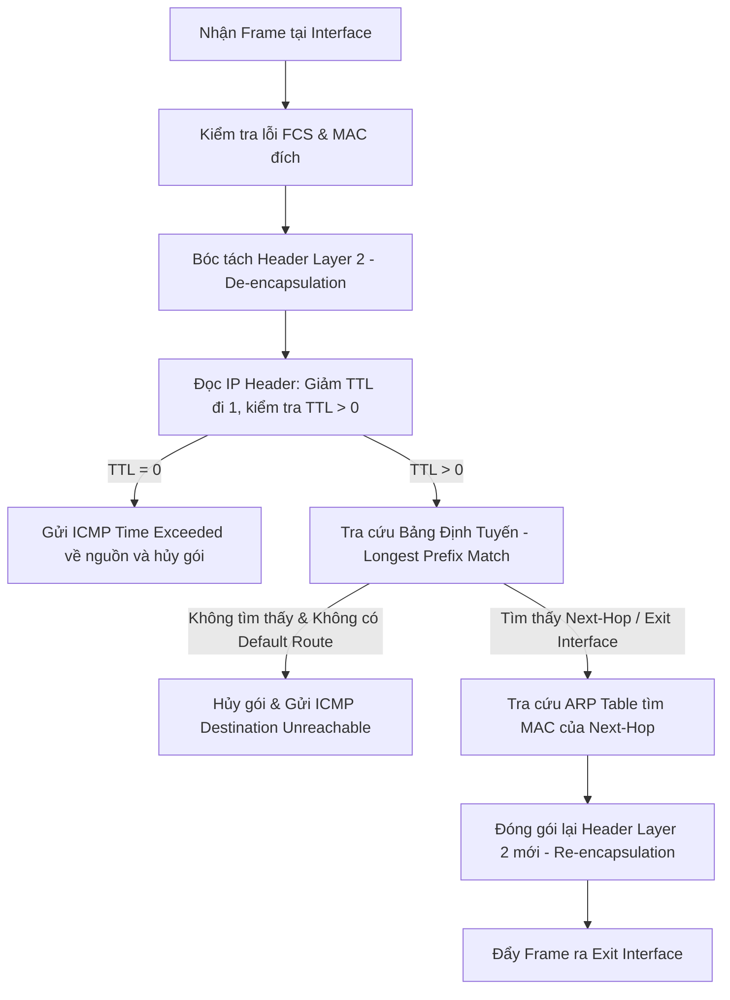
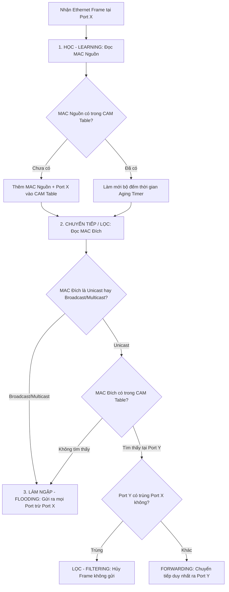
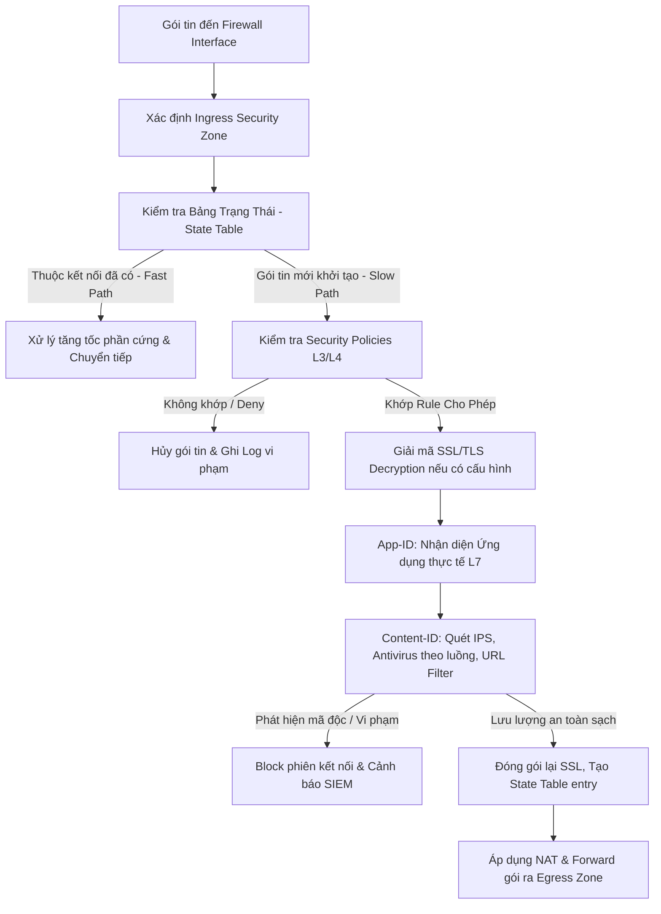
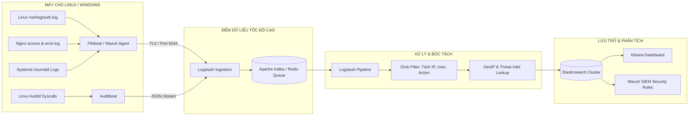
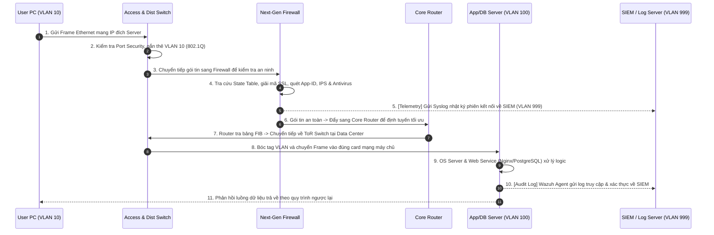
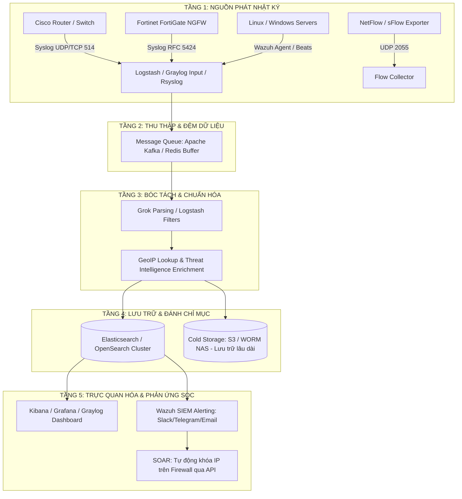
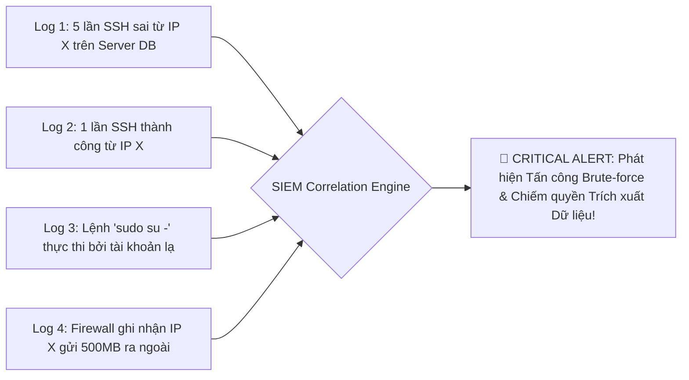

# TÀI LIỆU TOÀN TẬP VỀ HẠ TẦNG & AN TOÀN MẠNG DOANH NGHIỆP: ROUTER - SWITCH - SERVER - FIREWALL - MONITORING & SIEM
> **Chuyên đề**: Kiến trúc phần cứng, Nguyên lý hoạt động, Cấu hình thực tế, Phân đoạn mạng Management/Monitoring và Hệ thống Giám sát & Quản lý Nhật ký tập trung (SIEM / Correlation Rules / Syslog / SNMP / NetFlow).

---

# MỤC LỤC
1. [PHẦN 1: BỘ ĐỊNH TUYẾN (ROUTER)](#phần-1-bộ-định-tuyến-router)
   - 1.1. Tổng quan & Vị trí tầng OSI
   - 1.2. Nguyên lý hoạt động & Chu trình xử lý gói tin
   - 1.3. Kiến trúc phần cứng: Control Plane vs Data Plane
   - 1.4. Các giao thức định tuyến (Static, OSPF, BGP) & AD/Metric
   - 1.5. Các tính năng cốt lõi (NAT/PAT, Inter-VLAN, FHRP)
   - 1.6. Bảo mật & Giám sát trên Router (ACL, ZFW, uRPF, CoPP, Flexible NetFlow, Logging Host)
   - 1.7. Cấu hình mẫu Router Cisco IOS toàn diện
2. [PHẦN 2: BỘ CHUYỂN MẠCH (SWITCH)](#phần-2-bộ-chuyển-mạch-switch)
   - 2.1. Tổng quan về Switch (Layer 2 & Layer 3 Switch)
   - 2.2. Nguyên lý hoạt động: Learning, Forwarding, Flooding & CAM Table
   - 2.3. Mạng LAN ảo (VLAN) & Giao thức 802.1Q Trunking
   - 2.4. Giao thức chống vòng lặp Spanning Tree Protocol (STP / RSTP / MSTP)
   - 2.5. Gộp băng thông (EtherChannel / LACP) & Tính sẵn sàng cao (Stacking, VSS, MLAG)
   - 2.6. Bảo mật tầng 2 (Layer 2 Security: Port Security, DHCP Snooping, DAI, IP Source Guard)
   - 2.7. Cấu hình mẫu Switch Cisco IOS
3. [PHẦN 3: TƯỜNG LỬA THẾ HỆ MỚI (NEXT-GENERATION FIREWALL - NGFW)](#phần-3-tường-lửa-thế-hệ-mới-next-generation-firewall---ngfw)
   - 3.1. Khái niệm, Sự tiến hóa từ Packet Filter đến NGFW
   - 3.2. Nguyên lý hoạt động: Security Zones, State Table & Flow Pipeline
   - 3.3. Các công nghệ cốt lõi trên NGFW (App-ID, User-ID, Deep Packet Inspection, SSL Decryption)
   - 3.4. Các module an ninh tích hợp: IPS/IDS, Antivirus theo luồng, Web Filtering & Sandboxing
   - 3.5. Kết nối bảo mật VPN (IPsec Site-to-Site & SSL-VPN Remote Access)
   - 3.6. Cơ chế sẵn sàng cao (HA Active/Passive, Active/Active)
   - 3.7. Các hãng Firewall hàng đầu & Cấu hình mẫu thực tế (FortiGate / pfSense / Palo Alto)
4. [PHẦN 4: MÁY CHỦ DOANH NGHIỆP (SERVER)](#phần-4-máy-chủ-doanh-nghiệp-server)
   - 4.1. Khái niệm, Form Factor & Phần cứng chuyên dụng (ECC RAM, RAID, Redundant PSU, iDRAC/iLO)
   - 4.2. Hệ điều hành máy chủ (Linux Server vs Windows Server)
   - 4.3. Các dịch vụ mạng cốt lõi (DNS, DHCP, Web Server, Database, AD/LDAP, NTP)
   - 4.4. Ảo hóa (Type-1 Hypervisors: ESXi, Proxmox, KVM) & Container (Docker, K8s)
   - 4.5. Bảo mật, Nhật ký & Giám sát Server (Hardening, Syslog RFC 5424, SNMP Host MIB/OID, ELK Pipeline)
5. [PHẦN 5: MÔ HÌNH PHỐI HỢP TRONG KIẾN TRÚC DOANH NGHIỆP TOÀN DIỆN](#phần-5-mô-hình-phối-hợp-trong-kiến-trúc-doanh-nghiệp-toàn-diện)
   - 5.1. Topology mạng doanh nghiệp phòng thủ đa lớp & Phân đoạn mạng Management/Monitoring riêng biệt
   - 5.2. Luồng dữ liệu End-to-End từ Internet qua Firewall, Router, Switch đến Server và SIEM
   - 5.3. Bảng so sánh tổng hợp đa chiều Router vs Switch vs Firewall vs Server
6. [PHẦN 6: GIÁM SÁT & QUẢN LÝ NHẬT KÝ TẬP TRUNG (CENTRALIZED LOGGING & SIEM)](#phần-6-giám-sát--quản-lý-nhật-ký-tập-trung-centralized-logging--siem)
   - 6.1. Tổng quan về Giám sát An toàn Thông tin (SOC / SIEM / Telemetry)
   - 6.2. Giao thức SNMP Chi tiết (SNMPv1/v2c vs SNMPv3 USM, MIB/OID Cốt lõi, Polling vs Traps/Informs)
   - 6.3. Chuẩn Nhật ký Syslog (RFC 3164 vs RFC 5424, 8 Cấp độ Severity, Facilities, UDP/TCP/TLS)
   - 6.4. Kiến trúc Hệ thống Thu thập & Phân tích Log Tập trung (ELK Stack / Graylog / Wazuh SIEM Pipeline)
   - 6.5. Hệ thống SIEM & Tập luật Tương quan Sự kiện (Event Correlation Rules, Sigma, Wazuh XML, EQL)
   - 6.6. Mẫu Cấu hình Syslog & SNMP Thực tế trên Đa Nền tảng (Cisco IOS, Fortinet FortiGate, Linux Rsyslog)
   - 6.7. Chiến lược Lưu trữ, Tuân thủ (Compliance) & Bảo vệ Tính Toàn vẹn Nhật ký (WORM, Hashing)

---

# PHẦN 1: BỘ ĐỊNH TUYẾN (ROUTER)

## 1.1. Tổng quan & Vị trí tầng OSI
**Router (Bộ định tuyến)** là thiết bị mạng hoạt động tại **Tầng 3 (Network Layer)** của mô hình OSI. Nhiệm vụ cốt lõi của Router là **chuyển tiếp các gói tin (packets)** giữa các mạng con (Subnets) khác nhau và **tìm ra đường đi tối ưu nhất** đến đích.

```
+-------------------------------------------------------------------+
|                        MÔ HÌNH OSI & ROUTER                       |
+-------------------------------------------------------------------+
| Layer 7: Application  | HTTP, DNS, SSH, SNMP                      |
| Layer 6: Presentation | TLS/SSL, Data formatting                  |
| Layer 5: Session      | NetBIOS, RPC                              |
| Layer 4: Transport    | TCP, UDP, Port numbers                    |
| Layer 3: Network      | IP, ICMP, IPsec ---> [ ROUTER HOẠT ĐỘNG ] |
| Layer 2: Data Link    | Ethernet, MAC, Frame ---> [ Switch L2 ]   |
| Layer 1: Physical     | Cáp mạng, Cáp quang, Bit, Tín hiệu        |
+-------------------------------------------------------------------+
```

- **Phân chia Broadcast Domain**: Mỗi cổng (Interface) của Router là một Broadcast Domain độc lập, triệt tiêu nguy cơ bão broadcast trong toàn mạng.
- **Kết nối các mạng không đồng nhất**: Nối LAN với WAN/Internet, hoặc liên kết các chi nhánh văn phòng (Site-to-Site VPN).

---

## 1.2. Nguyên lý hoạt động & Chu trình xử lý gói tin



1. **Bóc tách Header L2 (De-encapsulation)**: Kiểm tra MAC đích có khớp với MAC cổng Router không, nếu đúng thì gỡ bỏ L2 Header/Trailer để lấy IP packet.
2. **Kiểm tra IP Header & TTL**: Giảm `TTL` đi 1. Nếu `TTL = 0`, hủy gói và gửi bản tin `ICMP Time Exceeded` về máy nguồn (chống vòng lặp vô tận).
3. **Tra cứu Bảng định tuyến (Longest Prefix Match)**: So khớp IP đích với bảng Routing Table (RIB/FIB), ưu tiên tuyến có Subnet Mask dài nhất (cụ thể nhất).
4. **Đóng gói lại Header L2 mới (Re-encapsulation)**: Tra bảng ARP tìm địa chỉ MAC của Next-Hop, gán MAC nguồn mới (cổng ra của router) và MAC đích mới (MAC Next-Hop).
5. **Chuyển tiếp (Forwarding)**: Đẩy gói tin qua cổng mạng tương ứng.

---

## 1.3. Kiến Trúc Phần Cứng: Control Plane vs Data Plane

- **Control Plane (Mặt phẳng điều khiển)**: Chạy trên CPU chính, phụ trách trao đổi các giao thức định tuyến (OSPF, BGP, EIGRP), tính toán đường đi, quản lý bảng định tuyến (RIB), và xử lý phiên quản trị (SSH/SNMP).
- **Data Plane / Forwarding Plane (Mặt phẳng dữ liệu)**: Chuyển tiếp gói tin với tốc độ phần cứng cực cao qua chip chuyên dụng **ASIC / FPGA / NPU** dựa trên bảng **FIB (Forwarding Information Base)** và **Adjacency Table** (cơ chế Cisco CEF).
- **Bộ nhớ Router**:
  - **RAM**: Lưu running-config, bảng định tuyến, ARP cache, bộ đệm packet (mất khi tắt nguồn).
  - **NVRAM**: Lưu cấu hình khởi động (startup-config).
  - **Flash**: Lưu hệ điều hành mạng (IOS, Junos, RouterOS).
  - **ROM / ROMMON**: Mã nạp vi chương trình khởi động và kiểm tra POST.

---

## 1.4. Các Giao Thức Định Tuyến & Administrative Distance (AD)

- **OSPF (Open Shortest Path First)**: Giao thức Link-State chuẩn mở, dùng thuật toán Dijkstra (SPF) để tìm đường đi ngắn nhất dựa trên Metric Cost (băng thông). Chia vùng Area để tối ưu mạng lớn (Area 0 Backbone).
- **BGP (Border Gateway Protocol)**: Giao thức Path Vector xương sống của Internet, định tuyến giữa các Autonomous System (AS) dựa trên các thuộc tính chính sách (AS-Path, Local Preference, MED).
- **Administrative Distance (AD)**: Độ tin cậy của nguồn định tuyến (giá trị càng nhỏ càng ưu tiên):
  - *Connected*: 0 | *Static*: 1 | *eBGP*: 20 | *EIGRP*: 90 | *OSPF*: 110 | *IS-IS*: 115 | *RIP*: 120 | *iBGP*: 200.

---

## 1.5. Các Tính Năng Cốt Lõi Trên Router
- **NAT / PAT (Port Address Translation)**: Chuyển đổi dải IP Private (RFC 1918) thành IP Public, phân biệt hàng nghìn phiên kết nối qua số hiệu cổng Layer 4 (Port).
- **Inter-VLAN Routing**: *Router-on-a-Stick* sử dụng 1 cổng vật lý chia thành nhiều Sub-interface gắn thẻ VLAN tag (802.1Q).
- **First Hop Redundancy Protocol (FHRP)**: HSRP (Cisco), VRRP (Chuẩn mở RFC 5798), GLBP giúp dự phòng Default Gateway cho máy trạm.

---

## 1.6. Bảo Mật & Giám Sát Chi Tiết Trên Router

### A. Control Plane Policing (CoPP)
Control Plane của Router rất dễ bị tấn công cạn kiệt tài nguyên (CPU Exhaustion) khi kẻ tấn công gửi bão gói tin nhắm vào chính địa chỉ IP của Router (VD: Bão ICMP, SSH Brute-force, BGP/OSPF flood).
- **Giải pháp**: **CoPP** tạo ra một bộ lọc chính sách QoS (Modular QoS CLI - MQC) đặt ngay trước CPU để phân loại và giới hạn tốc độ (Rate-limit) lưu lượng gửi lên Control Plane:
  - *Traffic Ưu tiên cao* (BGP, OSPF, SSH từ IP quản trị): Cho phép đi qua và bảo đảm băng thông.
  - *Traffic Ưu tiên trung bình* (ICMP, SNMP, NTP): Giới hạn tốc độ nghiêm ngặt (VD: 100 kbps).
  - *Traffic Nguy hại / Bất thường*: Chặn hoàn toàn (Drop).

### B. Chống Giả Mạo IP Nguồn (uRPF - Unicast Reverse Path Forwarding)
- **Strict Mode (`ip verify unicast source reachable-via rx`)**: Router kiểm tra xem IP nguồn của gói tin đến có trong bảng định tuyến và cổng đến có đúng là cổng mà Router sẽ dùng để gửi gói tin ngược lại hay không. Nếu không trùng, gói tin bị hủy ngay lập tức (Chống IP Spoofing hoàn hảo).
- **Loose Mode (`ip verify unicast source reachable-via any`)**: Chỉ kiểm tra xem IP nguồn có tồn tại trong bảng định tuyến hay không, không quan tâm cổng đến (Phù hợp môi trường định tuyến bất đối xứng Asymmetric Routing).

### C. Giám sát Lưu lượng mạng (Flexible NetFlow / IPFIX)
- Cho phép xuất thông tin chi tiết về 7 thông số định danh luồng (*Flow Key*): Source IP, Destination IP, Source Port, Destination Port, Layer 4 Protocol, Ingress Interface, IP Type of Service (ToS/DSCP).
- Định kỳ xuất dữ liệu qua giao thức UDP về máy chủ phân tích (NetFlow Collector / SIEM) để vẽ đồ thị lưu lượng và phát hiện bất thường an ninh.

### D. Cấu hình Nhật ký tập trung (Logging Host)
- Thiết lập Router đẩy toàn bộ log cảnh báo về SIEM Server tập trung (VLAN Monitoring), ghi rõ nhãn thời gian đến mili-giây và định danh cổng phát sinh.

---

## 1.7. Cấu Hình Mẫu Router Cisco IOS Toàn Diện

```cisco
! ==============================================================
! 1. KHỞI TẠO CƠ BẢN, BẢO MẬT QUẢN TRỊ & MÚI GIỜ
! ==============================================================
Router> enable
Router# configure terminal
Router(config)# hostname R1-Edge
R1-Edge(config)# service password-encryption
R1-Edge(config)# enable secret P@ssw0rdSecure!

! Cấu hình chuẩn hóa thời gian Syslog chi tiết đến mili-giây
R1-Edge(config)# clock timezone ICT 7 0
R1-Edge(config)# service timestamps debug datetime msec localtime show-timezone
R1-Edge(config)# service timestamps log datetime msec localtime show-timezone
R1-Edge(config)# service sequence-numbers

! ==============================================================
! 2. CẤU HÌNH GỬI SYSLOG VỀ MÁY CHỦ SIEM (VLAN 999)
! ==============================================================
! Đặt interface nguồn gửi log là Loopback0 hoặc cổng quản trị
R1-Edge(config)# interface Loopback0
R1-Edge(config-if)# ip address 10.255.255.1 255.255.255.255
R1-Edge(config-if)# exit

R1-Edge(config)# logging source-interface Loopback0
R1-Edge(config)# logging host 192.168.999.10 transport udp port 514
R1-Edge(config)# logging trap informational
R1-Edge(config)# logging facility local4
R1-Edge(config)# logging buffered 64000 debugging

! ==============================================================
! 3. CẤU HÌNH CONTROL PLANE POLICING (CoPP) BẢO VỆ CPU
! ==============================================================
! Định nghĩa ACL phân loại lưu lượng đến CPU
R1-Edge(config)# ip access-list extended ACL_COPP_MGMT
R1-Edge(config-ext-nacl)# permit tcp 192.168.99.0 0.0.0.255 any eq 22
R1-Edge(config-ext-nacl)# permit udp 192.168.999.0 0.0.0.255 any eq snmp
R1-Edge(config-ext-nacl)# exit

R1-Edge(config)# ip access-list extended ACL_COPP_ROUTING
R1-Edge(config-ext-nacl)# permit ospf any any
R1-Edge(config-ext-nacl)# exit

R1-Edge(config)# ip access-list extended ACL_COPP_ICMP
R1-Edge(config-ext-nacl)# permit icmp any any echo
R1-Edge(config-ext-nacl)# permit icmp any any echo-reply
R1-Edge(config-ext-nacl)# exit

! Tạo Class-map
R1-Edge(config)# class-map match-all CM_COPP_MGMT
R1-Edge(config-cmap)# match access-group name ACL_COPP_MGMT
R1-Edge(config-cmap)# exit
R1-Edge(config)# class-map match-all CM_COPP_ROUTING
R1-Edge(config-cmap)# match access-group name ACL_COPP_ROUTING
R1-Edge(config-cmap)# exit
R1-Edge(config)# class-map match-all CM_COPP_ICMP
R1-Edge(config-cmap)# match access-group name ACL_COPP_ICMP
R1-Edge(config-cmap)# exit

! Tạo Policy-map áp chính sách giới hạn băng thông (Policing)
R1-Edge(config)# policy-map PM_COPP_CONTROL_PLANE
R1-Edge(config-pmap)# class CM_COPP_ROUTING
R1-Edge(config-pmap-c)# police 1000000 conform-action transmit exceed-action transmit
R1-Edge(config-pmap-c)# exit
R1-Edge(config-pmap)# class CM_COPP_MGMT
R1-Edge(config-pmap-c)# police 500000 conform-action transmit exceed-action drop
R1-Edge(config-pmap-c)# exit
R1-Edge(config-pmap)# class CM_COPP_ICMP
R1-Edge(config-pmap-c)# police 100000 conform-action transmit exceed-action drop
R1-Edge(config-pmap-c)# exit

! Áp dụng chính sách vào Control Plane
R1-Edge(config)# control-plane
R1-Edge(config-cp)# service-policy input PM_COPP_CONTROL_PLANE
R1-Edge(config-cp)# exit

! ==============================================================
! 4. CẤU HÌNH FLEXIBLE NETFLOW (FnF) GIÁM SÁT LUỒNG MẠNG
! ==============================================================
! Tạo Flow Record
R1-Edge(config)# flow record FLOW_REC_SECURITY
R1-Edge(config-flow-record)# match ipv4 source address
R1-Edge(config-flow-record)# match ipv4 destination address
R1-Edge(config-flow-record)# match ipv4 protocol
R1-Edge(config-flow-record)# match transport source-port
R1-Edge(config-flow-record)# match transport destination-port
R1-Edge(config-flow-record)# collect counter bytes long
R1-Edge(config-flow-record)# collect counter packets long
R1-Edge(config-flow-record)# collect timestamp sys-uptime first
R1-Edge(config-flow-record)# collect timestamp sys-uptime last
R1-Edge(config-flow-record)# exit

! Tạo Flow Exporter đẩy dữ liệu về Flow Collector (VLAN 999)
R1-Edge(config)# flow exporter FLOW_EXP_SIEM
R1-Edge(config-flow-exporter)# destination 192.168.999.20
R1-Edge(config-flow-exporter)# source Loopback0
R1-Edge(config-flow-exporter)# transport udp 2055
R1-Edge(config-flow-exporter)# version 9
R1-Edge(config-flow-exporter)# exit

! Tạo Flow Monitor kết hợp Record và Exporter
R1-Edge(config)# flow monitor FLOW_MON_MAIN
R1-Edge(config-flow-monitor)# record FLOW_REC_SECURITY
R1-Edge(config-flow-monitor)# exporter FLOW_EXP_SIEM
R1-Edge(config-flow-monitor)# exit

! ==============================================================
! 5. CẤU HÌNH INTERFACES, uRPF VÀ ÁP DỤNG NETFLOW
! ==============================================================
R1-Edge(config)# interface GigabitEthernet0/0/0
R1-Edge(config-if)# description Ket_Noi_Mang_LAN_Core
R1-Edge(config-if)# ip address 192.168.10.1 255.255.255.0
R1-Edge(config-if)# ip verify unicast source reachable-via rx
R1-Edge(config-if)# ip flow monitor FLOW_MON_MAIN input
R1-Edge(config-if)# ip flow monitor FLOW_MON_MAIN output
R1-Edge(config-if)# no shutdown
R1-Edge(config-if)# exit

R1-Edge(config)# interface GigabitEthernet0/0/1
R1-Edge(config-if)# description Ket_Noi_ISP_WAN
R1-Edge(config-if)# ip address 203.0.113.2 255.255.255.252
R1-Edge(config-if)# ip verify unicast source reachable-via rx
R1-Edge(config-if)# ip flow monitor FLOW_MON_MAIN input
R1-Edge(config-if)# no shutdown
R1-Edge(config-if)# exit

R1-Edge(config)# ip route 0.0.0.0 0.0.0.0 203.0.113.1
```

---

# PHẦN 2: BỘ CHUYỂN MẠCH (SWITCH)

## 2.1. Tổng Quan Về Switch

```
+-------------------------------------------------------------+
|               PHÂN BIỆT CÁC LOẠI SWITCH                    |
+-------------------------------------------------------------+
| 1. Switch Layer 2 (L2 Switch):                              |
|    - Hoạt động tại tầng Data Link (Layer 2).                |
|    - Chuyển tiếp Frame dựa trên địa chỉ MAC.                |
|    - Phân chia Collision Domain độc lập trên từng port.     |
|    - Mặc định toàn bộ switch là 1 Broadcast Domain chung.   |
+-------------------------------------------------------------+
| 2. Switch Layer 3 (L3 / Multilayer Switch):                 |
|    - Tích hợp cả chức năng Switch L2 và Router L3.          |
|    - Định tuyến gói tin IP bằng phần cứng ASIC chuyên dụng. |
|    - Sử dụng SVI (Switched Virtual Interface) hoặc Routed   |
|      Port để định tuyến tốc độ dây (Wire-speed routing).    |
+-------------------------------------------------------------+
```

---

## 2.2. Nguyên Lý Hoạt Động Của Switch Layer 2

Switch hoạt động dựa trên bảng **MAC Address Table (hay CAM Table - Content Addressable Memory)** với 3 quy tắc cốt lõi:



1. **Học địa chỉ (Learning)**: Đọc **MAC nguồn** và gán với Port vừa nhận Frame vào bảng CAM (Aging timer mặc định 300s).
2. **Chuyển tiếp hoặc Lọc (Forwarding / Filtering)**: Tra **MAC đích** trong CAM Table. Nếu thấy cổng khác thì đẩy ra cổng đó; nếu thấy cùng cổng thì hủy (Filtering).
3. **Làm ngập (Flooding)**: Nếu MAC đích là Broadcast (`FF:FF:FF:FF:FF:FF`), Multicast, hoặc **Unknown Unicast**, Switch gửi bản sao ra **tất cả các cổng còn lại** trong cùng VLAN.

---

## 2.3. Mạng LAN Ảo (VLAN) & Giao thức 802.1Q Trunking
- **Access Port**: Cổng nối thiết bị đầu cuối (PC, Server), truyền Frame chuẩn không gắn thẻ (*Untagged*).
- **Trunk Port**: Cổng nối Switch-Switch hoặc Switch-Router, gắn thẻ **IEEE 802.1Q (4 Bytes)** chứa **VLAN ID (1-4094)**.
- **Native VLAN**: VLAN truyền trên đường Trunk mà không cần gắn tag (mặc định là VLAN 1, nên đổi để an toàn).

---

## 2.4. Spanning Tree Protocol (STP) & Chống Vòng Lặp
Chống bão Broadcast và lỗi lặp vòng Layer 2 khi có đường truyền vật lý dự phòng:
- **STP (IEEE 802.1D)**: Chậm (hội tụ mất 30-50s).
- **RSTP (IEEE 802.1w)**: Hội tụ cực nhanh (dưới 1-2s).
- **MSTP (IEEE 802.1s)**: Gom nhiều VLAN vào 1 cây STP để tiết kiệm CPU.

---

## 2.5. Gộp Băng Thông & Dự Phòng
- **EtherChannel / LACP (IEEE 802.3ad)**: Gộp 2-8 đường vật lý thành 1 kết nối logic tăng băng thông và tự động chịu lỗi đứt cáp.
- **Stacking / MLAG / vPC**: Hợp nhất nhiều switch vật lý thành 1 switch logic phục vụ dự phòng cổng và nâng cao băng thông.

---

## 2.6. Bảo Mật Tầng 2 (Layer 2 Security Best Practices)

| Nguy cơ tấn công Layer 2 | Giải pháp trên Switch |
| :--- | :--- |
| **MAC Flooding** (Làm tràn CAM Table) | **Port Security** (Giới hạn MAC trên port, Violation: Shutdown/Restrict) |
| **Rogue DHCP Server** (DHCP giả mạo) | **DHCP Snooping** (Chỉ cho phép DHCP Offer từ cổng Trusted) |
| **ARP Poisoning / MITM** | **Dynamic ARP Inspection (DAI)** (Đối chiếu ARP với DHCP Snooping Table) |
| **IP/MAC Spoofing** | **IP Source Guard (IPSG)** |
| **STP Attack** | **BPDU Guard** & **Root Guard** |
| **Giám sát lưu lượng** | **SPAN / RSPAN** (Port Mirroring cho IDS/IPS) |

---

## 2.7. Cấu Hình Mẫu Switch Cisco IOS
```cisco
! Tạo VLAN Data và VLAN Management/Monitoring
Switch(config)# vlan 10
Switch(config-vlan)# name USER_LAN
Switch(config)# vlan 99
Switch(config-vlan)# name VLAN_MANAGEMENT
Switch(config)# vlan 999
Switch(config-vlan)# name VLAN_MONITORING_SIEM
Switch(config)# exit

! Cấu hình Access Port kèm Port Security & BPDU Guard
Switch(config)# interface range GigabitEthernet0/1 - 10
Switch(config-if-range)# switchport mode access
Switch(config-if-range)# switchport access vlan 10
Switch(config-if-range)# spanning-tree portfast
Switch(config-if-range)# spanning-tree bpduguard enable
Switch(config-if-range)# switchport port-security
Switch(config-if-range)# switchport port-security maximum 2
Switch(config-if-range)# switchport port-security mac-address sticky
Switch(config-if-range)# switchport port-security violation shutdown
Switch(config-if-range)# exit

! Cấu hình Trunk Port & DHCP Snooping
Switch(config)# interface GigabitEthernet0/24
Switch(config-if)# switchport mode trunk
Switch(config-if)# switchport trunk allowed vlan 10,99,999
Switch(config)# ip dhcp snooping
Switch(config)# ip dhcp snooping vlan 10
Switch(config)# interface GigabitEthernet0/24
Switch(config-if)# ip dhcp snooping trust
Switch(config)# ip arp inspection vlan 10
```

---

# PHẦN 3: TƯỜNG LỬA THẾ HỆ MỚI (NEXT-GENERATION FIREWALL - NGFW)

## 3.1. Khái Niệm & Sự Tiến Hóa Của Firewall

**Firewall (Tường lửa)** là chốt chặn an ninh trung tâm trong hệ thống mạng, chịu trách nhiệm **kiểm soát, giám sát và sàng lọc toàn bộ lưu lượng dữ liệu vào/ra** dựa trên các quy tắc bảo mật nghiêm ngặt.

```
                  SỰ TIẾN HÓA CỦA CÁC THẾ HỆ FIREWALL
+-------------------------------------------------------------------------------+
| THẾ HỆ 1: Packet Filtering (Stateless Firewall)                              |
| - Kiểm tra từng gói tin đơn lẻ dựa trên L3/L4 (IP nguồn/đích, Port, Protocol).|
| - Không lưu nhớ ngữ cảnh kết nối, dễ bị vượt qua bởi các cuộc tấn công phức tạp|
+-------------------------------------------------------------------------------+
                                      |
                                      v
+-------------------------------------------------------------------------------+
| THẾ HỆ 2: Stateful Inspection Firewall                                        |
| - Quản lý Bảng trạng thái (State Table) theo dõi vòng đời TCP/UDP.            |
| - Tự động mở đường cho gói tin phản hồi hợp lệ (Established/Related).         |
+-------------------------------------------------------------------------------+
                                      |
                                      v
+-------------------------------------------------------------------------------+
| THẾ HỆ 3: Application Proxy / ALG (Application-Level Gateway)                 |
| - Đóng vai trò trung gian đứng giữa Client và Server tại Tầng 7 (Application).|
| - Phân tích sâu nội dung nhưng hiệu năng chuyển tiếp chậm.                     |
+-------------------------------------------------------------------------------+
                                      |
                                      v
+-------------------------------------------------------------------------------+
| THẾ HỆ 4: Next-Generation Firewall (NGFW - HIỆN NAY)                          |
| - Deep Packet Inspection (DPI) tốc độ cao ở phần cứng chuyên dụng.            |
| - Nhận diện ứng dụng thực tế bất chấp Port (App-ID).                          |
| - Gắn liền danh tính người dùng (User-ID).                                   |
| - Tích hợp toàn diện: IPS, Antivirus theo luồng, Web Filter, SSL Decryption,  |
|   Sandbox đám mây chống Zero-Day.                                            |
+-------------------------------------------------------------------------------+
```

---

## 3.2. Nguyên Lý Hoạt Động & Chu Trình Xử Lý Gói Tin Trên NGFW

### A. Phân Vùng Bảo Mật (Security Zones)
- **INSIDE (Trust Zone)**: Vùng mạng người dùng nội bộ LAN.
- **OUTSIDE (Untrust Zone)**: Mạng Internet công cộng không tin cậy.
- **DMZ (Demilitarized Zone)**: Vùng đệm chứa các máy chủ công khai (Web, Mail, DNS Server).
- **MANAGEMENT / MONITORING (Zone chuyên biệt)**: Vùng mạng quản trị và chứa cụm máy chủ SIEM/Log.



---

## 3.3. Các Công Nghệ Cốt Lõi Trên NGFW
- **App-ID (Application ID)**: Nhận diện chính xác ứng dụng (Facebook, BitTorrent, SSH,...) bất kể port thực tế.
- **User-ID**: Đồng bộ danh bạ Active Directory / LDAP / 802.1X để áp chính sách theo User/Group.
- **SSL/TLS Decryption (Inbound & Outbound)**: Giải mã lưu lượng HTTPS để quét mã độc ẩn giấu rồi mã hóa lại.
- **Deep Packet Inspection (DPI)**: Kiểm tra toàn bộ phần dữ liệu Payload của gói tin để phát hiện SQLi, XSS, Buffer Overflow, Ransomware.

---

## 3.4. Các Module An Ninh Tích Hợp (Security Profiles)
- **Intrusion Prevention System (IPS)**: Ngăn chặn kịp thời các cuộc tấn công khai thác lỗ hổng đã biết (CVE) và **Virtual Patching**.
- **Gateway Antivirus & Anti-Malware theo luồng**: Quét virus trực tiếp trên đường truyền mạng.
- **Web Filtering & DNS Security**: Phân loại URL, chặn C2, Phishing và chống DNS Tunneling.
- **Cloud Sandboxing (Palo Alto WildFire, FortiSandbox)**: Thực thi tệp lạ trên môi trường ảo cô lập để bắt mã độc Zero-day.

---

## 3.5. Kết Nối Mạng Ảo Bảo Mật (VPN) Trên Firewall
- **IPsec Site-to-Site VPN**: Mã hóa kết nối giữa Trụ sở (HQ) và Chi nhánh (Branch) bằng **IKEv2**, **AES-GCM-256**, Diffie-Hellman Group 19/20/21.
- **SSL-VPN / Remote Access VPN**: Cho phép nhân viên làm việc từ xa kết nối an toàn vào mạng nội bộ công ty qua Agent (FortiClient, GlobalProtect) kèm **MFA/2FA**.

---

## 3.6. Cơ Chế Dự Phòng Sẵn Sàng Cao (High Availability - HA)
- **Active / Passive (A/P)**: Thiết bị chính xử lý 100% lưu lượng, thiết bị phụ ở trạng thái chờ và đồng bộ State Table liên tục qua cáp Heartbeat (**Stateful Failover** dưới 1 giây).
- **Active / Active (A/A)**: Cả 2 thiết bị cùng xử lý lưu lượng và cân bằng tải.

---

## 3.7. Cấu Hình Mẫu Trên Fortinet FortiGate (FortiOS CLI)
```fortios
! Cấu hình gửi Syslog về máy chủ SIEM tập trung
config log syslogd setting
    set status enable
    set server "192.168.999.10"
    set mode udp
    set port 514
    set facility local7
    set format default
    set source-ip "192.168.99.1"
end

config log syslogd filter
    set forward-traffic enable
    set local-traffic enable
    set severity informational
end
```

---

# PHẦN 4: MÁY CHỦ DOANH NGHIỆP (SERVER)

## 4.1. Khái Niệm, Form Factor & Phần Cứng Chuyên Dụng
- **Form Factor**: Tower (dạng thùng), Rackmount (1U, 2U, 4U lắp tủ Rack Data Center), Blade Server (mật độ tính toán cực cao).
- **CPU Server**: Intel Xeon, AMD EPYC đa nhân đa luồng, hỗ trợ Multi-Socket.
- **RAM ECC (Error-Correcting Code)**: Tự động sửa lỗi đảo bit đơn, chống treo hệ thống.
- **Lưu trữ & RAID Controller**: Hỗ trợ ổ đĩa Hot-Swap SAS/NVMe. Cấu hình **RAID 1** (Mirror), **RAID 5** (Striping + Parity), **RAID 6** (Dual Parity), **RAID 10** (1+0).
- **Nguồn kép dự phòng (Redundant PSU)**: Cắm vào 2 nhánh điện A/B riêng biệt.
- **Quản trị Out-of-Band (iDRAC, iLO, IPMI)**: Bật/tắt nguồn và cài OS từ xa độc lập với hệ điều hành chính.

---

## 4.2. Hệ Điều Hành Máy Chủ
- **Linux Server (Ubuntu Server, RHEL, Rocky Linux, Debian)**: Mã nguồn mở, siêu nhẹ, tối ưu chạy Web Server, Database, Container, Microservices.
- **Windows Server (2022/2025)**: Tối ưu quản lý định danh người dùng tập trung (**Active Directory Domain Services - AD DS**), phân quyền thư mục tập tin SMB/CIFS, và các giải pháp Microsoft.

---

## 4.3. Các Dịch Vụ Mạng Cốt Lõi Trên Server
- **DNS** (BIND9 / Windows DNS - Port 53), **DHCP** (Kea / ISC - Port 67/68).
- **Web Server** (Nginx, Apache HTTPD, Caddy - Port 80/443).
- **Database** (PostgreSQL, MySQL, Redis - Port 5432, 3306, 6379).
- **Directory & AAA** (Active Directory / OpenLDAP - Port 389/636, Kerberos Port 88, RADIUS Port 1812).
- **NTP Time Sync** (Chrony / NTPd - Port 123), **File Server** (Samba/NFS - Port 445/2049).

---

## 4.4. Ảo Hóa & Container Hóa
- **Hypervisor Type-1 (Bare-Metal)**: Cài trực tiếp lên phần cứng máy chủ (**VMware ESXi**, **Proxmox VE**, **KVM/QEMU**).
- **Container (Docker & Kubernetes)**: Chia sẻ chung Linux Kernel, đóng gói nhẹ, triển khai tức thì.

---

## 4.5. Bảo Mật, Nhật Ký & Giám Sát Chi Tiết Trên Server

### A. Cấu trúc gói tin Syslog Chuẩn RFC 5424 trên Server Linux
Mỗi sự kiện hệ thống được phát sinh bởi tiến trình `systemd-journald` hoặc `rsyslog` đều tuân thủ cấu trúc 7 thành phần chuẩn hóa:

```
+-----------------------------------------------------------------------------------------------+
|                       CẤU TRÚC GÓI TIN SYSLOG THEO RFC 5424                                    |
+-----------------------------------------------------------------------------------------------+
| <PRI> | VERSION | TIMESTAMP (ISO-8601)      | HOSTNAME    | APP-NAME | PROCID | MSGID | SDATA | MSG |
+-------+---------+---------------------------+-------------+----------+--------+-------+-------+-----+
| <86>  | 1       | 2026-09-15T14:40:00.123Z  | srv-db01    | sshd     | 18234  | ID01  | [-]   | ... |
+-----------------------------------------------------------------------------------------------+
```
- **PRI `<86>`**: `(Facility 10: authpriv * 8) + Severity 6: Informational = 86`.
- **TIMESTAMP**: Độ chính xác mili-giây UTC kèm múi giờ ISO 8601.
- **HOSTNAME**: Tên định danh FQDN của máy chủ (`srv-db01.corp.internal`).
- **APP-NAME & PROCID**: Tên ứng dụng (`sshd`, `nginx`, `mysqld`) và Process ID của tiến trình sinh log.
- **STRUCTURED-DATA (SDATA)**: Cặp key-value có cấu trúc đóng mở ngoặc vuông `[exampleSDID@32473 ip="192.168.10.50" user="admin"]`.

---

### B. Giám sát Phần cứng & Dịch vụ Server qua SNMP (Host Resources MIB & OID)
Để NMS (Zabbix/Prometheus) giám sát trạng thái máy chủ, tiến trình `snmpd` trên Linux xuất các OID chuẩn:

```
+-------------------------------------------------------------------------------+
| THÔNG SỐ GIÁM SÁT SERVER            | OID CHUẨN (HOST RESOURCES / UCD-SNMP)   |
+-------------------------------------+-----------------------------------------+
| CPU 1-min Load Average              | .1.3.6.1.4.1.2021.10.1.3.1              |
| CPU 5-min Load Average              | .1.3.6.1.4.1.2021.10.1.3.2              |
| Tổng dung lượng RAM (Total RAM)     | .1.3.6.1.4.1.2021.4.5.0                 |
| Dung lượng RAM khả dụng (Avail RAM) | .1.3.6.1.4.1.2021.4.6.0                 |
| Tỷ lệ sử dụng phân vùng Disk /      | .1.3.6.1.4.1.2021.9.1.9.1               |
| Tổng số tiến trình đang chạy        | .1.3.6.1.2.1.25.1.6.0 (hrSystemProcesses|
| Thời gian hoạt động liên tục        | .1.3.6.1.2.1.1.3.0 (sysUpTime)          |
+-------------------------------------+-----------------------------------------+
```

---

### C. Kiến trúc Pipeline Đẩy Log từ Server vào Cụm ELK Stack / Wazuh



#### Cấu hình mẫu Logstash Pipeline (`/etc/logstash/conf.d/10-server-pipeline.conf`):
```ruby
input {
  beats {
    port => 5044
    ssl => true
    ssl_certificate => "/etc/logstash/certs/logstash.crt"
    ssl_key => "/etc/logstash/certs/logstash.pkcs8.key"
  }
}

filter {
  if [fileset][module] == "system" and [fileset][name] == "auth" {
    grok {
      match => { "message" => "%{SYSLOGTIMESTAMP:syslog_timestamp} %{HOSTNAME:hostname} sshd\[%{POSINT:pid}\]: %{DATA:sshd_action} for %{DATA:user} from %{IP:src_ip} port %{POSINT:src_port} %{WORD:auth_protocol}" }
    }
    date {
      match => [ "syslog_timestamp", "MMM  d HH:mm:ss", "MMM dd HH:mm:ss" ]
    }
    geoip {
      source => "src_ip"
      target => "source_geo"
    }
  }
}

output {
  elasticsearch {
    hosts => ["https://192.168.999.15:9200"]
    index => "enterprise-server-logs-%{+YYYY.MM.dd}"
    ssl => true
    cacert => "/etc/logstash/certs/ca.crt"
    user => "elastic"
    password => "ElasticP@ssw0rdSecure!"
  }
}
```

---

# PHẦN 5: MÔ HÌNH PHỐI HỢP TRONG KIẾN TRÚC DOANH NGHIỆP TOÀN DIỆN

## 5.1. Topology Mạng Doanh Nghiệp Phòng Thủ Đa Lớp & Phân Đoạn Mạng Management/Monitoring Riêng Biệt

Một thiết kế mạng doanh nghiệp đạt chuẩn an toàn thông tin bắt buộc phải **tách biệt hoàn toàn luồng dữ liệu nghiệp vụ (In-band Data Traffic)** khỏi **luồng dữ liệu quản trị và giám sát (Out-of-band Management & Monitoring Traffic)**:

```
                                  [ INTERNET / WAN ]
                                          |
                          +---------------+---------------+
                          |  BORDER ROUTER / ISP PEERING  |
                          |  - BGP Routing, Anti-DDoS     |
                          |  - NetFlow / SNMP Exporter    |
                          +---------------+---------------+
                                          |
                          +---------------+---------------+
                          |  EDGE NEXT-GEN FIREWALL (HA)  |
                          |  - IPS, Antivirus, SSL Proxy  |
                          |  - Syslog / Traffic Exporter  |
                          +---------------+---------------+
                                          |
        +---------------------------------+---------------------------------+
        |                                                                   |
 [ DMZ NETWORK ]                                                     [ CORE LAYER ]
 (VLAN 100: 172.16.100.0/24)                                  +-------------+-------------+
 (Web/Mail/DNS Servers)                                       | Core Router / L3 Switch   |
        |                                                     | - OSPF Backbone Area 0    |
 +------+------+                                              | - SVI Inter-VLAN Routing  |
 | DMZ Switch  |                                              +-------------+-------------+
 +------+------+                                                            |
        |                                   +-------------------------------+-------------------------------+
 +------+------+                            |                                                               |
 | Web Server  |                 [ DISTRIBUTION LAYER ]                                          [ DATA CENTER CORE ]
 | Mail Server |                 +----------+----------+                                         +----------+----------+
 | DNS Server  |                 | Dist Switch L3 / L2 |                                         | ToR Switch (L3/L2)  |
 +-------------+                 +----------+----------+                                         +----------+----------+
                                            |                                                               |
                                    [ ACCESS LAYER ]                                                [ SERVER FARM ]
                                 +----------+----------+                                         +----------+----------+
                                 | Access Switch L2    |                                         | Active Directory DC |
                                 +----------+----------+                                         | Database DB Cluster |
                                            |                                                    | File Server NAS/SAN |
                                 +----------+----------+                                         +---------------------+
                                 | VLAN 10: USER_LAN   |
                                 | VLAN 20: STAFF_LAN  |
                                 +---------------------+

=============================================================================================================================
                      [ VÙNG QUẢN TRỊ & GIÁM SÁT AN TOÀN MẠNG RIÊNG BIỆT (SOC / NOC) ]
=============================================================================================================================
                                                   |
        +------------------------------------------+------------------------------------------+
        |                                                                                     |
 [ VLAN 99: MANAGEMENT NETWORK ]                                               [ VLAN 999: MONITORING & SIEM NETWORK ]
 (Dải IP: 192.168.99.0/24)                                                     (Dải IP: 192.168.999.0/24)
 - Chỉ cho phép Administrator truy cập qua Bastion Host/VPN                     - Vùng chứa cụm máy chủ phân tích an ninh tập trung
        |                                                                                     |
 +------+----------------------------------+                                   +--------------+------------------------------+
 | - Out-of-Band Mgmt (iDRAC/iLO/IPMI)     |                                   | - Wazuh SIEM Server / Indexer / Dashboard    |
 | - Opengear Serial Console Server        |                                   | - ELK Stack (Elasticsearch, Logstash, Kibana)|
 | - Bastion Host / Jump Server            |                                   | - Syslog Receiver Daemon (Port 514 UDP/TCP)  |
 | - Thiết bị quản trị SSH/HTTPS GUI       |                                   | - NetFlow / IPFIX Flow Collector (Port 2055) |
 +-----------------------------------------+                                   | - Zabbix / Prometheus Network NMS (SNMP NMS) |
                                                                               +---------------------------------------------+
```

---

## 5.2. Luồng Dữ Liệu End-to-End Từ Client Truy Cập Server Qua Các Thiết Bị



---

## 5.3. Bảng So Sánh Tổng Hợp Đa Chiều: Router vs Switch vs Firewall vs Server

| Tiêu chí | Router (Bộ định tuyến) | Switch Layer 2 | Multilayer Switch (L3) | Next-Gen Firewall (NGFW) | Server (Máy chủ) |
| :--- | :--- | :--- | :--- | :--- | :--- |
| **Tầng OSI chính** | **Layer 3** (Network) | **Layer 2** (Data Link) | **Layer 2 & Layer 3** | **Layer 3 đến Layer 7** | **Layer 1 đến Layer 7** |
| **Đơn vị dữ liệu** | Packet (IP) | Frame (MAC) | Frame & Packet | Packet & App Payload | Application Data / File / DB |
| **Phần cứng xử lý**| CPU + NPU/ASIC | ASIC Chuyển mạch | ASIC Định tuyến + CAM | ASIC Bảo mật (SPU/CP) | CPU đa nhân (Xeon/EPYC), ECC RAM |
| **Trọng tâm chức năng**| Định tuyến liên mạng, nối WAN/Internet | Kết nối thiết bị cục bộ LAN | Chuyển mạch LAN + Routing Inter-VLAN cực nhanh | Kiểm soát an ninh, IPS, lọc ứng dụng, phòng thủ mã độc | Cung cấp ứng dụng, tính toán, xử lý dữ liệu và lưu trữ |
| **Cơ chế chuyển tiếp**| Routing Table (RIB/FIB)| Bảng MAC (CAM Table) | CAM + FIB (SVI) | Security Policies + State Table + App-ID | Socket Network Stack (TCP/UDP) |
| **Khả năng kiểm tra**| Stateless (mặc định) | Stateless | Stateless | **Stateful & Deep Packet Inspection (DPI)** | Xử lý logic ứng dụng tầng cao |
| **Phân vùng mạng** | Broadcast Domain | Collision Domain | VLAN & Subnet | **Security Zones (Trust, Untrust, DMZ)** | Host / Endpoint |

---

# PHẦN 6: GIÁM SÁT & QUẢN LÝ NHẬT KÝ TẬP TRUNG (CENTRALIZED LOGGING & SIEM)

## 6.1. Tổng Quan Về Giám Sát An Toàn Thông Tin & SOC / SIEM

```
+-------------------------------------------------------------------------------+
|                    3 TRỤ CỘT CỦA GIÁM SÁT HẠ TẦNG (TELEMETRY)                 |
+-------------------------------------------------------------------------------+
| 1. LOGS (Nhật ký sự kiện):                                                    |
|    - Bản ghi chi tiết các sự kiện diễn ra theo dòng thời gian (Ai, Làm gì,    |
|      Khi nào, Ở đâu, Thành công hay Thất bại). Tiêu chuẩn: Syslog, Audit log. |
+-------------------------------------------------------------------------------+
| 2. METRICS (Số liệu hiệu năng):                                               |
|    - Giá trị định lượng đo lường trạng thái thiết bị theo chu kỳ thời gian    |
|      (Tải CPU %, RAM %, Băng thông Interface Mbps, Nhiệt độ).                |
|    - Tiêu chuẩn: SNMP, Prometheus Exporter.                                   |
+-------------------------------------------------------------------------------+
| 3. FLOWS (Luồng lưu lượng mạng):                                              |
|    - Siêu dữ liệu thống kê các kết nối IP qua thiết bị (NetFlow, IPFIX, sFlow)|
|    - Phục vụ phân tích Top Talkers, phát hiện DDoS và bất thường băng thông.  |
+-------------------------------------------------------------------------------+
```

---

## 6.2. Giao Thức SNMP Chi Tiết (Simple Network Management Protocol)

### A. Kiến trúc hoạt động của SNMP
- **SNMP Manager (NMS)**: Máy chủ giám sát (Zabbix, PRTG, Prometheus) định kỳ gửi truy vấn hoặc nhận cảnh báo.
- **SNMP Agent**: Tiến trình phần mềm chạy ngầm trên Router, Switch, Server để thu thập dữ liệu phần cứng.
- **MIB (Management Information Base)**: Cơ sở dữ liệu phân cấp dạng cây chứa các biến trạng thái.
- **OID (Object Identifier)**: Chuỗi số định danh duy nhất cho một thông số (VD: `.1.3.6.1.2.1.1.3.0` là `sysUpTime`).

### B. Hai cơ chế truyền dữ liệu trong SNMP
1. **Pull (Polling)**: NMS chủ động gửi bản tin `GET-REQUEST`, `GET-NEXT`, `GET-BULK` tới cổng **UDP 161** của Agent để lấy dữ liệu.
2. **Push (Event-driven Alerts)**:
   - **SNMP Trap**: Khi có sự cố đột xuất (Interface down, quạt hỏng), Agent bắn bản tin Trap về NMS tại cổng **UDP 162** (Unacknowledged).
   - **SNMP Inform**: Tương tự Trap nhưng **có bản tin ACK xác nhận** từ NMS, đảm bảo không bị thất lạc cảnh báo quan trọng.

### C. So sánh SNMPv1, SNMPv2c và SNMPv3

| Tiêu chí | SNMPv1 | SNMPv2c | SNMPv3 (Chuẩn an toàn khuyến nghị) |
| :--- | :--- | :--- | :--- |
| **Xác thực** | Community String (Plaintext) | Community String (Plaintext) | **USM (User-based Security Model)**: Username + Password |
| **Mã hóa dữ liệu** | Không có (Truyền rõ) | Không có (Truyền rõ) | **Mã hóa mạnh: AES-128 / AES-256 / 3DES** |
| **Bảo vệ toàn vẹn** | Không | Không | **HMAC-MD5 / HMAC-SHA-256 / SHA-512** |
| **Mức độ an ninh** | Không phân cấp | Không phân cấp | 1. `noAuthNoPriv`<br>2. `authNoPriv`<br>3. **`authPriv` (Vừa SHA vừa AES)** |

---

## 6.3. Chuẩn Nhật Ký Syslog (RFC 3164 vs RFC 5424)

### A. So sánh định dạng thông điệp
- **RFC 3164 (BSD Syslog)**: `<PRI>TIMESTAMP HOSTNAME TAG: MESSAGE` (Không có năm, không chuẩn hóa múi giờ).
- **RFC 5424 (Chuẩn hiện đại)**: `<PRI>VERSION TIMESTAMP HOSTNAME APP-NAME PROCID MSGID STRUCTURED-DATA MSG` (Chuẩn ISO 8601, hỗ trợ mili-giây và dữ liệu có cấu trúc).

### B. Công thức tính PRI & 8 Mức Độ Nghiêm Trọng (Severity)
$$\text{PRI} = (\text{Facility} \times 8) + \text{Severity}$$

```
+-------------------------------------------------------------------------------+
| SEVERITY | TÊN MỨC ĐỘ     | Ý NGHĨA KỸ THUẬT                                  |
+----------+----------------+---------------------------------------------------+
|    0     | Emergency      | Hệ thống hoàn toàn không thể sử dụng (Panic)      |
|    1     | Alert          | Cần hành động khắc phục ngay lập tức              |
|    2     | Critical       | Lỗi tình trạng nguy kịch (VD: Hỏng phần cứng)     |
|    3     | Error          | Lỗi xử lý thông thường                            |
|    4     | Warning        | Cảnh báo sự cố tiềm ẩn (VD: CPU vượt ngưỡng 85%)  |
|    5     | Notice         | Điều kiện hoạt động bình thường nhưng quan trọng  |
|    6     | Informational  | Thông tin hoạt động bình thường (VD: Interface UP)|
|    7     | Debug          | Thông tin chi tiết phục vụ gỡ lỗi lập trình       |
+-------------------------------------------------------------------------------+
```

---

## 6.4. Kiến Trúc Hệ Thống Thu Thập & Phân Tích Log Tập Trung



---

## 6.5. Hệ Thống SIEM & Tập Luật Tương Quan Sự Kiện (Correlation Rules)

### A. Nguyên lý hoạt động của Công cụ Tương quan (Correlation Engine)
Hệ thống SIEM thu thập hàng triệu dòng log mỗi ngày từ Router, Switch, Firewall, Server. Nếu chỉ đọc log đơn lẻ, chuyên viên bảo mật sẽ bị ngập trong cảnh báo giả (**Alert Fatigue**). Công cụ tương quan (Correlation Engine) xâu chuỗi nhiều sự kiện độc lập trong một cửa sổ thời gian trượt (**Sliding Time Window**) để phát hiện chính xác hành vi tấn công phức tạp.



---

### B. Các Kịch Bản Tấn Công Kinh Điển & Mẫu Quy Tắc Tương Quan (Correlation Rules)

#### Kịch bản 1: Phát hiện Dò quét Mật khẩu (SSH Brute Force Attack)
- **Logic**: Phát hiện $\ge 5$ lần đăng nhập SSH thất bại (`Failed password`) từ cùng một địa chỉ IP nguồn trong vòng 2 phút, sau đó có 1 lần đăng nhập thành công (`Accepted password`).

##### Cú pháp Luật Wazuh XML (`/var/ossec/etc/rules/local_rules.xml`):
```xml
<group name="sshd,authentication_failures,">
  <!-- Rule mức độ thấp: Đăng nhập SSH thất bại -->
  <rule id="100001" level="5">
    <if_sid>5710</if_sid>
    <description>Phat hien dang nhap SSH that bai</description>
  </rule>

  <!-- Correlation Rule mức độ cao: Lặp lại quá 5 lần trong 120 giây -->
  <rule id="100002" level="12" frequency="5" timeframe="120">
    <if_matched_sid>100001</if_matched_sid>
    <same_source_ip />
    <description>CANH BAO NGUY HIEM: Phat hien tan cong SSH Brute-force tu mot dia chi IP</description>
    <mitre>
      <id>T1110.001</id>
    </mitre>
  </rule>
</group>
```

##### Cú pháp Chuẩn Quốc Tế Sigma Rule (YAML):
```yaml
title: SSH Brute Force Followed by Successful Login
id: 8f9b2c3a-1234-4567-89ab-cdef01234567
status: production
description: Phat hien chuoi hanh vi do quet mat khau SSH lien tiep va dang nhap thanh cong
logsource:
    product: linux
    service: sshd
detection:
    selection_fail:
        event_id: 'sshd_failed'
    selection_success:
        event_id: 'sshd_success'
    timeframe: 2m
    condition: selection_fail | count(src_ip) >= 5 and selection_success
falsepositives:
    - Nguoi dung quen mat khau go sai nhieu lan
level: high
```

---

#### Kịch bản 2: Dò quét Cổng Mạng Nội Bộ (Internal Reconnaissance / Port Scan)
- **Logic**: Một máy trạm trong VLAN 10 gửi gói tin TCP SYN đến hơn 20 cổng khác nhau hoặc hơn 10 địa chỉ IP khác nhau trong cùng 1 phút và bị Firewall từ chối (`Action: Deny/Drop`).

##### Cú pháp Elasticsearch EQL (Event Query Language):
```eql
sequence by source.ip with maxspan=1m
  [ network where event.action == "firewall_drop" and network.transport == "tcp" ] with count >= 20
```

---

#### Kịch bản 3: Tấn công Leo thang Đặc quyền (Privilege Escalation)
- **Logic**: Người dùng không thuộc nhóm quản trị viên thực thi lệnh chỉnh sửa file `/etc/sudoers` hoặc gán quyền `chmod +s` (SUID bit) cho một file binary bất thường.

##### Cú pháp Luật Wazuh FIM / Auditd Rule:
```xml
<rule id="100005" level="14">
  <if_group>syscheck</if_group>
  <match>/etc/sudoers|/etc/shadow</match>
  <description>NGUY HIEM: File cau hinh dac quyen he thong bi sua doi trai phep!</description>
  <mitre>
    <id>T1078</id>
    <id>T1548</id>
  </mitre>
</rule>
```

---

## 6.6. Mẫu Cấu Hình Syslog & SNMP Thực Tế Trên Đa Nền Tảng

### 1. Cấu hình trên Router & Switch Cisco IOS

```cisco
! Đặt múi giờ và cấu hình log chi tiết
Router(config)# clock timezone ICT 7 0
Router(config)# service timestamps log datetime msec localtime show-timezone
Router(config)# logging source-interface Loopback0
Router(config)# logging host 192.168.999.10 transport udp port 514
Router(config)# logging trap warnings
Router(config)# logging facility local4

! Cấu hình SNMPv3 authPriv
Router(config)# snmp-server view MONITOR-VIEW iso included
Router(config)# snmp-server group SOC-GROUP v3 priv read MONITOR-VIEW
Router(config)# snmp-server user soc-admin SOC-GROUP v3 auth sha AuthP@ssw0rd123! priv aes 256 PrivP@ssw0rd456!
Router(config)# snmp-server host 192.168.999.20 informs version 3 priv soc-admin
```

---

### 2. Cấu hình trên Tường lửa Fortinet FortiGate (FortiOS CLI)

```fortios
config log syslogd setting
    set status enable
    set server "192.168.999.10"
    set mode udp
    set port 514
    set facility local7
    set format default
    set source-ip "192.168.99.1"
end

config system snmp user
    edit "forti-soc-user"
        set status enable
        set security-level auth-priv
        set auth-proto sha256
        set auth-pwd "FortiAuthKey#2026"
        set priv-proto aes256
        set priv-pwd "FortiPrivKey#2026"
        set queries enable
    next
end
```

---

### 3. Cấu hình trên Linux Server (Rsyslog)

#### A. Cấu hình Syslog Receiver Server (`/etc/rsyslog.conf`):
```conf
module(load="imudp")
input(type="imudp" port="514")

module(load="imtcp")
input(type="imtcp" port="514")

$template RemoteDevices, "/var/log/remote/%FROMHOST-IP%/%$YEAR%-%$MONTH%-%$DAY%.log"
if ($fromhost-ip != '127.0.0.1') then ?RemoteDevices
& stop
```

#### B. Cấu hình Forwarder Client (`/etc/rsyslog.d/50-forward-siem.conf`):
```conf
auth,authpriv.*          action(type="omfwd" target="192.168.999.10" port="514" protocol="tcp"
                                action.resumeRetryCount="100"
                                queue.type="linkedList"
                                queue.size="10000")
```

---

## 6.7. Chiến Lược Lưu Trữ, Tuân Thủ (Compliance) & Toàn Vẹn Nhật Ký

```
+-------------------------------------------------------------------------------+
| NGUYÊN TẮC BẢO VỆ TOÀN VẸN NHẬT KÝ (LOG INTEGRITY & COMPLIANCE)               |
+-------------------------------------------------------------------------------+
| 1. Tính bất biến (Immutability / WORM):                                       |
|    - Lưu log vào hệ thống Write-Once-Read-Many để kẻ tấn công dù có quyền     |
|      Root cũng không thể xóa dấu vết sau khi xâm nhập.                        |
+-------------------------------------------------------------------------------+
| 2. Ký số & Băm dữ liệu (Log Hashing):                                         |
|    - Định kỳ mỗi giờ tự động tạo mã băm SHA-256 cho file log và lưu trữ chữ ký|
|      số độc lập để chứng minh tính nguyên vẹn trước tòa án hoặc kiểm toán.    |
+-------------------------------------------------------------------------------+
| 3. Thời gian lưu trữ theo tiêu chuẩn quốc tế (Retention Policy):              |
|    - PCI-DSS: Lưu trữ tối thiểu 1 năm (trong đó 3 tháng luôn sẵn sàng tra cứu)|
|    - ISO/IEC 27001 & SOC 2: Lưu trữ từ 6 tháng đến 3 năm tùy cấp độ dữ liệu. |
|    - Phân tầng lưu trữ: Hot Storage (SSD - 30 ngày) -> Warm Storage (HDD -    |
|      90 ngày) -> Cold Storage (Nén S3 Glacier - 365+ ngày).                   |
+-------------------------------------------------------------------------------+
| 4. Đồng bộ thời gian tuyệt đối (NTP Synchronization):                         |
|    - Toàn bộ Router, Switch, Firewall, Server BẮT BUỘC phải đồng bộ thời gian |
|      với cụm máy chủ NTP Server nội bộ để phục vụ đối soát tương quan sự kiện |
|      (Timeline Reconstruction) khi điều tra sự cố an ninh mạng.               |
+-------------------------------------------------------------------------------+
```
